# Sentiment AI — Long-term Roadmap

> **Vision**: Xây dựng hệ thống QC tự động có khả năng tự cải thiện, giảm dependency vào team kỹ thuật,
> hướng tới **F1 > 0.8** và giảm chi phí inference thông qua Local LLM.

---

## Target Architecture

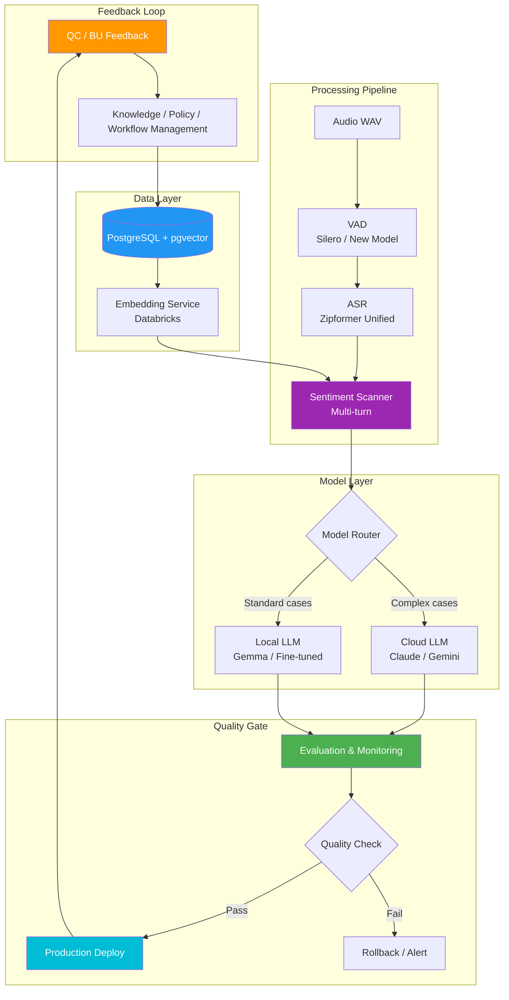

---

## Transformation Goal

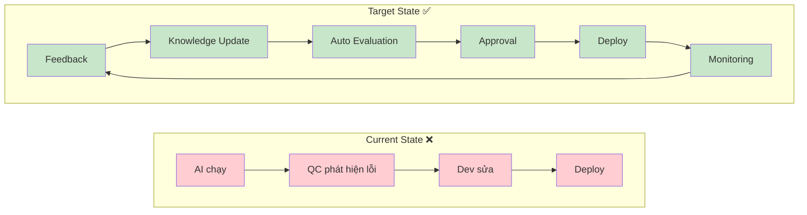

---

## Phase Overview

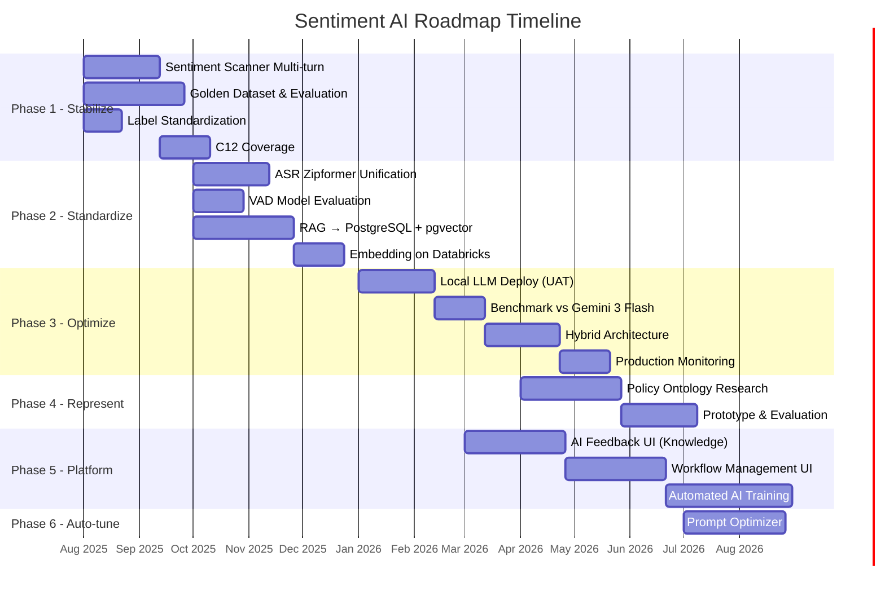

---

## Phase 1 — Stabilize & Improve Quality

> **Goal**: Đạt F1 > 0.8, xây nền tảng evaluation chắc chắn

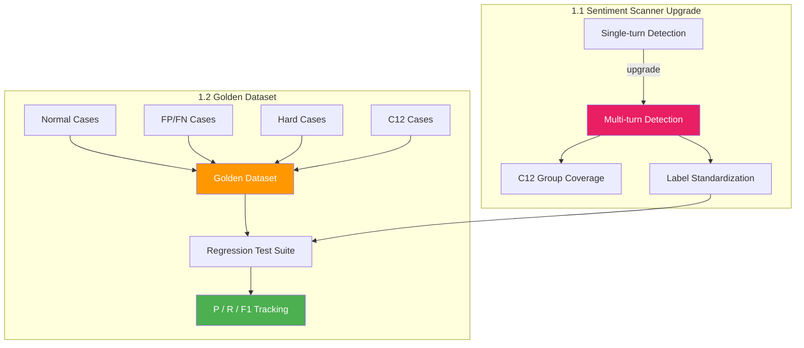

### Label Mapping

| Label cũ | Label mới (chuẩn hóa) | Score Offset |
|-----------|----------------------|--------------|
| `vi_pham_thai_do_warning` | **Thái độ Warning** | -5 |
| `vi_pham_thai_do_cao` | **Thái độ cao** | -10 |
| `vi_pham_thai_do_nghiem_trong` | **Thái độ nghiêm trọng** | -20 |
| `khong_vi_pham` | Không vi phạm | 0 |

### Key Metrics

| Metric | Current | Target |
|--------|---------|--------|
| **F1** | ~0.7x | > 0.80 |
| **Precision** | TBD | > 0.85 |
| **Recall** | TBD | > 0.75 |
| False Positive Rate | High | < 15% |

---

## Phase 2 — Standardize Audio & RAG Architecture

> **Goal**: Chuẩn hóa toàn bộ pipeline từ Audio → Embedding, đảm bảo consistency Local/UAT/Prod

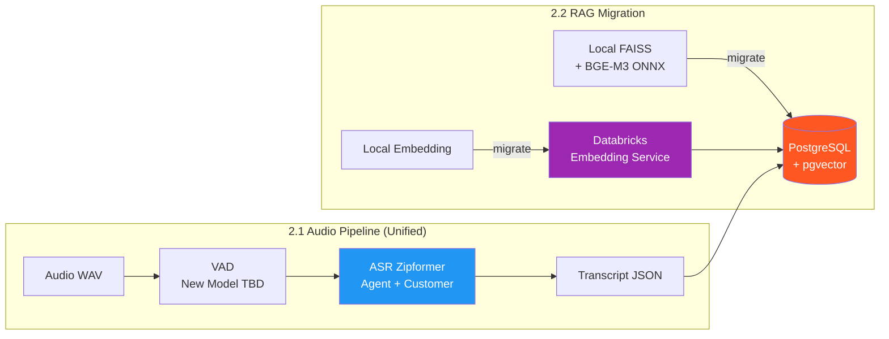

### ASR Unification Plan

```
┌─────────────────────────────────────────────────────────────────┐
│                    BEFORE (Current)                              │
├─────────────────────────────────────────────────────────────────┤
│  Agent:    Gipformer v4 (Zipformer + ChainAttention, ONNX)      │
│  Customer: NeMo Parakeet CTC 0.6B (.nemo checkpoint)            │
│  VAD:      Silero VAD (ONNX) × 2                                │
├─────────────────────────────────────────────────────────────────┤
│                    AFTER (Target)                                │
├─────────────────────────────────────────────────────────────────┤
│  Agent:    Zipformer (unified)                                  │
│  Customer: Zipformer (unified)                                  │
│  VAD:      New VAD model (evaluate) / Silero upgraded           │
│  Denoise:  Optional (evaluate ROI)                              │
└─────────────────────────────────────────────────────────────────┘
```

### RAG Migration Checklist

- [ ] Setup PostgreSQL + pgvector infrastructure
- [ ] Migrate corpus from local YAML/FAISS → pgvector
- [ ] Deploy embedding model on Databricks
- [ ] Implement versioning mechanism for knowledge
- [ ] Validate retrieval quality (before vs after)
- [ ] Update Hush resource config to point to new services
- [ ] Ensure Local/UAT/Prod use identical configs

---

## Phase 3 — Local LLM & Cost Optimization

> **Goal**: Giảm chi phí inference, đảm bảo quality không giảm

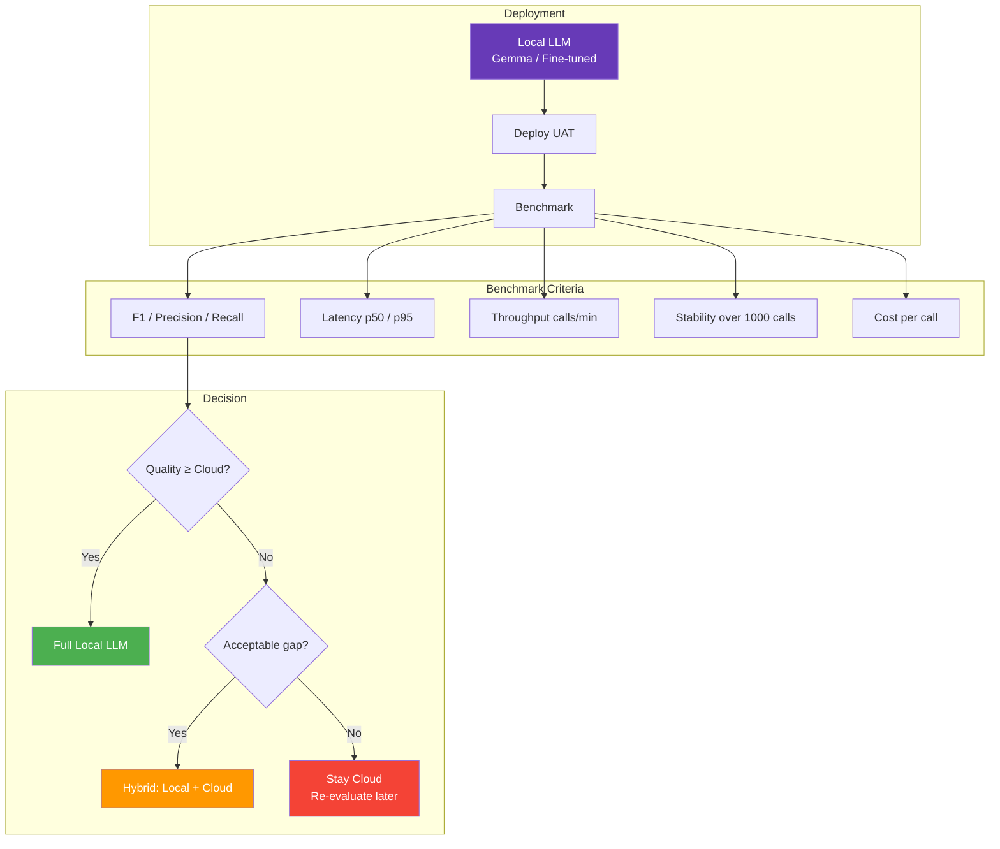

### Cost Comparison Model

```
┌────────────────────┬──────────────┬──────────────┬──────────────┐
│                    │  Cloud Only  │   Hybrid     │  Local Only  │
├────────────────────┼──────────────┼──────────────┼──────────────┤
│ Cost / 1000 calls  │    $$$       │     $$       │      $       │
│ Latency (p95)      │   ~3-5s      │    ~2-4s     │    ~1-2s     │
│ Quality (F1)       │   Baseline   │   ~Baseline  │    TBD       │
│ Dependency         │   High       │    Medium    │    Low       │
│ GPU Required       │    No        │    Yes       │    Yes       │
└────────────────────┴──────────────┴──────────────┴──────────────┘
```

### Production Monitoring Dashboard

| Metric | Alert Threshold |
|--------|----------------|
| F1 drop | > 5% drop vs baseline |
| Latency p95 | > 10s |
| Error rate | > 2% |
| Fallback rate | > 10% |
| Cost/day | > budget × 1.2 |

---

## Phase 4 — Policy & Knowledge Representation

> **Goal**: Giảm dependency vào prompt dài, dễ cập nhật policy

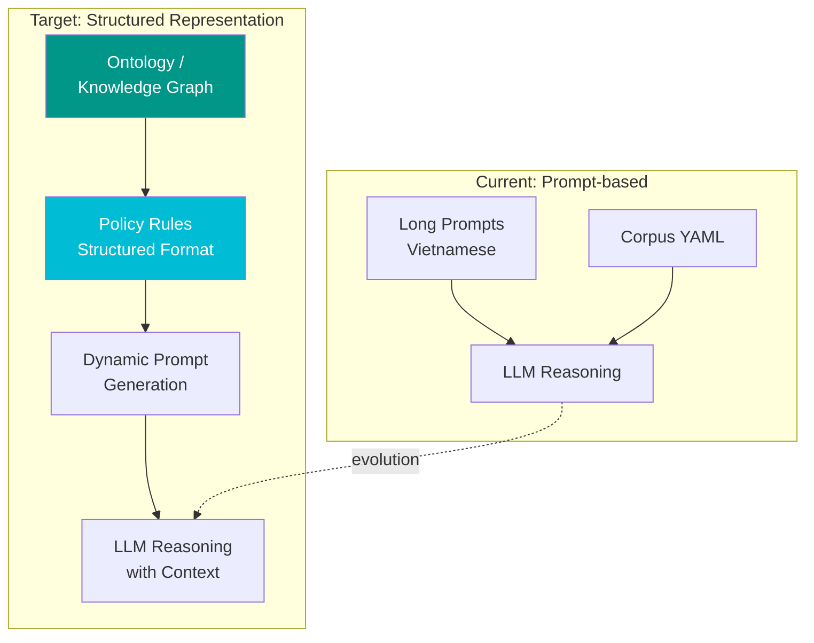

### Benefits vs Risks

| Aspect | Prompt-based (Current) | Ontology (Target) |
|--------|----------------------|-------------------|
| Update policy | Edit prompt files | Edit structured rules |
| Trace reasoning | Hard | Easy (rule → evidence) |
| BU can modify | No | Yes (with UI) |
| Complexity | Low | Medium-High |
| Risk | Prompt drift | Over-engineering |

### Evaluation Criteria (Go/No-Go)

- [ ] Quality improvement ≥ 5% F1 trên prototype
- [ ] Maintenance effort giảm ≥ 50%
- [ ] BU có thể update mà không cần dev intervention
- [ ] Không tăng latency > 20%

---

## Phase 5 — AI Feedback & Training Platform

> **Goal**: BU/QC tự quản lý knowledge và workflow, hệ thống tự cải thiện

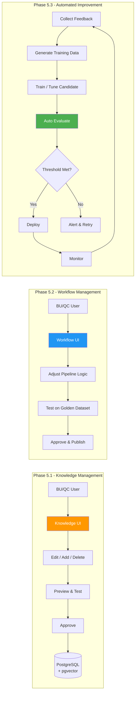

### Knowledge Management Flow

```
┌──────────┐    ┌──────────┐    ┌──────────┐    ┌──────────┐    ┌──────────┐
│  Feedback │───▶│   Edit   │───▶│   Test   │───▶│ Approve  │───▶│ Publish  │
│  from QC  │    │Knowledge │    │  Preview │    │  by Lead │    │  to Prod │
└──────────┘    └──────────┘    └──────────┘    └──────────┘    └──────────┘
                      │                                                │
                      ▼                                                ▼
              ┌──────────────┐                                ┌──────────────┐
              │  Version     │                                │  Audit Log   │
              │  Control     │                                │  + Rollback  │
              └──────────────┘                                └──────────────┘
```

---

## Phase 6 — Prompt Optimization (Medium/Low Priority)

> **Prerequisite**: Golden Dataset + Automated Evaluation phải stable trước

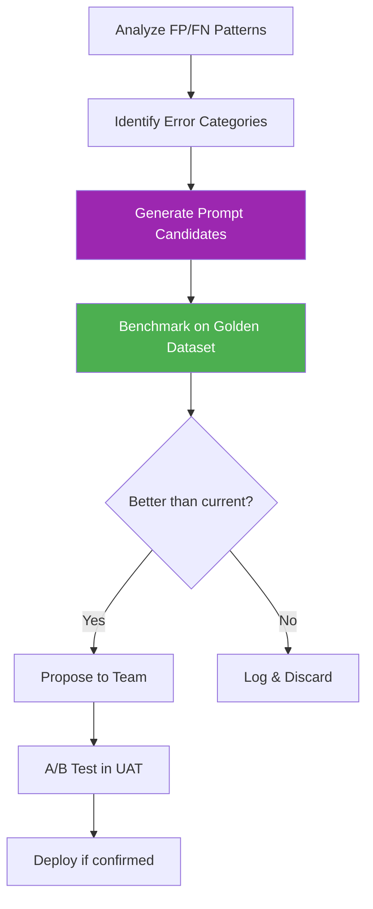

---

## Priority Matrix

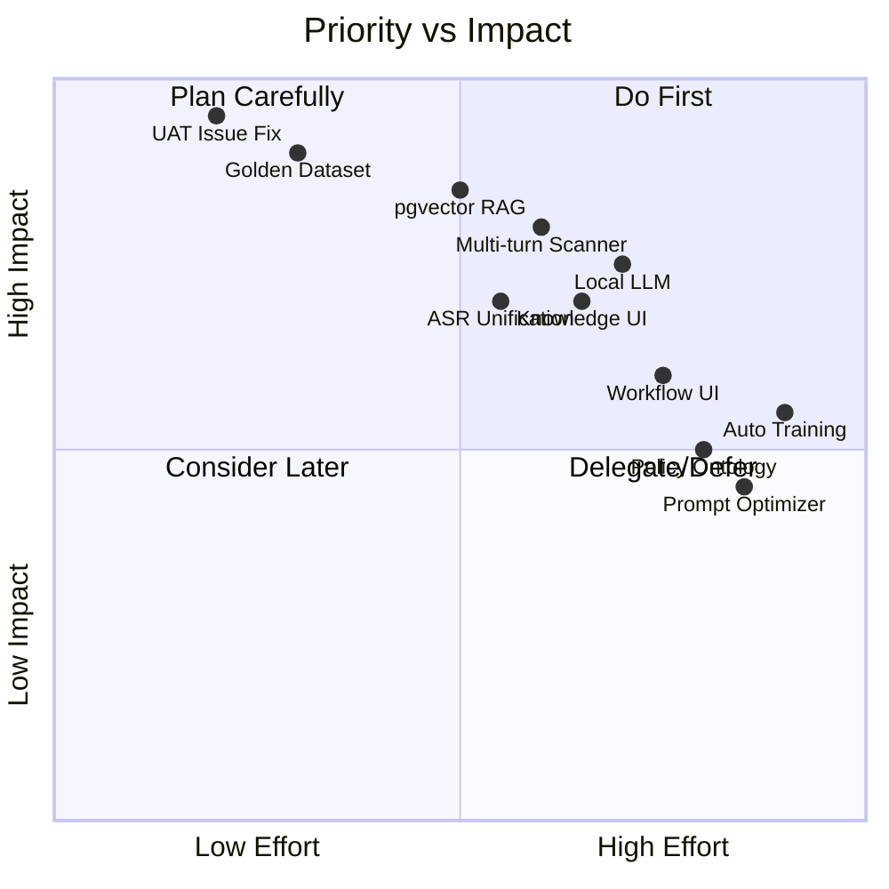

---

## Priority Table

| Priority | Workstream | Goal | Status |
|:--------:|-----------|------|:------:|
| 🔴 **P0** | UAT & Issue Fix | F1 > 0.8 | 🟡 In Progress |
| 🔴 **P0** | Golden Dataset | Standardize evaluation | 🔵 Planning |
| 🔴 **P0** | PostgreSQL + pgvector | Standardize RAG | 🔵 Planning |
| 🟠 **P1** | ASR / VAD Unification | Standardize audio pipeline | 🔵 Planning |
| 🟠 **P1** | Local LLM | Reduce inference cost | 🔵 Planning |
| 🟠 **P1** | AI Feedback UI (Phase 1) | BU manages knowledge | 🔵 Planning |
| 🟡 **P2** | Multi-turn Scanner / C12 | Increase violation coverage | 🔵 Planning |
| 🟡 **P2** | AI Workflow UI (Phase 2) | BU tunes workflow | ⚪ Future |
| 🟡 **P2** | Policy/Ontology | Reduce prompt dependency | ⚪ Future |
| 🟢 **P3** | Prompt Optimizer | Automate tuning | ⚪ Future |
| 🟢 **P3** | Automated AI Training | Closed-loop improvement | ⚪ Future |

---

## Success Metrics

```
┌─────────────────────────────────────────────────────────────────────────┐
│                         KPIs Dashboard                                   │
├─────────────────────┬───────────────┬───────────────┬───────────────────┤
│      Metric         │   Current     │   Phase 1     │   Final Target    │
├─────────────────────┼───────────────┼───────────────┼───────────────────┤
│  F1 Score           │    ~0.7x      │    > 0.80     │     > 0.85        │
│  Cost / 1000 calls  │    $$$        │    $$$        │     $  (Local)    │
│  Latency p95        │    ~5s        │    ~4s        │     < 2s          │
│  BU Update Time     │    Days       │    Days       │     Hours (UI)    │
│  Deploy Frequency   │    Weekly     │    Weekly     │     Daily (Auto)  │
│  Violation Coverage │    6/7 groups │    7/7        │     7/7 + expand  │
└─────────────────────┴───────────────┴───────────────┴───────────────────┘
```

---

## Risk Register

| Risk | Impact | Likelihood | Mitigation |
|------|--------|-----------|------------|
| Local LLM quality < Cloud | High | Medium | Hybrid fallback architecture |
| pgvector migration data loss | High | Low | Parallel run + validation |
| BU resistance to new UI | Medium | Medium | Training + gradual rollout |
| Ontology over-engineering | Medium | Medium | Prototype first, Go/No-Go gate |
| ASR model regression | High | Low | A/B test + rollback mechanism |
| Prompt optimizer hallucinations | Medium | High | Human approval gate |

---

## Dependencies & Integration Map

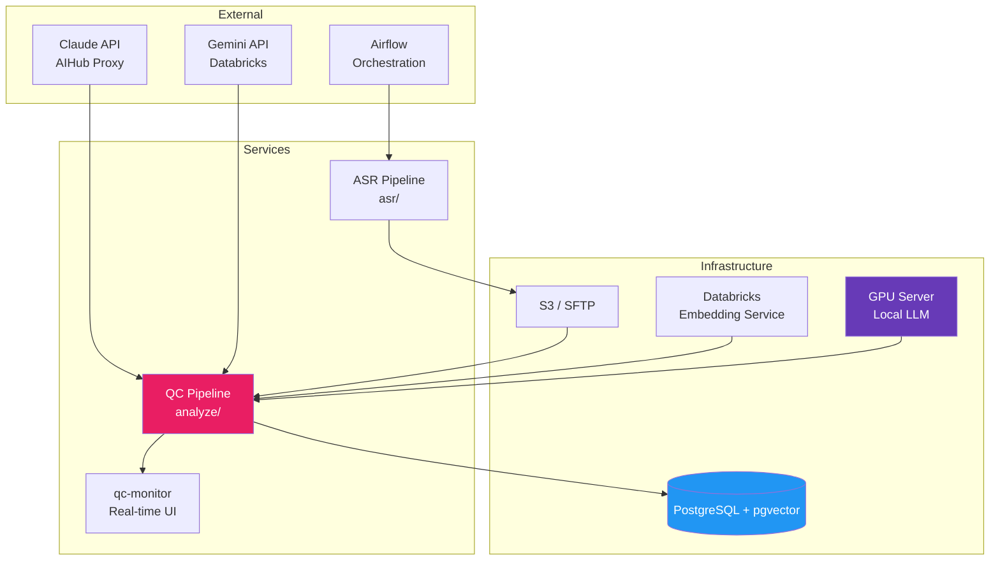

---

## Quick Links

| Resource | Location |
|----------|----------|
| Codebase (ASR) | `asr/` |
| Codebase (sentiment) | this repository |
| Architecture | `CLAUDE.md`, `docs/FLOW_sentiment_agent_end_to_end.html` |
| Prompt Files | `src/**/prompts/` |
| Resources Config | `resources.yaml`, `models.yaml` |
| Selfcheck Fixtures | `tests/sample/fixtures/` |
| Deployment contract | `docs/MLE.md` |
| Past plans, reports, board docs | `docs/archive/` |

---

*Last updated: August 2026*
*Author: MLE/DS2 Team*
