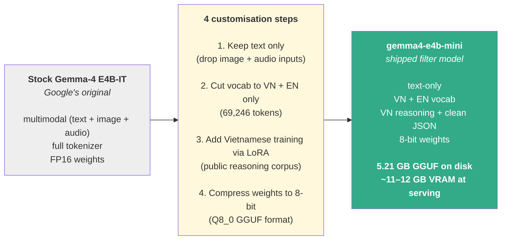
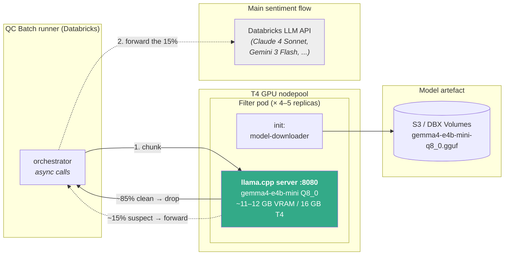

# DAB — E4B Local Pre-Filter Gate

## Stage 1: Use Case Scoping & Requirement Profiling

**Objective:** Define the "Performance Bar" and hardware constraints before benchmarking.

### **1.1. Requirement Analysis:**

1. **use-case objective:**

Deploy a self-hosted small LLM as a *pre-filter gate* in front of the existing **main sentiment flow** — the current pipeline that routes every call to Databricks-hosted LLMs (Claude 4 Sonnet, Gemini 3 Flash, …) running scanner + verifier. Only calls with suspicion of compliance violation should reach the main sentiment flow. Specifically:

- **Cost reduction:** cut Databricks LLM API spend by dropping clean calls at the on-prem gate before they reach the main sentiment flow. Target ≥ 70 % cost saving; achieved ~85 %.
- **Lower latency + higher throughput:** local T4 inference avoids the cloud round-trip and provider-queue wait on every clean call. The fleet (4–5 T4 pods × 44 calls/min each = 176–220 calls/min aggregate) processes the daily 25–30 k-call batch in ~2–2.5 h; routing every call to the cloud API would be bottlenecked by request queue depth well before it approached this window.
- **Cloud API rate-limit tolerance:** only the ~15 % suspect calls reach the Databricks LLM API, keeping traffic well under the provider's request-per-minute quota — reduce throttling, backoff, or retries on the calls that do proceed.

2. **model objective:**

The model must perform two tasks on the Vietnamese ASR transcript of a completed collection call:

- **Violation classification:** flag calls exhibiting known compliance-risk patterns — threat / intimidation, procedure breach, information leakage, aggressive tone, non-cooperative deflection — plus their indirect / euphemistic paraphrases on noisy ASR text.
- **Structured output:** emit strict JSON — routing decision + short reason — for the orchestrator to consume without parse overhead.

**Quality target:** violation recall ≥ 95 %, clean-call filter rate ≥ 70 %, pipeline end-to-end F1 (gate + main sentiment flow vs. QC ground truth) ≥ 0.80

3. **use-case applications:**

In-scope deliverables:

- Filter model weights (Q8_0 GGUF, Gemma-4 E4B family).
- Serving container: llama.cpp on T4, exposing an OpenAI-compatible chat completions API.
- Per-call structured logs of every routing decision.

**Out of scope: ASR, the main sentiment flow.**

4. **Final Requirement Summarization**

| **Aspect** | **Specification** |
|---|---|
| **Function** | Binary pre-filter gate on Vietnamese collection-call transcripts — decides whether a call proceeds to the main sentiment flow. |
| **Violation Recall SLO** | ≥ 95 % against QC ground truth. |
| **Filter Rate SLO** | ≥ 70 % of clean calls dropped at the gate — the direct lever for the ≥ 70 % Databricks LLM API cost-saving target. |
| **Pipeline F1 SLO** | ≥ 0.80 end-to-end (gate + main sentiment flow vs. QC ground truth). |
| **Throughput SLO** | ≥ 40 calls/minute per T4 GPU. |
| **Hardware** | NVIDIA T4 16 GB — existing on-prem GPU nodepool; no additional capex. |
| **License** | Must permit commercial on-prem deployment by a regulated financial institution. |

### **1.2. Categorize the data environment:**

***Note:** The filter consumes text — Vietnamese ASR transcripts of complete collection calls. This section describes the data sources, processing mode, and upstream environment that determine input quality.*

1. **Data Source:**

- **Weight-training corpus:** public Vietnamese reasoning corpus — provides general VN reasoning + JSON-format capability. **No Win data touches weights.**
- **Prompt-tuning data:** 1 737 QC-labeled pilot calls, used to refine the filter prompt's few-shot examples until pilot recall cleared the 95 % floor. No weight update.
- **Evaluation (Golden) — two independent live-day held-outs:**
  - `live_20260716` — full day (~15 k calls); 52 QC-confirmed violations, all others assumed clean.
  - `live_20260722` — full day (~15 k calls); 95 QC-confirmed violations, all others assumed clean.
- **Production input:** Vietnamese ASR transcripts of completed collection calls.

2. **Processing Mode:**

- **Mode:** offline batch after call completion.
- **Trigger:** scheduled Databricks batch job (~8–10 h/day window).
- **Throughput budget:** ≥ 40 calls/minute per T4 GPU (currently 44); 4–5 T4 pods clear the daily 25–30 k-call batch in ~2–2.5 h.

3. **Upstream Input Environment:**

- Vietnamese collection-call transcripts — regional accents, banking / collection domain jargon.
- ASR-degraded text: mis-recognitions, filler words, incomplete utterances, VN + EN code-switching.
- **Implication for the filter:** must tolerate noisy VN text and detect indirect / euphemistic violation phrasing without being misled by ASR artefacts.

4. **Mandatory Constraints:**

| **Constraint** | **Value / Rationale** |
|---|---|
| **GPU** | NVIDIA T4 16 GB — existing on-prem nodepool. Upgrade would require capex; this proposal must fit within current hardware. |
| **Model VRAM** | ≤ 13 GB working set per pod (weights + KV cache + CUDA workspace at production `ctx-size 8192, parallel 4`). Excludes anything larger than ~5 B params at Q8 quantization. |
| **Throughput (SLA)** | ≥ 40 calls/minute per T4 GPU; below this the daily batch window slips. |
| **Language / dialect** | Vietnamese + regional accents; tolerant of noisy ASR, with occasional EN mixing. |
| **Structured output** | Strict JSON (routing decision + short reason) — the orchestrator does not parse free-form text. |
| **License** | Permits commercial on-prem use by a regulated financial institution. |

5. **Other constraints:**

- **Vietnamese tokenizer efficiency:** must cover VN tone marks + syllable structure efficiently; EN-leaning tokenizers spend 2–3× the tokens, increasing latency and KV-cache pressure.
- **Total Cost of Ownership (TCO):** on-prem filter (existing T4) must cost meaningfully less than sending 100 % of calls to the Databricks LLM API at target traffic.
- **Adaptability:** QC-rule changes land as versioned prompt edits (frequent, no weight update); LoRA re-tune on a single T4 as fallback if prompt-tuning saturates.

### **1.3. Model Architecture**

1. **Base model selection:**

Three families were seriously considered for the pre-filter role. The design principle is to pick the *smallest* base model clearing the recall floor — smallest, not largest-that-fits, preserves VRAM + compute headroom on the T4 for concurrent chunk workers. Only one family cleared the bar:

| **Family** | **Representatives** | **Verdict** |
|---|---|---|
| Cloud LLM API | Claude 4 Sonnet, Gemini 3 Flash | Violates the cost objective — every filter call would incur cloud spend, defeating the ~85 % saving target. **Ruled out on economics; not benchmarked.** |
| Small OSS on T4 (~1B–4B) | Gemma-4 E2B, Qwen 3.5 4B | Fit T4 with headroom + high throughput but missed the recall floor + hallucinate more on new / unseen violation phrasings — see benchmark below. |
| **Small-mid Q8 OSS — Gemma-4 E4B family** | **Gemma-4 E4B-IT (text-only)** | **SELECTED as base model.** |
| Large OSS (~7B+) | Qwen 3.5 9B, Gemma-4 12B | Even at Q4 / Q8, weights + KV cache × concurrent chunk workers exceed T4's 16 GB — or fit marginally but drop throughput below the 40 rpm SLA needed to clear the daily 25–30 k-call QC batch. **Ruled out — doesn't fit T4 at QC-flow volume.** |

**Head-to-head benchmark of base models** on the Golden Set (`live_20260716` + `live_20260722`), all stock / zero-shot:

| **Base model** | **Params** | **Violation Recall** | **Filter Rate** | **Verdict** |
|---|---|---|---|---|
| **Gemma-4 E4B-IT (text-only)** | ~5 B | **0.85** | **0.74** | **SELECTED as base.** Highest untuned baseline; strong headroom for LoRA + prompt-tune to clear the 0.95 floor. |
| Gemma-4 E2B | ~2 B | 0.62 | 0.67 | Below recall floor + hallucinates on new violation patterns — rejected. |
| Qwen 3.5 4B | ~4 B | 0.54 | 0.72 | Below recall floor + hallucinates on new violation patterns — rejected. |

**Why the E4B backbone over smaller candidates:** even untuned, Gemma-4 E4B-IT reaches 0.85 recall — far ahead of E2B (0.62) and Qwen 3.5 4B (0.54). E4B-IT also hallucinates materially less on unseen violation phrasings, an essential property when QC rules evolve and new violation categories are added via prompt updates alone.

2. **Customisation pipeline (Gemma-4 E4B-IT → `gemma4-e4b-mini`):**

Starting from **Gemma-4 E4B-IT (text-only)** — the base model selected above — four transformations produce the shipped filter artefact, [`thanglq150188/gemma4-e4b-mini`](https://huggingface.co/thanglq150188/gemma4-e4b-mini):

<!-- CONFLUENCE PASTE STEP: replace the Mermaid code block below with dab_e4b_customisation_pipeline.png (export from VS Code MPE preview → right-click → Chrome (Puppeteer) → PNG). -->

The merged LoRA was trained on public corpus only — **no Win data in the merged weights**.

### **1.4. Fine-Tuning Strategy**

1. **Why fine-tuning is needed:**

Stock Gemma-4 E4B-IT reaches 0.85 violation recall on the Golden Set — strong, but 10 pp below the 0.95 SLA floor. Two gaps remain that only adaptation can close: (1) Vietnamese noisy-text reasoning on ASR-degraded transcripts (mis-recognitions, regional accents, code-switching); (2) structured-output discipline — the stock base occasionally emits free-form prose when a strict JSON contract is required, breaking the orchestrator's parser.

2. **Two-layer strategy — LoRA + prompt-tuning:**

Adaptation is deliberately split into two layers with different update cadences:

| Layer | Data | When updated | What it teaches |
|---|---|---|---|
| **LoRA on weights** | Public Vietnamese reasoning corpus (see below) | Once at build; refresh only if prompt-tuning saturates | General VN reasoning + JSON discipline |
| **Prompt tuning** | 1 737 QC-labeled pilot calls | Continuous — every QC-rule change | Domain-specific violation patterns |

QC rules evolve constantly — new violation phrasings, category revisions, edge cases surfaced by periodic QC review. Weight retraining for every rule change would kill iteration speed; prompt-tuning turns rule updates into a Git-review cycle, not a T4 retraining run.

**Weights are never fine-tuned on Win data.** Pilot calls contain customer PII, and weight-tuning on PII risks residue in the merged model — an unacceptable risk for a model registered as an on-prem artefact. Prompt-tuning keeps PII patterns out of weights entirely.

3. **LoRA corpus — curated subset of public Vietnamese reasoning data:**

The LoRA layer trains on a **cherry-picked subset** of public Vietnamese reasoning corpora — instruction-following + chain-of-thought (CoT) examples from open community sources on Hugging Face. Profile: ~1.7 training epochs on the curated subset.

**Why subset, not the full corpora:** the LoRA was trained on a single-GPU workstation setup, not a cluster. Full-scale community datasets run into millions of rows (see sizes below) — training in full would take days and give diminishing returns on a downstream *binary* classification task. We deliberately filtered to samples that transfer to the filter (general reasoning, arithmetic / logic, JSON-format) and skipped irrelevant slices (OCR / VQA / translation subtasks).

Source datasets we subsampled from (exact sample-selection recipe available on request from the LoRA trainer):

| Source | Total size | What we took from it | Subset size |
|---|---|---|---|
| [`5CD-AI/Vietnamese-1m5-kaist-CoT-gg-translated-unrefined`](https://huggingface.co/datasets/5CD-AI/Vietnamese-1m5-kaist-CoT-gg-translated-unrefined) | 1.6 M rows / 4.6 GB / 216 task categories | Reasoning / QA / arithmetic categories only | ~20 k rows |
| [`5CD-AI/Vietnamese-Multi-turn-Chat-Alpaca`](https://huggingface.co/datasets/5CD-AI/Vietnamese-Multi-turn-Chat-Alpaca) | Multi-turn VN Alpaca-style instruction data | Strict-JSON / instruction-following slice | ~5 k rows |
| [`CohereForAI/aya_collection`](https://huggingface.co/datasets/CohereForAI/aya_collection) | 112 + languages, multilingual instruction tuning | Vietnamese slice (`vie`) only, for instruction-following breadth | ~5 k rows |

**Total curated LoRA training set:** ~30 k examples, 1.7 epochs on the single-GPU workstation.

4. **Method decision — LoRA over full fine-tune:**

Full fine-tuning a ~5 B model overflows T4 VRAM during the backward pass. LoRA on rank adapters keeps trainable parameters under ~1 % of total — fits a single T4, converges in hours, and costs an order of magnitude less than a fresh full-fine-tune each time drift triggers a rebuild. The trained LoRA is *merged* into the base at build time — zero adapter-loading overhead at inference.

## Stage 2: Benchmark Mechanism — Technical Pre-Scoring

**Principle:** measure the shipped filter model on fixed, unseen held-out data. Two independent live-day held-outs (`live_20260716` + `live_20260722`) provide a robustness signal — no result rests on a single day of production.

1. **Benchmark methodology:**

- **Held-out data:** two full live-days (`live_20260716`, `live_20260722`), each ~15 k calls. Each day contains a QC-audited subset that serves as ground truth (52 confirmed violations on 16/07; 95 on 22/07).
- **Ground-truth convention:** confirmed violations = positive labels; non-audited calls are assumed clean.
- **Metrics reported:**
  - **Violation Recall** — confirmed violations forwarded / all confirmed violations.
  - **Filter Rate** — calls dropped at the gate / total calls in the day (proxy for cost saving).
  - **Pipeline end-to-end F1** — full-pipeline decisions (gate + main sentiment flow) vs QC ground truth.
  - **Throughput** — calls processed per T4 GPU per minute at production concurrency.
- **Configurations compared in this stage:** base (untuned Gemma-4 E4B-IT) vs. shipped (`gemma4-e4b-mini` LoRA-adapted). Comparison against current production (no-filter baseline) is reported in Stage 3.

2. **Performance — Violation Recall + Filter Rate (adaptation lift):**

Measured on both held-outs (combined; per-day breakdown available on request):

| Configuration | Violation Recall | Filter Rate |
|---|---|---|
| Gemma-4 E4B-IT (base, untuned) | 0.85 | 0.74 |
| **`gemma4-e4b-mini` (LoRA-adapted)** | **97.2 %** (+12.2 pp) | **84.6 %** (+10.6 pp) |

The adaptation lifts recall by 12.2 pp above the untuned base and filter rate by 10.6 pp — clearing both the 95 % recall floor and the 70 % filter-rate target.

*Comparisons against the current production configuration (no filter / keyword-only pre-filter) are reported in Stage 3.*

3. **Pipeline end-to-end F1:**

F1 measured over the full pipeline (gate + main sentiment flow) against QC ground truth on the combined held-outs (n = 361 audited: 147 confirmed violations + 214 clean):

| Configuration | TP | FN | FP | TN | Precision | Recall | **F1** |
|---|---:|---:|---:|---:|---:|---:|---:|
| Main sentiment flow alone (baseline — no gate) | 124 | 23 | 20 | 194 | 0.862 | 0.844 | **0.852** |
| **Gate + main sentiment flow (production configuration)** | 121 | 26 | 17 | 197 | 0.877 | 0.823 | **0.849** |
| Δ | −3 | +3 | −3 | +3 | +1.5 pp | −2.1 pp | **−0.3 pp** |

The pipeline clears the F1 ≥ 0.80 target with margin. Adding the gate trades a small recall drop (−2.1 pp — the 4 violations the gate misses outright plus a slight distribution-shift penalty on the forwarded subset) for a small precision gain (+1.5 pp — the gate correctly drops some clean calls that would otherwise trip up the main sentiment flow). Net F1 change is essentially zero: **the gate delivers the ~85 % cost saving on the full production stream at negligible pipeline-F1 cost.**

4. **Throughput profile:**

Measured on production T4 pods (4 concurrent chunk workers per pod):

| Config | Throughput |
|---|---|
| 1× T4 pod | 44 calls/min |
| Fleet: 4–5× T4 pods on Databricks GPU nodepool | 176–220 calls/min aggregate |

**Daily batch:** the fleet clears the 25–30 k-call daily QC batch in ~2–2.5 h.

**Note on latency:** the filter is a batch pipeline — per-call latency is not tracked as an SLO. Throughput (calls/minute) is the only performance SLA.

5. **Interpretation & trade-offs:**

**Recall trade-off:** gate recall of **97.2 %** vs. baseline 1.00 (no-filter) means the gate silently drops **~2.8 %** of confirmed violations before they reach the main sentiment flow. This gap is the accepted cost of the ~85 % filter rate that drives the cost saving; it was reviewed and signed off by the QC team ahead of DAB submission.

**Reversibility:** the runtime kill-switch (env-var flag) reverts the pipeline to 100 % main sentiment flow without redeploy — if the recall gap costs more in undetected violations than expected, the gate can be disabled in seconds while a fix is prepared.

**Filter rate → cost saving:** ~85 % filter rate means ~85 % fewer calls reach the Databricks LLM API — cost model in Stage 4.

6. **Serving specification:**

| Item | Value |
|---|---|
| Architecture | Decoder-only transformer (Gemma-4 E4B family) — 42 layers, hidden 2560, sliding + full hybrid attention |
| Parameters | ~5 B effective |
| Context length | 131 K tokens available; ~4–8 K used per chunk in production |
| Quantisation | Q8_0 GGUF (8-bit weights), 5.21 GB on disk |
| Tokenizer | Gemma SentencePiece, pruned to 69 246 tokens (VN + EN) |
| VRAM working set | ~11–12 GB per pod at `ctx-size 8192, parallel 4` (5.21 GB weights + ~2–3 GB shared KV pool + ~3–4 GB CUDA activations & workspace) — under the 13 GB per-pod budget; ~4 GB T4 headroom |
| Adaptation | LoRA on ~30 k public VN reasoning subset (merged into base at build) |

7. **Deployment / Serving:**

- **Inference engine:** `llama.cpp` server (`ghcr.io/ggml-org/llama.cpp:server-cuda` upstream image, version pinned by commit digest) serving the Q8_0 GGUF with flag set: `--n-gpu-layers 99 --ctx-size 8192 --parallel 4 --swa-full --cache-reuse 256 -fa on --jinja --chat-template-file gemma4_chat.jinja`.
  - **Mandatory flags:** `--swa-full`, `--cache-reuse 256`, and `-fa on` (flash-attention) are required. Without `--swa-full`, cache-reuse is silently disabled and per-pod throughput collapses to ~19 calls/min — well below the 40 rpm SLO.
- **Topology:** one `llama.cpp` pod per T4 GPU; ~4–5 pods on the Databricks GPU nodepool for the daily batch.
- **API:** OpenAI-compatible `/v1/chat/completions` on port 8080; the QC batch runner calls asynchronously.
- **Model artefact distribution:** GGUF file (5.21 GB) pulled from S3 / Databricks Volumes at pod startup via an init container — keeps the runtime image lightweight and lets model updates ship independently of code.

**Deployment architecture:**

<!-- CONFLUENCE PASTE STEP: replace the Mermaid code block below with dab_e4b_deployment_architecture.png (export from VS Code MPE preview → right-click → Chrome (Puppeteer) → PNG). -->

8. **Container image:**

| Aspect | Value |
|---|---|
| Base image | `ghcr.io/ggml-org/llama.cpp:server-cuda` (upstream, unmodified) |
| Runtime patches | None — Q8_0 GGUF runs out-of-box on T4 `sm_75` |
| Chat template | `gemma4_chat.jinja` mounted at startup (mandatory — Gemma-4 uses `<|turn>` tokens) |
| Health check | `/health` (built-in `llama.cpp` endpoint) |
| Container security | Non-root user, minimal CUDA base, Trivy scan in CI (0 CRITICAL required) |
| Model artefact | Q8_0 GGUF pulled at startup; SHA256 checksum verified before serving |

9. **Governance & Risk:**

| Risk | Description | Mitigation |
|---|---|---|
| **Recall drift as QC rules evolve** | New violation phrasings unseen in the current prompt may be missed | Quarterly prompt review + periodic audit workflow (manual today: rerun main sentiment flow on a sample of gate-dropped calls, compare; automated daily audit + alerting in Phase-2) |
| **Silent False Negatives** | Gate marks a real violation as clean; the call is never audited downstream | Periodic offline recall audit on gate-dropped samples (manual today; automated daily audit + alert if audit-sample recall drops below 0.95 in Phase-2) |
| **Parser errors mask violations** | LLM returns malformed JSON, breaking the forwarding logic | **Fail-open:** any parse error → forward the call as if suspect. Track parse-fail rate as a health metric |
| **Single T4 SPOF (per pod)** | One T4 failure disables the pod | Runtime kill-switch reverts to 100 % main sentiment flow — no batch outage. HA T4 in Phase-2 |
| **Prompt injection via ASR text** | Adversarial caller could try to influence the classifier | Filter output is a boolean — worst case is a mis-classified call, not code execution. Monitor parse-fail rate |
| **Weight distribution / licensing** | Merged LoRA hosted publicly on Hugging Face | LoRA trained on public data only; Gemma Terms permit commercial redistribution |

10. **Compliance & Security:**

| Area | Status |
|---|---|
| **Data residency** | Filter runs entirely on the on-prem T4 nodepool. Only the ~15 % suspect calls reach the Databricks LLM API — inherits the existing main sentiment flow compliance envelope. |
| **Decree 13/2023/NĐ-CP** | Applies the same PII processing agreement as the current main sentiment flow; no expansion of scope. |
| **Model artefact — PII in weights** | Zero. LoRA trained on public data only; merged weights carry no Win customer data. |
| **License** | Gemma Terms — commercial on-prem use permitted for regulated financial institutions. |
| **Network / container** | `llama.cpp` binds localhost only; exposed via wrapper. Container runs non-root, minimal CUDA base, Trivy scan in CI. |
| **Secrets** | No secrets in the filter runtime; model artefact fetched via IRSA / instance role. |

## Stage 3: Benchmark Mechanism — Selection Logic & Golden Image Comparison

**Principle:** confirm the proposed filter clears every governance / deployment / operational gate, and quantify the delta vs. the pipeline as it runs in production today.

### 3.1. Selection Logic

The filter must clear a sequence of gates. Each is answered in detail in earlier stages; this section is the pass/fail recap for the board.

1. **Governance Gate** — Does the model licence permit commercial on-prem use? Any PII in weights?
   → **PASS.** Gemma Terms permit commercial redistribution + on-prem use by regulated financial institutions. LoRA trained on a curated subset of public Vietnamese reasoning corpora only — no Win data in the merged weights.

2. **Deployment Gate** — Does the model fit the existing T4 hardware within the working-set budget? Is it cost-negative vs. baseline?
   → **PASS.** ~11–12 GB working set at production config (`ctx-size 8192, parallel 4`), with ~4 GB T4 headroom. ~85 % Databricks LLM API cost saving on filtered traffic.

3. **Scalability Gate** — Does the model support horizontal scaling on the current serving substrate?
   → **PASS.** Served via `llama.cpp` containers on the Databricks GPU nodepool — one pod per T4, 4–5 pods for the daily batch, add replicas for higher traffic.

4. **Data Privacy Gate (L1/L2)** — Transcript data contains customer PII. Where does the data live?
   → **PASS.** Filter runs entirely on-prem; only the ~15 % suspect calls are forwarded to the Databricks LLM API, inheriting the existing main sentiment flow compliance envelope.

5. **Real-Time / Streaming Gate** — Is real-time inference required?
   → **NO.** Filter is a scheduled batch pipeline; per-call latency is not tracked as an SLO. Throughput ≥ 40 rpm per T4 is the only performance SLA (currently 44 rpm).

6. **Structured Output** — Downstream orchestrator requires strict JSON?
   → **PASS.** Filter emits strict JSON (routing decision + short reason); no free-form prose. Fail-open behaviour on any parse error forwards the call to the main sentiment flow.

**Conclusion:** the filter clears every gate on the decision path.

### 3.2. Compare with Current Production (Golden Image status)

Win has no formal Golden Image for the pre-filter role today — the current production pipeline routes 100 % of calls to the main sentiment flow with no LLM pre-filter. The proposed filter is compared against that as-is production baseline:

| Metric | Current production (no filter) | **Proposed (gate + main flow)** | Delta |
|---|---:|---:|---|
| Calls forwarded to Databricks LLM API | 100 % of daily traffic | ~15 % | **−85 %** |
| Violation Recall | 0.844 | 0.823 | −2.1 pp |
| Precision | 0.862 | 0.877 | +1.5 pp |
| Pipeline end-to-end F1 | 0.852 | 0.849 | −0.3 pp |
| Throughput bottleneck | Cloud API rate limits + provider queue | T4 pod aggregate (176–220 calls/min) | Predictable, no external quota |
| Daily batch window | Bounded by cloud rate limits | ~2–2.5 h on the 4–5 pod fleet | Bounded, in-house |
| Databricks LLM API spend | Baseline (100 %) | ~15 % of baseline | **~85 % saving** |
| Hardware | Existing (cloud API only) | + 4–5 existing T4 pods on Databricks nodepool | Zero capex |

*(Recall / Precision / F1 measured on `live_20260716` + `live_20260722` audited subsets, n = 361.)*

**Recommendation:** as Win has no incumbent pre-filter, we propose **`gemma4-e4b-mini` served via `llama.cpp` on T4 as the first Golden Image for the pre-filter role**, subject to DAB approval.

## Stage 4: DAB Decision Template

**Principle:** final evidence for approval + architecture sign-off. This stage is self-contained — a board member should be able to read *only Stage 4* and reach a decision.

### 4.1. Use Case Summary

| Field | Value |
|---|---|
| **Project** | E4B Local Pre-Filter Gate — a small on-prem LLM sitting in front of the main sentiment flow, forwarding only suspect calls through it. |
| **Business domain** | Debt-collection call quality control (Voice / Collection Ops). |
| **Business requirements** | Violation Recall ≥ 95 %, Filter Rate ≥ 70 %, Pipeline F1 ≥ 0.80, Throughput ≥ 40 calls/min per T4, on-prem for the filter component, zero capex. |
| **Traffic profile** | Batch — 25–30 k calls/day, cleared by the 4–5 T4 pod fleet in ~2–2.5 h during the 8–10 h daily window. |
| **Owner** | Voice QC — DS2 — Win AI Center. |
| **Proposed model** | [`thanglq150188/gemma4-e4b-mini`](https://huggingface.co/thanglq150188/gemma4-e4b-mini) — customised Gemma-4 E4B-IT (text-only, VN+EN vocab-pruned, LoRA-adapted, Q8_0 GGUF, ~5 B params, 5.21 GB artefact). Served via `llama.cpp server-cuda` on T4. |

### 4.2. Model Selection Logic

- **Selected model:** `gemma4-e4b-mini` (Q8_0 GGUF, customised Gemma-4 E4B-IT text-only).
- **Decision path:** Governance Gate → Deployment Gate → Scalability Gate → Data Privacy Gate → Batch + Structured-Output constraints → head-to-head benchmark. Full gate walkthrough in § 3.1.
- **Why the E4B family?** Base Gemma-4 E4B-IT reaches 0.85 recall on the Golden Set untuned — well ahead of smaller alternatives (E2B 0.62, Qwen 3.5 4B 0.54), with headroom to clear the 0.95 SLA floor after adaptation. E4B-IT also hallucinates materially less on unseen violation phrasings — critical as QC rules evolve via prompt updates.
- **Why not the current Golden Image?** Win has no incumbent pre-filter — the role is new. We propose the shipped `gemma4-e4b-mini` + `llama.cpp` container as the **first Golden Image for the pre-filter role**.

### 4.3. Benchmark Evidence

Measured on the combined Golden Set (`live_20260716` + `live_20260722`, n = 361 audited — 147 confirmed violations + 214 clean):

| Metric | Target | Achieved | Status |
|---|---|---|---|
| Violation Recall | ≥ 95 % | **97.2 %** | ✔ |
| Filter Rate | ≥ 70 % | **84.6 %** | ✔ |
| Pipeline end-to-end F1 (gate + main flow) | ≥ 0.80 | **0.849** | ✔ |
| Throughput per T4 pod | ≥ 40 calls/min | **44 calls/min** | ✔ |
| VRAM working set per pod | ≤ 13 GB | **~11–12 GB** | ✔ |
| Parse failure rate | ≤ 0.5 % | negligible (fail-open covers the residual) | ✔ |

Full methodology, confusion matrix, and side-by-side base-vs-tuned + no-filter-vs-with-filter comparisons in Stage 2 + § 3.2.

### 4.4. Financial Projection

*(Numbers assume current traffic profile — ~750–900 k calls/month at the target 25–30 k/day. Databricks T4 pod rate: $0.734/hr = 10.48 DBU × $0.07/DBU on Model Serving.)*

| Line item | Current production (9 T4 pods, no filter) | Proposed (4–5 T4 pods + filter) |
|---|---:|---:|
| T4 pod compute — Databricks | 9 pods × $0.734/hr × 8–10 h × 30 d = **~$1,585–1,982/month** | 4–5 pods × $0.734/hr × 8–10 h × 30 d = **~$704–1,101/month** |
| Databricks LLM API (Claude Sonnet + Gemini Flash) | **~$2,100–3,000/month** ($70–100/day) | ~$315–450/month (~85 % lower) |
| **Total monthly** | **~$3,685–4,982/month** | **~$1,019–1,551/month** |
| **Monthly saving** | — | **~$2,100–3,900/month** (~55–80 % total cost) |
| **Annual saving** | — | **~$25,000–47,000/year** |

**Capex = 0** — uses the existing `ezcallbot-t4-gpu-nodepool`. The saving comes from two levers: (1) LLM API spend drops ~85 % because only ~15 % of calls reach the main sentiment flow; (2) compute pod count drops 9 → 4–5 because main-flow pods no longer need to sustain 100 %-traffic throughput.

*Baseline figures: current 9-pod configuration runs 8–10 h/day (measured, Aug 2026). Proposed 4–5-pod utilisation not yet evaluated — cost math applies the same 8–10 h/day range as a conservative upper bound; actual utilisation to be measured during Phase-1 rollout.*

### 4.5. DAB Decision Guideline

**Scoring:** each criterion 1–10, weighted, aggregated. Pass threshold: weighted total ≥ 7.0 / 10 and no Compliance or Security item below 6.

| Criterion | Weight | Score | Weighted | Rationale |
|---|---:|---:|---:|---|
| Business Requirement Mapping | 15 % | 10 | 1.50 | Directly delivers the ~85 % Databricks LLM API cost saving — the primary business ask. |
| Performance & Accuracy | 25 % | 9 | 2.25 | All SLOs cleared: Recall 97.2 %, Filter Rate 84.6 %, F1 0.849 (targets 95 % / 70 % / 0.80). |
| Feature / Capability | 10 % | 9 | 0.90 | Strong VN reasoning + strict JSON contract; prompt-driven update surface for QC rule iteration. |
| Deployment / Serving | 15 % | 9 | 1.35 | Fits existing T4 with ~4 GB headroom (~11–12 GB / 16 GB); mature `llama.cpp` runtime, no runtime patches. |
| Operational | 10 % | 8 | 0.80 | Structured logs + kill-switch + fail-open shipped at go-live; audit workflow manual at go-live, automated daily audit + Prometheus / Langfuse dashboards in Phase-2. |
| Governance & Risk | 10 % | 9 | 0.90 | Kill-switch reversibility, fail-open on parse error, drift-monitoring plan, no PII in weights. |
| Compliance | 10 % | 10 | 1.00 | Inherits main sentiment flow compliance envelope; Gemma Terms cleared; Decree 13/2023/NĐ-CP aligned. |
| Security | 5 % | 9 | 0.45 | Non-root container, minimal CUDA base, Trivy scan in CI, SHA256-verified model artefact. |
| **TOTAL** | **100 %** | — | **9.15** | **Above pass threshold (7.0). No pillar below 8.** |

### 4.6. Board Submission Checklist

| Field | Details |
|---|---|
| **Model Category** | GenAI (Local LLM) — small-footprint pre-filter gate (Gemma-4 E4B family, Q8_0 GGUF). |
| **Primary Goal** | Automated pre-filtering of ~85 % clean calls upstream of the main sentiment flow — deliver ~85 % Databricks LLM API cost saving with negligible pipeline-F1 impact. |
| **Golden Image status** | **Requested approval as first Golden Image for the pre-filter role.** |
| **Critical risks** | (1) Recall drift as QC rules evolve. (2) Parse failure hiding violations. (3) Single-T4 SPOF per pod. |
| **Mitigation** | (1) Audit workflow — manual today (periodic rerun of main sentiment flow on gate-dropped samples); automated daily audit + alerting in Phase-2, target recall ≥ 0.95. (2) Fail-open on parse error → call forwarded to main sentiment flow. (3) Runtime kill-switch reverts to 100 % main sentiment flow without redeploy; HA T4 provisioned in Phase-2. |
| **Cost (monthly / annual)** | Capex = 0. Opex saving: **~$2,100–3,900/month (~$25,000–47,000/year)** from combined ~85 % LLM API cost reduction + compute-pod reduction (9 → 4–5 T4 on Databricks). |
| **Hardware fit** | Compatible with existing NVIDIA T4 16 GB (~11–12 GB working set, ~4 GB headroom); no A100 / H100 required. |
| **Recommendation** | **Board sign-off: YES** — approve for production deployment and register as the first Golden Image for the pre-filter role, subject to audit-workflow discipline from go-live and automated daily audit + alerting shipped in Phase-2. |
