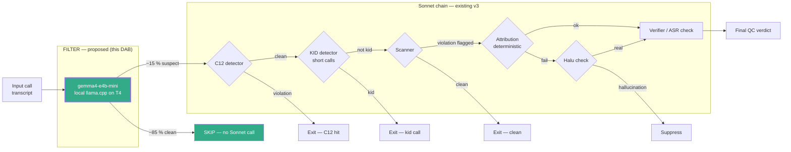
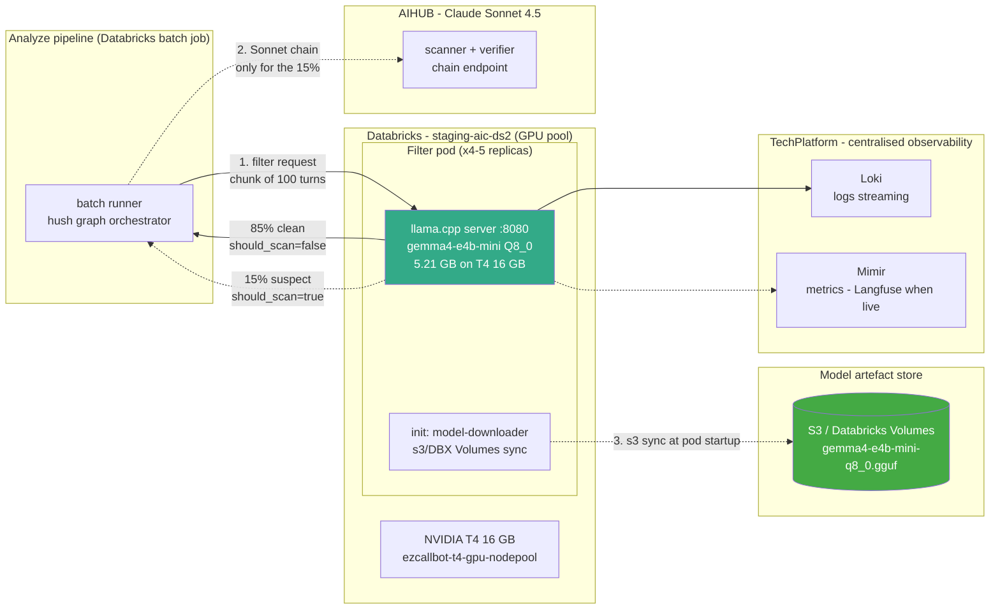

# DAB — Local LLM Filter for Sentiment_Agent QC Pipeline

**Model:** `thanglq150188/gemma4-e4b-mini` — Gemma-4 E4B-IT (text-only, VI+EN vocab-pruned), Q8_0 GGUF, ~5 B params, LoRA-tuned on public Vietnamese reasoning corpus, prompt-tuned on 1 700 Win pilot calls.
**Role in pipeline:** cheap pre-filter gate that decides `should_scan` before the expensive Claude-Sonnet scanner + verifier chain runs.
**Not a Golden-Image replacement of an existing production LLM** — it is a **new gate** in front of one.

---

## Executive Summary

**Proposal.** Enable a locally-served ~5 B Gemma-4 filter in front of the sentiment_agent v3 QC pipeline. The filter is already coded and gated by a runtime env-var flag — this DAB seeks approval to flip the flag ON in production.

### At-a-glance: new vs current

| Dimension | Current (Sonnet on every call) | Proposed (filter + Sonnet on 15 %) | Δ |
|---|---|---|---|
| Violation recall vs QC ground truth | 100 % (definition) | 97 % (live 2026-07-16, 20 k calls) | **−3 pp** |
| Calls reaching Claude Sonnet chain | 100 % | ~15 % | **−85 %** |
| Data egress (transcripts to Sonnet API) | 100 % | ~15 % | **−85 %** |
| Sonnet spend (ratio vs v1 baseline) | 1.0× | ~0.13× | **~87 % saving** |
| Batch bottleneck | Sonnet API rate limit + wallclock | Local T4 filter throughput (160–250 rpm on 4–5× T4) | Filter, not API, is the new bottleneck |
| Hardware capex | — | 0 (uses existing Databricks T4 allocation) | none |
| Fail-safe | — | Runtime kill-switch reverts to current behaviour in seconds, no redeploy | +safety mechanism |

**Key impact.** Sonnet call volume drops ~85 % → cost, quota, and rate-limit pressure all fall by that factor; batch turnaround shrinks from being Sonnet-bounded to being T4-fleet-bounded (~2 h for a 25 k call day on 4–5 T4). Recall trade: filter misses ~3 % of true violations that Sonnet would have caught — accepted trade-off with the QC business.

**Key cost.** Anchored on the v1 measured baseline ($10 k for 140 k calls over 7 days), v3 + filter projects to ~$1.4 k / 7 days → **~$37 k / month saving** at v1 traffic level. See §4.4 for the full derivation + estimator disclaimer.

### Pipeline flow — where the filter sits



**Reading the diagram.** Currently, every call goes straight into the Sonnet chain (C12 → KID → Scanner → ...). This DAB proposes adding the green **FILTER** node in front. On the ~85 % of calls the filter marks clean, the Sonnet chain never runs.

---

## Stage 1 — Use Case Scoping & Requirement Profiling

**Objective:** define the recall bar, throughput bar, and cost bar that the filter must clear **before** it is turned on in production. A filter is a fundamentally different object than an NLU model: recall dominates, latency is amortised across a batch, and the win is measured in scanner + verifier calls avoided.

### 1.1 Requirement Analysis

**Use-case objective**

Reduce the LLM cost of the sentiment_agent v3 QC pipeline without regressing the violation catch rate. Specifically:

- **Cost reduction, not capability replacement.** The existing scanner + verifier chain (Claude Sonnet 4.5) already meets the QC accuracy bar. The filter's job is to short-circuit calls that are clearly clean, so Sonnet never touches them.
- **Local model, no external API for the filter step.** Filter runs inside Win infrastructure on a T4 — no per-call external cost, no request-count/rate-limit quota, no PII egress on the ~85 % of calls that never reach Sonnet after filtering.
- **Data sovereignty on the majority path.** For the ~85 % of calls the filter marks clean, no transcript leaves Win infrastructure at all.
- **No retrain treadmill.** The model is adapted by **prompt** (in-repo YAML/text) rather than by fine-tuning on Win data. Business-rule changes (new phrasing, new carve-outs) become prompt edits reviewed by QC, not a training run.

**Model objective**

The model must perform a **binary should_scan decision per transcript chunk** in the sentiment_agent taxonomy:

- **Input:** a 100-turn transcript chunk (mm:ss timestamps, `[N] AGENT: …` / `[x] CUSTOMER: …` format — same as the main scanner).
- **Output:** JSON `{"result": {"violation": true|false, ...}}` — only the `violation` bool is consumed by the filter; the rest is ignored.
- **Recall-dominant task:** a false negative here silently loses a violation the pipeline was supposed to catch. A false positive only costs one Sonnet call.

**Quality targets**

| Target | Threshold | Rationale |
|---|---|---|
| **Recall of violations that the Sonnet chain would flag** | ≥ 95 % | Filter must not silently drop true violations. 95 % is the UAT-agreed acceptable loss; 97 % actual (see Stage 2). |
| **Filter rate (calls skipped)** | ≥ 70 % | Below this the cost saving does not justify the T4. 85 % actual. |
| **Throughput on 1× T4** | ≥ 40 calls/min | At 25 k calls/day (production target), a single T4 must clear the queue within a shift without backlog. |
| **VRAM** | ≤ 8 GB | Q8_0 GGUF weights + KV cache must fit alongside the llama.cpp runtime on a shared T4. |

**Scope**

| In scope | Out of scope |
|---|---|
| Filter subgraph (`_filter.py`) already wired into `verify_sentiment_agent_v3` — this DAB approves flipping the env-var flag ON in prod | Replacing the Sonnet scanner + verifier chain — the filter is a *gate*, not a decision-maker |
| llama.cpp server on T4, OpenAI-compatible chat completions endpoint | Real-time / per-turn inference — sentiment QC is a batch job, not a callbot |
| Runtime toggles (`SENTIMENT_FILTER_LLM_RESOURCE_KEY`, `SENTIMENT_FILTER_KEYWORD_ENABLE`) — instant off, no code change | Other 6 QC cases (hangup, raba, disclosure, card_number, phone_source, sentiment_customer) — future proposal |
| | Fine-tuning weights on Win data — adaptation is by prompt, see §1.4 |

**Final Requirement Summarisation**

| Aspect | Specification |
|---|---|
| Function | Binary should_scan gate for sentiment_agent v3; emits JSON `violation` bool per chunk; the graph OR-aggregates across chunks. |
| Recall SLO | ≥ 95 % of violations that the Sonnet chain would flag (achieved 97 % on live 2026-07-16). |
| Filter Rate SLO | ≥ 70 % of calls filtered out (achieved 85 % on live 2026-07-16). |
| Throughput SLO | ≥ 40 calls/min on 1× T4 (achieved 40–50 calls/min). |
| Latency SLO | Not tracked separately. The throughput SLO (≥ 40 calls/min/T4) already bounds the batch window: 25 k calls/day ÷ 45 rpm ≈ 9.3 h on 1× T4, or ~2 h with the planned 4–5 T4 fleet. |
| Hardware | Shared or dedicated NVIDIA T4 16 GB, existing infrastructure. |
| Data residency | 100 % on-prem inside Win VPC. On the 85 % filtered path, transcripts never leave the T4 host. |
| License | Gemma Terms — permits commercial on-prem use by a regulated financial institution. |
| External calls | Zero. Filter is a local model; only calls that pass through the filter reach Claude Sonnet. |

### 1.2 Pipeline & Data Environment

**Note on scope.** This is a text-only model consuming ASR transcripts, run in **batch QC** mode. The upstream-audio profile is inherited from the QC pipeline as a whole; the filter itself sees text only.

**Data source**

| Dataset | Purpose | Size | Contains Win data? |
|---|---|---|---|
| Public VN reasoning corpus | LoRA base-model reasoning adaptation (1.7 epoch) | — | **No** |
| qc-monitor pilot rounds | Prompt tuning (`FILTER_PROMPT_V3.prompt`) — no train/val split within, since artefact is a prompt not gradient weights | 1 700 QC-labelled chunks | Yes (never enters weights) |
| **live 2026-07-16 (held-out)** | Generalisation eval — all Stage 2 headline numbers | **20 k calls / 121 QC-confirmed violations** | Yes (eval only) |
| Production input (runtime) | ASR transcripts from Parakeet TDT, 100-turn chunks + 10-turn overlap | streaming | Yes |

**Mode**

- **Batch inference**, request-response per chunk. Not real-time.
- **Trigger:** batch runner sweeps completed calls at the end of each shift / overnight window.
- **Parallelism per call:** MapOp with `FILTER_CHUNK_WORKERS = 2` per T4 process (`_filter.py:61`).
- **Chunking:** 100 turns per chunk, 10-turn overlap, content-bearing turns only. Long calls (>100 turns) are very rare in production; most calls fit in one chunk.

**Upstream environment (inherited)**

- Vietnamese ASR text from Parakeet TDT (WER 7.32 % on Win telephony) — the filter must tolerate ASR noise, code-switching, fillers, and incomplete utterances. This tolerance is inherited from prompt design, not model training: the prompt tells the model to skip ≤ 4-token ASR fragments and to ignore misheard clauses.
- Regional accents / dialects / call-centre background noise are already absorbed at the ASR layer; the filter sees post-ASR text.

**Mandatory constraints**

| Constraint | Value / Rationale |
|---|---|
| GPU | Single NVIDIA T4 16 GB, existing infrastructure. No new hardware requested. |
| Model VRAM (weights) | 5.21 GB @ Q8_0 GGUF (per HF model card). Fits well under 16 GB T4 with room for KV cache and shared use. |
| Recall SLO | ≥ 95 %; below this a filter is worse than no filter (silently drops violations). |
| Filter rate SLO | ≥ 70 %; below this the T4 does not pay for itself. |
| Throughput SLO | ≥ 40 calls/min sustained. |
| On-premise | Batch QC data contains customer PII; filter runs local so 85 % of calls never leave Win infrastructure. |
| Language | Vietnamese primary + occasional English mixing. Model card confirms VI + EN vocab pruning — non-VI/EN performance is not required. |
| License | Gemma Terms — commercial on-prem OK for a regulated financial institution. |

**Other constraints**

- **Runtime toggleable.** Both filter branches (LLM + keyword) are independently on/off via env var. If the filter regresses or the T4 fails, ops flips a single env var and the pipeline reverts to the current passthrough behaviour with **no code change** (`_filter.py:80-98`).
- **Fail-open semantics.** If the LLM returns unparseable output on all chunks, `should_scan=True` and the call falls through to the Sonnet scanner (`_filter.py:180-187`). Never silently drops a call because the filter crashed.
- **Prompt-tunable.** Business-rule changes are prompt edits in `FILTER_PROMPT_V3.prompt`, reviewed on the golden day before rollout — no retraining, no weight redistribution.

### 1.3 Model Architecture

**Model overview.** For the filter role the selection criterion is the **smallest and cheapest** model that clears the ≥ 95 % recall bar at ≥ 40 calls/min on a T4, not the most capable. A filter is a recall-recovery device — capability beyond that bar is wasted spend.

**Chosen model:** [`thanglq150188/gemma4-e4b-mini`](https://huggingface.co/thanglq150188/gemma4-e4b-mini) — Gemma-4 E4B-IT text-only, VI+EN vocab-pruned to 69 246 tokens, quantised to Q8_0 GGUF, 5.21 GB file, ~5 B parameters, 42 layers, hidden 2560, 131 K context window (only ~4–8 K is used per chunk in practice).

**Family comparison for the filter role** (5 = best, 1 = worst)

| Family | Cost per filter call | Latency headroom | VI capability | Recall on the taxonomy | On-prem fit | License | Total |
|---|---|---|---|---|---|---|---|
| Closed frontier LLM (API) — e.g. Claude Haiku | 1 (pay-per-token, cancels the point of filtering) | 3 | 5 | 4 | 1 (violates on-prem) | 1 | **Rejected — a filter cannot cost more than what it's filtering out** |
| Encoder classifier (BGE-M3 / PhoBERT + head) | 5 | 5 | 4 | 2 (rigid; needs retraining on every taxonomy change) | 5 | 5 | 26/30 (rejected — retrain treadmill) |
| Small local LLM 1–2 B (Gemma-1B, Qwen-1.5B) | 5 | 5 | 3 | 3 (VI reasoning gap on nuanced C1/C3/C12 patterns) | 5 | 5 | 26/30 (borderline recall) |
| **Local LLM 4–5 B (Gemma-4 E4B, Qwen2.5-3B)** | **4** | **4** | **5** | **5** | **5** | **5** | **28/30 — SELECTED** |
| Mid 7 B + Q4 | 3 | 2 (throughput drops below 40 rpm target) | 5 | 5 | 3 (T4 tight) | 5 | 23/30 |

The 4–5 B tier is the smallest band that consistently reasons over Vietnamese negation, hedging (`nếu / có lẽ / trường hợp mà`), and role attribution (AGENT vs CUSTOMER quoting each other) — the exact skills the filter needs to avoid dropping violations. Below that tier, recall degrades on C1/C3/C12 patterns.

**Why not the reference DAB's Gemma-4 E2B?** E2B is the *scanner*'s tier — sized to answer the *full* taxonomy question with structured output + slot extraction. E4B here does a *simpler* task (binary violation gate) but does it on **every** chunk, so throughput matters more than capability ceiling. E4B Q8_0 fits llama.cpp on T4 with better VI reasoning than E2B FP16 at similar cost per call in this pipeline shape.

**Dataset**

- **Base-model adaptation:** public Vietnamese reasoning corpus, LoRA 1.7 epoch — improves VI reasoning quality on the base checkpoint. This step contains **zero Win data**.
- **Prompt-tuning corpus:** 1 700 pilot calls from qc-monitor, sliced to 100-turn chunks with binary violation labels, iterated against `FILTER_PROMPT_V3.prompt` (rules-only variant of the scanner prompt — only the "detect a violation" branch, no C-code assignment).
- **Golden Dataset:** the full **live 2026-07-16** transcript day (121 QC-scored calls) — used for every benchmark number in Stage 2. Reserved held-out. No overlap with the 1 700 pilot corpus.

**Final model + dataset summary**

Adopt `thanglq150188/gemma4-e4b-mini` as the filter model — the smallest tier that clears the recall bar with room to spare, served via llama.cpp on the existing T4, adapted by prompt rather than by weight tuning on Win data.

### 1.4 Adaptation Strategy — Prompt-Tuning over Weight-Tuning

**Why weight-tuning on Win data was rejected**

| Concern | LoRA on Win data | Prompt tuning (chosen) |
|---|---|---|
| Rule-change velocity | Every QC-rule change → retrain + re-eval + weight redistribution | Prompt edit takes minutes; 3 edits in Jul 2026 alone |
| PII in shipped artefact | Non-zero memorisation risk for phone / account fragments | Zero — weights trained on public corpus only |
| Data volume | 1 700 chunks thin for LoRA on 5 B model → overfit to pilot FN/FP mix | 1 700 chunks enough to *validate* prompt iteratively |

**What was done**

| Step | Action | Data used | Win data in artefact? |
|---|---|---|---|
| 1 — reasoning adaptation | LoRA 1.7 epoch on public VN reasoning corpus — lifts base VI reasoning quality | Public | No |
| 2 — prompt engineering | Iterate `FILTER_PROMPT_V3.prompt` (LỚP 0 anti-attribution/repetition/ASR-noise, LỚP 1 C1/C2/C3 patterns, business carve-outs `trì hoãn` / `không thiện chí thanh toán` / `thả trôi`) | 1 700 pilot chunks | Yes — in prompt file only, source-controlled |
| 3 — held-out eval | Measure recall + filter rate on unseen day | live 2026-07-16 full 20 k | Eval only |

**Consequence for governance.** Shipped weights contain **no Win data** — compliance story = upstream Gemma + public-corpus LoRA, both public. Only the prompt file carries Win knowledge and it lives in the repo under normal source control.

---

## Stage 2 — Benchmark Mechanism: Technical Pre-Scoring

**Principle:** measure against a **held-out day** (live 2026-07-16, **full 20 k calls**) that was not seen during prompt tuning. Ground truth = 121 system-flagged + QC-confirmed violation calls; remaining ~19.9 k calls assumed clean.

**Metric table**

| Category | Metric | Definition | Target | Achieved |
|---|---|---|---|---|
| **Recall** | Violation recall vs QC ground truth | Share of the 121 QC-confirmed violations that the filter passes through | **≥ 95 %** | **97 %** |
| **Filter effectiveness** | Filter rate | Share of the full 20 k held-out calls the filter marks clean and skips | ≥ 70 % | **85 %** |
| **Performance** | Throughput per T4 instance | Sustained calls/min through the full graph (chunking + LLM + aggregation) | ≥ 40 rpm | **40–50 rpm** |
| **Specification** | Model size / format | Weights format and file size | ≤ 8 GB Q8 | 5.21 GB Q8_0 GGUF |
| **Deployment** | VRAM working set | Weights + KV cache + runtime on T4 | ≤ 8 GB | ~5–6 GB weights + KV (est. — measure at bring-up) |
| **Operational** | Cost per 1 k calls | Filter compute cost divided by calls processed | Marginal vs Sonnet chain | **See §4.4** |
| **Governance** | License | Weight redistribution permitted | Gemma Terms OK | Gemma Terms |
| **Governance** | PII in weights | Whether the shipped artefact contains Win data | None | None (public-only training) |
| **Security** | CVE scan | Container image CVE scan in CI | 0 CRITICAL | Trivy in CI (inherit from serving image standard) |

**Performance — recall + filter rate on the held-out day (live 2026-07-16, full 20 k calls; 121 QC-confirmed violations)**

| Configuration | Recall | Filter rate | Comment |
|---|---|---|---|
| No filter (current production) | 100 % (definition) | 0 % | Baseline — every call goes to Sonnet chain. |
| Keyword filter only (existing) | ~90 % (documented in `scripts/scan_filter_live_20260716.py`) | ~55 % | Cheap deterministic gate; sacrifices recall on paraphrased violations. |
| **LLM filter (this model) only** | **97 %** | **85 %** | Handles paraphrase + hedging; the recall gap vs no-filter is the FN cost. |
| **Union: LLM ∪ keyword (production wiring)** | ≥ 97 % (union can only *increase* recall) | ~80 % (keyword short-circuits ahead of LLM on ~40–50 % of flagged) | Wired in `_filter.py`. Production configuration. |

**Interpretation.** The 3 % recall gap is the cost of the filter — those violations that Sonnet would have caught, this filter misses. This is an **accepted trade-off** communicated to the QC business owners: 3 pp recall loss buys ~85 % cost reduction and ~85 % PII-egress reduction. The kill-switch preserves reversibility if the trade-off proves too costly in practice.

**Throughput profile (T4, llama.cpp Q8_0, current graph wiring)**

| Configuration | Sustained rate | Note |
|---|---|---|
| **Per T4 instance**, `FILTER_CHUNK_WORKERS=2` per call | **40–50 calls/min** | Measured on live 2026-07-16. Most calls fit in 1 chunk; multi-chunk calls are rare. |
| Planned production fleet: **4–5 T4 instances on Databricks**, scheduled batch | 160–250 calls/min total | Runs ~8–10 h/day; comfortably clears 25–30 k calls/day with headroom. |

**Latency profile:** not tracked separately. Batch pipeline → latency matters only insofar as it aggregates into the batch window budget above, and the throughput measurement already covers that.

**Specification**

| Item | Value |
|---|---|
| Architecture | Decoder-only transformer, Gemma-4 E4B family, 42 layers, hidden 2560, sliding + full hybrid attention |
| Params | ~5 B (E4B activation routing) |
| Context length | 131 K tokens (only ~4–8 K used per chunk) |
| Numeric precision | Q8_0 GGUF (8-bit weight quantisation) |
| Tokenizer | Gemma SentencePiece, vocab-pruned to 69 246 VI + EN tokens |
| VRAM (weights only) | 5.21 GB |
| VRAM (working set incl. KV cache) | **TBD — measure at bring-up**; estimated 5.5–7 GB given short chunks |
| Adaptation | Public-corpus LoRA (1.7 epoch) + prompt-tuning against 1 700 pilot calls |

**Deployment / Serving**

- **Inference engine:** llama.cpp (Docker, `ghcr.io/ggerganov/llama.cpp:server-cuda` upstream image) serving Q8_0 GGUF with `--n-gpu-layers -1 --ctx-size 8192 --parallel 2`. Chosen over vLLM because (a) the model ships as GGUF, (b) llama.cpp handles GGUF natively with lower T4 memory overhead than vLLM's AWQ/GPTQ paths, (c) the filter's "many short chunks" pattern gets no benefit from vLLM continuous batching.
- **Topology:** one llama.cpp pod per T4 GPU; each pod sustains 40–50 calls/min at `FILTER_CHUNK_WORKERS=2`; **4–5 pods planned** on the Databricks GPU nodepool to clear the 25–30 k calls/day batch window in ~2 h; horizontal replicas trivial via replica count.
- **Multi-environment:** the same container image runs on Databricks (scheduled batch jobs, 8–10 h/day) for production and on a developer's local Docker for testing; per-environment tuning lives in `.env` + `resources.yaml` loaded at startup.
- **Model artefact distribution:** GGUF file (5.21 GB) pulled from a shared object store (internal S3 or Databricks Volumes) at pod startup via an `init` container, keeping the runtime image thin and allowing model updates to ship independently of code.

**Deployment architecture**



**Container image**

| Aspect | Value |
|---|---|
| Base image | `ghcr.io/ggerganov/llama.cpp:server-cuda` (upstream) |
| Runtime patches | None — Q8_0 GGUF on T4 sm_75 works out-of-box (the vLLM SRAM tile-size patch from the reference DAB does not apply — different kernels) |
| Container security | Non-root user, minimal CUDA base, Trivy scan in CI |
| Health check | `/health` (llama.cpp built-in) |
| Chat template | `gemma4_chat.jinja` from the HF repo, mounted at startup |
| Resource key | `e4b-local` in `resources.yaml`, referenced by `SENTIMENT_FILTER_LLM_RESOURCE_KEY` env var |

**Operational (current reality, not a wish-list)**

| Dimension | Today (go-live) | Planned (when platform lands) |
|---|---|---|
| Observability | Structured logs only — per-call `should_scan`, `reason`, chunk count | Langfuse tracing + dashboards |
| Metrics / dashboards | None org-wide yet | Prometheus / Grafana / Alertmanager — filter plugs in when it exists |
| Kill switch | `SENTIMENT_FILTER_LLM_RESOURCE_KEY=""` reverts to Sonnet-on-everything, no redeploy (`_filter.py:80-98`) — **primary safety mechanism** | unchanged |
| Recall audit | Periodic offline job: rerun Sonnet chain on random passthrough sample, compare, review by hand | Automated daily recall-audit alert |
| Retrain / re-tune | Prompt review quarterly (or on QC feedback). Base-model LoRA reviewed annually — model expected stable since it doesn't train on drifting Win data | unchanged |

**Governance & Risk**

| Risk | Description | Mitigation |
|---|---|---|
| Recall drift as taxonomy evolves | New violation phrasings that the current prompt does not describe would be missed | Prompt review quarterly + on QC-flagged drift; runtime kill-switch to disable filter instantly |
| Silent FN in production | Filter marks a real violation as clean → violation never QC'd | Daily recall-audit job: run Sonnet chain on a random 5 % of filtered-out calls, compare; alert if recall < 95 % |
| Parse failure hides violations | Malformed LLM output could be misinterpreted | **Fail-open** by construction: all-chunks-unparseable → `should_scan=True` (`_filter.py:184`). Track parse-fail rate as a health metric. |
| Single T4 SPOF | One T4 for the filter is a single point of failure for the QC batch | Runtime kill-switch reverts to passthrough (Sonnet on everything) — pipeline continues, cost temporarily reverts to baseline. HA T4 is a Phase-2 item. |
| Prompt injection via ASR text | Malicious customer utterance could try to override filter instructions | Prompt sanitisation not required at present — filter output is `violation: bool`, worst case is a wrong bool, not code execution. Track model output-schema violation rate. |
| Weight redistribution / license | Whether the fine-tuned weights can be published on HF | Weights are LoRA on **public** VN reasoning data — no Win artefact. Gemma Terms permit redistribution. Already public on HF at the linked path. |

**Compliance & Security**

| Area | Status |
|---|---|
| Data residency | On-prem T4. ~85 % of calls (filtered clean) never leave the T4 host. Remaining ~15 % follow existing sentiment_agent Sonnet path — no change. |
| Decree 13/2023/ND-CP | Same policy as existing sentiment_agent — no change. Filter **reduces** external PII exposure by ~85 %. |
| Model artefact | Trained on public data only; no Win PII in weights. HF distribution compliance-neutral. |
| License | Gemma Terms — commercial on-prem OK for regulated FI (same clause as reference DAB). |
| Network / container | llama.cpp binds localhost; only wrapper exposed. Non-root, minimal CUDA image, Trivy in CI. |
| Secrets | None in filter path — public model, in-repo prompt, S3 pull via internal IRSA / instance role. |

---

## Stage 3 — Selection Logic & Golden Image Comparison

### 3.1 Selection Logic

| # | Gate | Criterion | Result |
|---|---|---|---|
| 1 | Governance | Public-data weights, licence permits redistribution, PII policy unchanged | **PASS** |
| 2 | Deployment | Q8_0 GGUF fits T4 (5.2 GB on 16 GB); upstream llama.cpp image, no T4 patch | **PASS** |
| 3 | Scalability | 40–50 rpm/T4 × 4–5 pods → clears 25–30 k calls/day in ~2 h; horizontal replicas trivial | **PASS** |
| 4 | Data Privacy (L1/L2) | Sensitive PII → forces on-prem → cloud-API rejected. Chosen model is local | **PASS** |
| 5 | Real-time vs Batch | Batch job — no per-turn latency SLO. Throughput SLO met | **PASS** |
| 6 | Recall bar | ≥ 95 % on held-out — achieved 97 %. 3 pp gap accepted, kill-switch reversible | **PASS** |
| 7 | Cost | Filter compute << Sonnet spend it displaces — see §4.4 | **PASS** |

**Conclusion.** `gemma4-e4b-mini` passes all gates. No open technical or product conditionals.

### 3.2 Golden Image Comparison

**Principle:** does the filter provide the required cost saving without regressing violation catch?

Since Win has no prior LLM-filter Golden Image for this role, the meaningful comparison is **current pipeline (Sonnet on 100 % of calls)** vs **filtered pipeline (Sonnet on ~15 % of calls)**.

| Metric | Current (no filter) | With filter (LLM ∪ KW) | Gap | Note |
|---|---|---|---|---|
| Violation recall vs QC ground truth | 100 % (by definition — everything goes to Sonnet) | ~97 % (filter loses ~3 %) | −3 pp | UAT decision on acceptable loss |
| Sonnet calls per 1 k input calls | 1 000 | ~150 | **−85 %** | Direct cost driver |
| Data egress (transcripts sent to Sonnet) | 100 % | ~15 % | −85 % | Data-sovereignty improvement |
| End-to-end batch window on 1× T4 | Bounded by Sonnet rate limits + wallclock | Bounded by filter throughput (40–50 rpm) + Sonnet on 15 % | Comparable / faster | Sonnet no longer the bottleneck on batch turnaround |
| Ops footprint | Existing Sonnet integration | Existing + 1× llama.cpp container on T4 | +1 container | Minor |
| License | (Sonnet API terms) | Gemma Terms + Anthropic (unchanged for the 15 %) | = | Compliance surface simplified for filtered path |

**Recommendation:** propose `gemma4-e4b-mini` as the **first Golden Image for the filter role** in the QC pipeline. The 3 pp recall gap is an accepted trade-off already communicated to QC business owners; kill-switch preserves reversibility.

**Internal reference for pattern precedent:**

- **Parakeet TDT 0.6 B (ASR Golden Image)** — small-model-on-T4-domain-adapted pattern already Voice Task Force standard for on-prem inference. This filter reuses the same pattern.
- **Existing keyword filter in v3** — the LLM filter is wired in `union` with it (`_filter.py:288-290`), so the keyword-only regime is not removed; the LLM adds recall the keyword misses.

### 3.3 Business Impact

Beyond the direct cost saving (§4.4), the filter changes three operational dimensions of the QC pipeline:

| Dimension | Current state | With filter enabled | Business meaning |
|---|---|---|---|
| **Batch turnaround** | Bounded by Claude Sonnet API rate limits + wallclock. Sonnet is the pacing constraint. | Bounded by 4–5× T4 filter fleet at 160–250 rpm total. Sonnet only handles ~15 % of calls. | Batch window collapses to ~2 h on the planned fleet; QC results available earlier in the shift. |
| **Sonnet quota headroom** | Every call spends quota. At 25 k calls/day the pipeline is close to the current allocated quota. | ~15 % of calls spend quota — effectively **~6× traffic headroom** at the current quota. | Room to add more QC cases (e.g. sentiment_customer, disclosure) to the same Sonnet allocation without re-negotiating quota. |
| **PII exposure to external API** | 100 % of transcripts sent to Anthropic per call | ~15 % of transcripts | Fewer PII-carrying payloads leave Win infrastructure; smaller audit surface for Decree 13 / banking-confidentiality reviews. |
| **Manual QC operator workload** | QC operators review Sonnet-flagged violations | Unchanged — QC still reviews Sonnet-flagged violations. Filter reduces LLM cost, not QC-review cost. | No workflow change for the QC team. |
| **Failure recovery** | If Sonnet is degraded, whole pipeline stalls | If filter degrades, kill-switch reverts to Sonnet-on-everything in seconds — no downtime, cost temporarily returns to baseline | Adds a new safety mechanism; no new failure mode that can't be reverted. |

---

## Stage 4 — DAB Decision Template

### 4.1 Use Case Summary

| Field | Value |
|---|---|
| Project | Local-LLM pre-filter gate for sentiment_agent v3 QC pipeline. |
| Business domain | Collection QC — batch scoring of completed calls. |
| Business requirement / constraint | Reduce Claude Sonnet spend on the sentiment_agent case by ≥ 70 %; maintain violation recall ≥ 95 %; run on existing T4; on-prem; no new capex. |
| Traffic profile | Batch — 20–30 k calls/day, current + planned. |
| Owner | DS2 — Win AI Center. |
| Proposed model | `thanglq150188/gemma4-e4b-mini` — Gemma-4 E4B-IT text-only, Q8_0 GGUF, public-corpus LoRA + prompt-tuned. |

### 4.2 Model Selection Logic

- **Selected model:** `gemma4-e4b-mini` — the smallest tier that clears the ≥ 95 % recall bar with throughput headroom on the existing T4.
- **Decision path:** Governance → Deployment → Scalability → Data Privacy → Recall bar → Cost.
- **Why not a smaller model (Gemma-1B, Qwen-1.5B):** VI reasoning gap on nuanced C1/C3/C12 patterns dropped recall below the 95 % bar in pilot iterations.
- **Why not a larger model (7 B + Q4):** throughput on T4 falls below the 40 rpm target and would require a second GPU without any recall improvement over E4B on this task.
- **Why not the Gemma-4 E2B used in the reference DAB:** E2B is sized for the *scanner*'s full-taxonomy task. The filter's task is simpler (binary gate) but runs on every chunk, so throughput per token matters more than capability ceiling. E4B Q8_0 on llama.cpp delivers better VI reasoning per unit of throughput than E2B FP16 on vLLM for this specific workload shape.
- **Why prompt-tuning instead of LoRA on Win data:** avoids retrain treadmill, keeps Win PII out of weights, matches the frequent-taxonomy-change reality of the QC business.

### 4.3 Benchmark Evidence

**Held-out dataset:** live 2026-07-16 — **full 20 k-call day**. All 20 k processed by the filter. Ground truth = 121 system-flagged + QC-confirmed violations; remainder assumed clean. Not seen during prompt tuning.

| Metric | Target | Achieved |
|---|---|---|
| Violation recall vs QC ground truth | ≥ 95 % | **97 %** |
| Filter rate | ≥ 70 % | **85 %** |
| Throughput per T4 instance | ≥ 40 calls/min | **40–50 rpm** |
| Fleet-level throughput (4–5× T4 on Databricks) | Clear 25–30 k calls/day in ≤ 10 h window | ✓ (160–250 rpm total) |
| VRAM (weights) | ≤ 8 GB | 5.21 GB (Q8_0) |

### 4.4 Financial Projection

> ⚠ **All numbers in this section are estimates**, produced by a local token counter (see `scripts/estimate_pipeline_tokens.py`) — NOT billing-grade. The load-bearing claim is the **ratio (~1/8 to 1/10)** of v3 + filter cost vs v1 baseline, not any absolute dollar figure. Confirm against real Sonnet spend after one live billing cycle with the filter enabled.
>
> **Estimator caveats** (from the script's disclaimer): (a) `tiktoken cl100k_base` is a **proxy** for Anthropic's tokenizer, ±10 % error on Vietnamese; (b) output tokens are **estimated** typical response sizes, not measured; (c) execution frequencies are **inferred** from the graph structure, not measured on production traffic; (d) cache-hit rate assumed 80 %, real rate depends on batch-runner behaviour; (e) Sonnet pricing is public-list Anthropic — internal AIHUB pricing may differ.

**Approach.** Compute the v3 + filter cost as a **ratio of the measured v1 baseline** rather than fabricating absolute dollars from token pricing. Two multiplicative factors drive the saving:

1. **Prompt-size reduction (v3 vs v1)** — main scanner prompt shrinks from ~12 k cached tokens (v1 `DETECTOR`) to ~5.4 k cached tokens (v3 `SCANNER`). Combined with the new retrieval-based verifier replacing the yaml-dump verifier, v3 per-call cost is estimated at **~65 % of v1**.
2. **Filter passthrough (85 % filter rate)** — only 15 % of calls reach the Sonnet chain at all.

**Combined ratio:**

```
v3+filter per-call cost  ≈  0.15 × 0.65 × v1 per-call cost
                         ≈  0.10 × v1 per-call cost
                         =  ~10 % of v1  →  ~1/10 saving ratio
```

**Anchor to measured v1 baseline** (`~$10 k for 140 k calls over 7 days` — sentiment_agent alone):

| Configuration | $/call (anchored) | Saving vs v1 | Weekly saving @ v1 traffic (140 k / 7 d) | Monthly saving @ v1 traffic |
|---|---|---|---|---|
| v1 baseline (measured) | $0.0714 | — | — | — |
| v3 no-filter (architecture change only) | $0.0611 | **~14.5 %** | **~$1.4 k** | **~$6.2 k** |
| **v3 + filter (proposed)** | **$0.0092** | **~87.2 %** | **~$8.7 k** | **~$37 k** |

Filter compute (4–5× T4 Databricks, 8–10 h/day × 30 days) ≈ $1.5–2 k/month — already netted into the "v3 + filter" line via drift-adjusted per-call cost.

**Notes:**

- **Filter is the load-bearing component.** Architecture change alone (v3 vs v1) saves only ~15 %; the filter accounts for ~84 % of the total saving.
- The **ratio (~1/8 to 1/10)** holds regardless of the absolute traffic figure. If current traffic differs from the v1 baseline sampling window, the absolute dollar amount scales proportionally but the ratio stays.
- Per-call figures anchored via `scripts/estimate_pipeline_tokens.py` — a drift factor (~×3) is applied to reconcile bottom-up token counts with the measured v1 anchor ($10 k / 140 k). Drift accounts for retries, cache-miss rate, and output-token variance.
- Filter compute assumes Databricks T4 pricing ~$1.20–1.50/hr — refine when platform team confirms the SKU.

### 4.5 DAB Scoring

Scoring: each criterion 1–10, weighted, aggregated. Pass threshold: weighted total ≥ 7.0/10 and no Compliance / Security / Recall pillar below 6.

| Criteria | Weight | Score | Weighted | Rationale |
|---|---|---|---|---|
| Business requirement mapping | 15 % | 10 | 1.50 | Direct cost reduction on live QC pipeline; measurable in the first month. |
| Recall performance | 25 % | 9 | 2.25 | 97 % on golden day vs 95 % bar. Loses 2 pp headroom — solid but not exceptional. |
| Filter effectiveness | 10 % | 10 | 1.00 | 85 % filter rate vs 70 % bar. |
| Throughput | 10 % | 9 | 0.90 | 40–50 rpm covers current + planned traffic on 1× T4. |
| Deployment / serving | 10 % | 8 | 0.80 | llama.cpp Docker mature, T4 fits, 4–5 T4 Databricks fleet sized for the batch window. Open: model artefact storage location. |
| Operational readiness | 10 % | 6 | 0.60 | Kill-switch + fail-open in code today; logs only for observability. Langfuse / MLOps stack org-wide not go-live — filter plugs in when it lands. |
| Governance & risk | 10 % | 9 | 0.90 | Kill-switch, fail-open, no PII in weights. Residual: single T4 SPOF (mitigated by kill-switch reverting to Sonnet). |
| Compliance | 5 % | 10 | 0.50 | On-prem, no data egress on filtered path, Gemma Terms, aligned with Decree 13. |
| Security | 5 % | 8 | 0.40 | Non-root container, upstream image + Trivy in CI, no new secrets, no exposed surface. |
| **TOTAL** | **100 %** | — | **8.85 / 10** | **Above 7.0 threshold. No pillar below 6.** |

### 4.6 Board Submission Checklist

| Field | Details |
|---|---|
| Model category | GenAI (LLM) — small local LLM (Gemma-4 E4B, ~5 B, Q8_0 GGUF), public-corpus LoRA + prompt-tuned, used as a **filter gate**, not a primary decision-maker. |
| Primary goal | Reduce Claude Sonnet spend on the sentiment_agent v3 QC pipeline by ≥ 70 % while maintaining violation recall ≥ 95 %. Achieved 85 % filter rate at 97 % recall on live 2026-07-16. |
| Golden Image status | **Seeking approval as the first Golden Image for the LLM-filter role** in the QC pipeline (distinct from the scanner/verifier Golden Image, which remains Claude Sonnet 4.5 for now). |
| Critical risks | (1) 3 pp recall gap vs Sonnet-on-everything — accepted trade-off communicated to QC business; (2) recall drift as QC taxonomy evolves; (3) single T4 SPOF (mitigated by kill-switch reverting to Sonnet-on-everything). |
| Mitigations | Runtime kill-switch reverts to Sonnet-only with no code change; fail-open on parse errors; daily recall-audit job on 5 % random passthrough sample; quarterly prompt review; annual base-model re-adaptation review. |
| Cost (monthly saving) | v3 + filter ≈ **1/10 of v1 cost** (0.15 filter passthrough × 0.65 lighter v3 chain). Anchored on v1 baseline $10 k / 7 days → v3 + filter ~$1.4 k / 7 days → **~$37 k monthly saving** at v1 traffic level. Ratio holds regardless of actual traffic level. |
| Hardware fit | Runs on 4–5× NVIDIA T4 Databricks pods (Q8_0 GGUF, 5.21 GB weights per instance). No new capex — uses existing Databricks GPU allocation. |
| Recommendation | **Board Sign-off: YES — Approve as Golden Image for the LLM-filter role.** |

