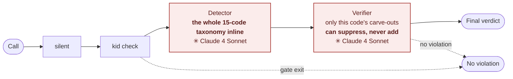
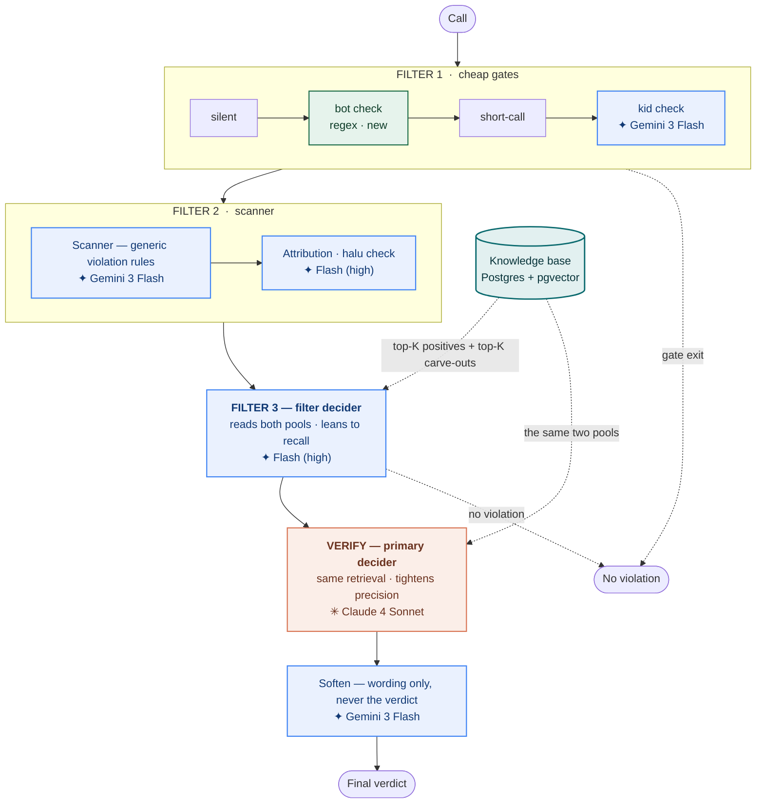
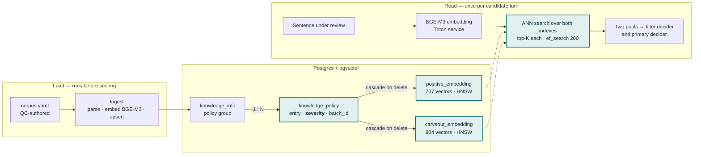
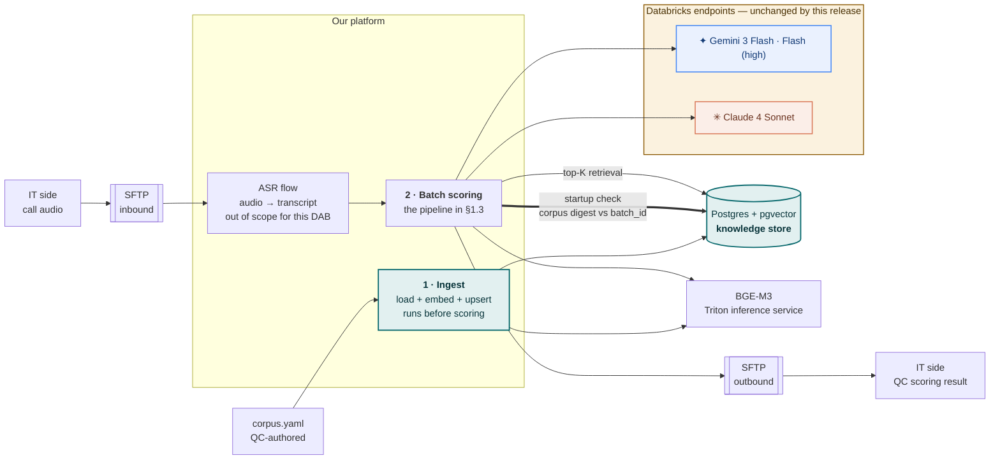

# DAB — Virtual QC on Agent Sentiment (version 2)

**Release scope:** the `sentiment_agent` case — the **Agent Attitude** QC criterion. The six other QC cases are unchanged and out of scope.

**Objective:** replace a single-step decision path with a layered architecture that retrieves the relevant policy before deciding, and move the policy corpus out of the software package into a shared database.

**Evidence:** UAT of 21–25 Aug 2026 — **334 calls**, scored on both environments in parallel and adjudicated by QC. False alarms **177 → 68**; missed violations **53 → 20**. Both down 62 %.

**Recommendation:** **approve go-live**, subject to one condition — written confirmation from the consuming system on the new `Warning` severity value (§3.1, gate 5).

## Stage 1 — Use Case, Architecture, Scope

### 1.1 The problem
Win's collection agents place **15,000–30,000 calls on a working day**. Every one is subject to QC on seven criteria; **Agent Attitude** is the one this pipeline scores. Manual review reaches only a small fraction of that volume, so the system screens every call and hands QC a shortlist to adjudicate.

The system does not replace QC judgement. It decides **what QC spends its time on** — which makes the quality of the shortlist the business metric, not the model's internal accuracy.

**The judgement is context-dependent, not keyword-detectable.** Two pairs taken verbatim from the policy corpus, each pair one word apart:

| Sample | Verdict | Corpus |
|---|---|---|
| `anh chị bình tĩnh trao đổi được không` | not a violation | carve-out, `tich_cuc` |
| `anh có trao đổi lịch sự được không ạ` | **violation** | positive, `warning` |
| `nếu như anh không trao đổi lịch sự thì em xin phép ngắt máy` | not a violation | carve-out, `tich_cuc` |
| `nếu mà anh bất lịch sự thì em xin phép ngắt máy` | **violation** | positive, `warning` |

Steering the customer to stay calm is permitted; asking whether they can be *polite* questions their manners — and the trailing politeness particle `ạ` does not exempt it. In the second pair, `không lịch sự` states a condition for ending the call while `bất lịch sự` puts a label on the person.

**The rulebook is large and it keeps moving.** QC maintains **919 policy entries across 81 categories**, expanded into **1,611 phrase variants**:

| | Entries | Variants |
|---|---|---|
| Violation examples | 421 | 707 |
| Carve-outs — explicitly *not* violations | 498 | 904 |
| **Total** | **919** | **1,611** |

Carve-outs outnumber violation examples. Most of the business effort goes into stating what is **not** a violation, which is exactly the knowledge a keyword or single-prompt approach cannot hold.

**The cost of each failure mode is asymmetric:**

| Failure mode | Who absorbs it | Why it matters |
|---|---|---|
| **False alarm** — a clean call is flagged | QC reviewer, then the agent | Review time spent on nothing. If it survives review, an agent is penalised for a violation that did not occur |
| **Missed violation** — a real one passes silently | The bank | Compliance exposure. Unlike a false alarm, a miss **produces no signal** — no queue entry, no record, nothing to review later |

**The business problem.** On the current production pipeline roughly **one in five** flagged calls is a real violation, and QC adjudication found **53 missed violations in 334 calls**. QC absorbs the first as spent review capacity; the bank carries the second as unquantified exposure. Both trace to the same architectural cause — §1.2. Separately, the policy knowledge ships inside the software package, so a QC wording change waits on a release cycle.

### 1.2 Production today — one prompt, the whole rulebook pasted in

What runs on live is prompt engineering: there is no retrieval anywhere in the flow, the knowledge is text inside the prompt, and every stage runs on **Claude 4 Sonnet**. The shortfall is therefore not a question of model tier — production already uses the strongest model available at every step.

The **detector** is a single prompt carrying the whole taxonomy inline — fifteen codes, each with its list of trigger phrases — and it makes the decision. The **verifier** is a second pass that runs only when the detector has flagged something. It receives the detector's code, that code's one-line name, the quoted turn, a window of surrounding turns, and the exception clauses **filed under that one code** — twenty-nine clauses across the fifteen codes, three of which have none at all. Twenty-five of the twenty-nine are carve-outs; the remaining four are keep-rules that forbid suppression on a literal phrase. What the verifier never receives is the policy that defines the violation: the trigger-phrase list for each code exists only in the detector prompt. The verifier is therefore not a second opinion on whether the turn is a violation — it can only ask whether this particular flag should be cancelled. Two limitations follow, both **structural** rather than a shortfall of tuning:

1. **Carve-outs are reached through a label, not through the wording.** Which exceptions the verifier sees is decided by the code the detector assigned. A turn filed under the wrong code never meets the carve-out that would have cleared it, however closely it matches. The rulebook is consulted through a fifteen-way classification rather than against the sentence under review — precisely the failure the pairs in §1.1 illustrate, and the direct cause of the false-alarm rate in §2.2.
2. **Nothing can recover a miss.** The verifier can only suppress a flag, never add one, and it is bypassed entirely when the quoted turn matches one of a fixed list of keyword phrases. A violation the detector does not flag leaves no record, and no later stage can catch it.

### 1.3 Proposed architecture — three filter layers, then one verification pass

Each layer removes candidates the next would otherwise have to judge. The naming matters: **the filter decider is a filter, not the classifier.** Its prompt leans to recall — it would rather pass a doubtful case on than drop it. Precision is won one stage later, in the **primary decider**, which re-tests the same candidate against the same retrieved evidence on a stronger model.

| Layer | Stage | Responsibility | Model |
|---|---|---|---|
| **Filter 1** | silent · bot check · short-call | Cheap deterministic exits | — |
| | kid check | Customer is a child → skip | Gemini 3 Flash |
| **Filter 2** | Scanner | Generic violation rules; sweeps the transcript, returns candidate turns. Does not conclude | Gemini 3 Flash |
| | Attribution · halu check | The quoted turn must belong to the agent and exist in the transcript | Gemini 3 Flash (high) |
| **Filter 3** | **Filter decider** | Reads top-K violation examples + top-K carve-outs + taxonomy in one pass. **Recall-leaning** | Gemini 3 Flash (high) |
| **Verify** | **Primary decider** | Same retrieval, stricter test, stronger model. **Tightens precision** — clears flags the filter decider let through | Claude 4 Sonnet |
| **Wording** | Soften | Rewrites the reason for the business reader. Never changes the verdict | Gemini 3 Flash |

**New in this release:** bot check, two-pool retrieval, the primary decider, and soften. All model calls route through the existing Databricks endpoints; bindings are per-stage environment variables, so re-tiering needs no code change.

Model routing also inverts against production. Live runs Claude 4 Sonnet on every stage; the proposed pipeline runs Gemini 3 Flash across the primary path and scopes Sonnet to the primary decider, which fires only on calls already flagged.

### 1.4 Knowledge base — Postgres + pgvector

| | Before | After |
|---|---|---|
| Storage | File packaged with the code, one copy per running instance | One central database |
| Risk | N copies can drift apart with nothing to detect it | Single source of truth |
| Changing a policy | Through the software release cycle | Edit the entry, reload the store, effective on the next batch |
| Severity | Inferred from the criterion code, in code | Carried on the QC-authored entry |

**Verified: changing the substrate did not change retrieval.** All **1,611** corpus variants were replayed as queries against both the old and the new store and compared on three axes — ranking order, result set, and field-level content. **1,611 / 1,611 identical.** No language model participates in this measurement, so the result carries no sampling noise. This is an infrastructure change, not a behavioural one.

**Deletion semantics.** Removing a policy entry cascades to its vectors. A policy *group* cannot be deleted while entries still reference it — a deliberate restriction, so a group-level operation cannot silently strip knowledge the retriever depends on.

**Downstream contract change.** Because severity now comes from the entry rather than from code, the severity field moves from two levels (`high`, `critical`) to three, adding **`Warning`** — recorded so QC can see it, but carrying no score deduction against the agent. A downstream system that does not recognise the value may treat it as *no violation*, which would make a recorded call invisible. **Written confirmation from the consuming system is required — gate 5, §3.1.**

**What this prepares, and what it does not do.** A shared store is the precondition for **QC maintaining the policy entries directly**, without an engineering release. That is the **next initiative and a separate submission** — it is not part of this release, which puts the store and the ingest path in place.

---

### 1.5 Deployment view
Audio arrives from IT over SFTP, goes through our ASR flow, and the transcript is
what this pipeline scores; results return to IT over SFTP. Within that boundary this
release adds two processes and one shared store, and no new endpoints. Placement, scheduling and
environment wiring belong to the deployment team; what this release fixes is the
**order** — the knowledge store must be loaded, and verified current, before any
scoring runs.

| Element | New in this release | Owner |
|---|---|---|
| Ingest step | **Yes** — must run before the first scoring process starts | Deployment team places it; this repo provides the command |
| Postgres + pgvector store | **Yes** — one shared database | Bank infrastructure |
| BGE-M3 embedding | No — existing Triton inference service, called by both ingest and scoring | Existing |
| Databricks model endpoints | No — same endpoints, per-stage binding by environment variable | Existing |
| SFTP exchange with IT | No — audio in, results out, unchanged | Existing |
| ASR flow | No — treated as a black box here; produces the transcripts this pipeline scores | Existing, ours |
| Batch scoring process | No — same entrypoint, same output contract | Existing |

### 1.6 Scope
| In scope | Out of scope |
|---|---|
| The `sentiment_agent` case — Agent Attitude criterion | The six other cases: `hangup`, `raba`, `disclosure`, `card_number`, `phone_source`, `sentiment_customer` |
| Policy corpus and retrieval index moved to a shared database | Real-time / per-turn inference |
| Per-stage model routing via environment configuration | Retraining any model weights |
| | Enabling the model-based pre-filter tier (code present, left in passthrough) |
| | QC editing policy entries directly — the next initiative, §1.4 |

All seven cases share one pipeline but are independent in decision logic. Scoping the release to one case allows the measured impact to be attributed to exactly what changed, and allows this case alone to be rolled back.

### 1.7 Requirements and constraints
| Item | Specification |
|---|---|
| **Function** | Per call: violation verdict · criterion code · severity · evidence turn indices · reason text |
| **Acceptance bar** | Reduce false alarms **and** missed violations **together**, against production, on the same QC-adjudicated set. A one-sided trade is not accepted for this release |
| **Infrastructure** | No new hardware, no new nodes. Adds one shared knowledge database |
| **Downstream contract** | Record shape and criterion codes unchanged. The severity field accepts one additional value — §1.4 |
| **Rollback** | Full: flip the entrypoint alias, one line, no re-release. Partial: each optional stage disables via one environment variable |
| **Data and security** | No new data destination, no new secret, no new listening port. LLM routing stays on the existing Databricks endpoints |
| **Safe degradation** | A disabled optional stage must return the preceding stage's verdict — no error, no code change |

## Stage 2 — Measurement and Results
### 2.1 Measurement design

QC selected **334 calls** from 21–25 Aug 2026 and adjudicated both environments, run in parallel, on that same set. QC identified **98 calls** containing an Agent Attitude violation — the shared reference point for both environments.

Because the call set and the adjudicator are identical on both sides, the difference is attributable to the architecture change and is not confounded by data or grading differences.

**Why two numbers instead of one composite score.** False alarms and missed violations move in opposite directions. A composite figure hides that trade-off, and the trade-off is precisely what the board is being asked to weigh — see §4.5.

### 2.2 Results

| Metric | Definition | Production | Proposed | Δ |
|---|---|---|---|---|
| **False alarms** | System flags, QC finds no violation | 177 | **68** | **−62 %** |
| **Missed violations** | QC finds a violation, system stayed silent | 53 | **20** | **−62 %** |
| Correct detections | Both agree a violation occurred | 45 | **78** | +33 calls |
| Calls flagged | Total sent to QC for review | 222 | 146 | −76 calls |
| Precision | Share of flagged calls that were real | 20.3 % | **53.4 %** | +33.1 pp |
| Recall | Share of QC-found violations the system caught | 45.9 % | **79.6 %** | +33.7 pp |
| F1 | Harmonic mean of the two above | 28 % | **64 %** | +36 pp |

The proposed pipeline flags **76 fewer calls** while catching **33 more real violations**. The share of QC's review queue worth reviewing rises from about **one in five** to **better than one in two**.

### 2.3 Business impact

Normalised to 1,000 calls scored, at the rates measured on the UAT set:

| Per 1,000 calls scored | Production | Proposed | Change |
|---|---|---|---|
| Calls placed in the QC review queue | 665 | **437** | **−228 calls of review work** |
| …of which are real violations | 135 | **234** | +99 |
| …of which are false alarms | 530 | **204** | −326 |
| Violations that go undetected | 159 | **60** | **−99 missed** |

**Running cost.** At 35,215 calls a day over 22 working days:

| | Old flow | New flow |
|---|---|---|
| Basis | estimated — token model at Claude 4 Sonnet list price | **measured** — \$76 for 35,215 calls, 21 Aug 2026 |
| Per call | \$0.0382 | **\$0.0022** |
| Per day | ~\$1,345 | **\$76** |
| **Per month** | **~\$29,600** | **~\$1,670** |

**About \$28,000 a month lower — a factor of 18.** The old-flow figure is estimated at 2.0 characters per token, the expensive end for Vietnamese; at 2.67 characters per token it is \$22,200 a month and the factor is 13. The conclusion does not turn on which end of that range is right.

Two compounding causes, both architectural rather than commercial — both flows price against the same Databricks endpoints:

1. **The old flow had no pre-filter.** Every call entered the model chain. The new pipeline screens on a deterministic keyword list first, at no model cost, so a call that does not match never reaches a paid stage.
2. **The old flow ran Claude 4 Sonnet at every stage.** Its detector alone — one prompt of 17,485 characters against the full transcript, on every call — accounts for **93 % of its entire spend**. The new pipeline runs Gemini 3 Flash across the primary path and calls Sonnet only at the primary decider, which fires on calls already flagged.

| | Effect |
|---|---|
| **QC capacity** | Roughly a third less review volume, and the queue that remains is more than twice as dense in real findings. Of every 10 calls a reviewer opens, 2 contain a real violation today against 5 under the proposed pipeline |
| **Fairness to agents** | Two of every three unfounded flags disappear before they can reach a scorecard |
| **Compliance exposure** | Three of every five previously undetected violations are surfaced |
| **Running cost** | Scoring the same volume costs roughly an eighteenth of what it costs today |

### 2.4 Where the improvement comes from
| Architecture change | Effect | Mechanism |
|---|---|---|
| **Two-pool retrieval instead of a code-scoped exception list** | Fewer false alarms | Carve-out examples are selected by wording and enter the context on equal footing with violation examples. The model can separate a phrase that *sounds* like a violation from one the policy excludes — the pairs in §1.1 |
| **Retrieval ranked against the sentence under review** | Fewer of both | Which policy is consulted no longer depends on a fifteen-way code being assigned correctly first — a miscoded turn still retrieves the entries that match its wording |
| **Primary decider** | Fewer false alarms | Flagged calls are re-tested on a stronger model against the same evidence, and may be cleared |
| **Bot check** | Fewer false alarms | Calls answered by an IVR or voicemail are identified and skipped before scoring |
| **Deterministic pre-filter, then per-stage model routing** | Lower cost | A keyword screen removes most calls before any model is called; of those that remain, only calls already flagged reach Claude 4 Sonnet. The old flow put every call through Sonnet — §2.3 |
| **Attribution · halu check** | Fewer false alarms | Removes verdicts quoting turns absent from the transcript, or attributing the customer's words to the agent |

### 2.5 High / critical band
Among the **11 calls** QC graded high or critical severity, production detected **10 / 11** and the proposed pipeline **3 / 11**.

The proposed pipeline has **three** severity levels where production has **two**, so the gap may reflect re-grading — those calls still surfaced, but placed at `Warning` — rather than lost detection. **That reading has not been verified against the data.**

On a sample of 11 calls the finding does not carry enough weight to gate the release, and the overall recall figure (79.6 % against 45.9 %) runs the other way. It is recorded here and covered operationally by monitoring items 1–3 in §4.3, which surface unflagged calls carrying high or critical indicators.

**Correcting this is a data edit, not a release.** Severity is carried on the policy entry rather than derived in code (§1.4). A call surfaced at the wrong level is corrected by changing that entry's severity; a call cleared against a carve-out that proved too broad is corrected by narrowing that entry. Both take effect on the next batch after a reload — no code change, no release, no re-measurement of the pipeline. That is the practical return on moving the knowledge into a shared store, and it is why this finding is recorded rather than treated as a blocker. The one case the corpus cannot repair on its own is a call the scanner never raised at all; monitoring items 1–3 exist to separate that case from the other two.

---

## Stage 3 — Selection Gates
### 3.1 Selection gates

| # | Gate | Basis | Result |
|---|---|---|---|
| 1 | **Scope** | The `sentiment_agent` case only. The six other cases are untouched and need no re-measurement. Rollback is per-case | **PASS** |
| 2 | **Governance** | No new data destination — audio in and results out stay on the existing SFTP exchange with IT. LLM routing unchanged on the existing Databricks endpoints. No model weights changed. No new secrets | **PASS** |
| 3 | **Deployment** | No new hardware or nodes. Adds one shared knowledge database. Full rollback by a single file change, no re-release | **PASS** |
| 4 | **Performance** | False alarms 177 → 68 and missed violations 53 → 20 on the same 334 QC-adjudicated calls. Meets the both-directions bar | **PASS** |
| 5 | **Downstream compatibility** | Record shape and criterion codes unchanged. The severity field gains the value `Warning`, because severity now comes from the policy entry | **CONDITIONAL** — written confirmation required from the consuming system |

**Conclusion.** Four gates pass. Gate 5 is the single approval condition.

---

## Stage 4 — Decision
### 4.1 Summary

| Field | Content |
|---|---|
| Change category | Pipeline architecture update — `sentiment_agent` case only; adds one shared knowledge database |
| Objective | Reduce both error types together; put the policy corpus in a shared store |
| Evidence | UAT, 334 calls, 21–25 Aug 2026, adjudicated by QC on both environments in parallel |
| Result | False alarms 177 → 68 · missed violations 53 → 20 · both −62 % |
| Business effect | Per 1,000 calls: 228 fewer sent for review, 99 more real violations caught, 99 fewer missed |
| Infrastructure | No new hardware or nodes. One shared knowledge database |

### 4.2 Risks, controls and rollback
| Risk | Control | Recovery time |
|---|---|---|
| Live-traffic results fall short of UAT | Flip the entrypoint alias back to the previous pipeline | Minutes, no re-release |
| Primary decider clears a violation it should have kept | Disable the stage by environment variable; the filter decider's verdict then stands | Under a minute |
| Assigned severity does not match QC's view | Adjust severity on the policy entry, reload the store | Same day |
| **Contradictory entries in the corpus** | **5 phrases are currently present as both a violation example and a carve-out** (plus 16 same-kind duplicates). Retrieval surfaces both sides, so the decider stages receive evidence they cannot reconcile — a live contributor to the residual error. QC adjudicates the 5; the ingest step then rejects any load that reintroduces a contradiction | Same day, once adjudicated |
| Downstream system cannot handle `Warning` | Written confirmation before traffic opens — gate 5 | Before go-live |
| Knowledge store out of step with the corpus | **Startup check**: the system refuses to start when store and corpus disagree on version, rather than scoring against stale policy | Detected at startup |
| Knowledge database unavailable | Same startup check; stops with a clear message rather than returning empty results | Detected at startup |

### 4.3 Post-go-live monitoring
As requested by QC in the UAT assessment:

| # | Owner | Item |
|---|---|---|
| 1 | System | Retain the list of calls the filter excluded, retrievable by QC for periodic inspection |
| 2 | System | Surface, with priority, calls showing high or critical indicators that were not flagged |
| 3 | QC | Sample the excluded set periodically, measure the true miss rate, feed it into the next tuning round |
| 4 | Both | Track the two error types separately; do not merge them into a composite. Prioritise miss control in the high / critical band |

### 4.4 Board submission checklist
| Field | Content |
|---|---|
| Evidence | UAT, 334 calls, 21–25 Aug 2026: false alarms 177 → 68, missed violations 53 → 20 |
| Infrastructure verification | Retrieval identical on 1,611 / 1,611 queries between the old and the new store |
| Business effect | Per 1,000 calls: review queue 665 → 437, real violations caught 135 → 234 |
| Infrastructure | No new hardware or nodes. One shared knowledge database |
| Rollback | Entrypoint alias — minutes. Optional stages disable individually — under a minute |
| **Approval condition** | **Consuming system confirms in writing that it handles the `Warning` severity value** (§1.4, gate 5) |
| **Recommendation** | **Approve go-live, subject to that written confirmation.** |

### 4.5 Question for the board
In this release both error types fell together, so no trade-off had to be made. That will not hold in the next tuning rounds: from here, reducing one raises the other.

The board is asked to set the priority between **reducing unnecessary review** and **reducing missed violations**, so that the engineering team has a stated basis for tuning.

---

## Related documents

| Document | Content |
|---|---|
| `docs/SLIDES_DAB_sentiment_agent_golive_full.html` | Presentation version of this document, with speaker notes |
| `docs/DAB_sentiment_agent_pipeline_golive.md` | DAB Aug 2026 — pipeline architecture, F1 on the internal golden set |
| `src/jobs/rag/README.md` | Procedure for loading the knowledge store into the database (`operonx-run rag_seed`) |
| `docs/RAG_POSTGRES_HANDOVER.md` | Operational handover plan and remaining items |
