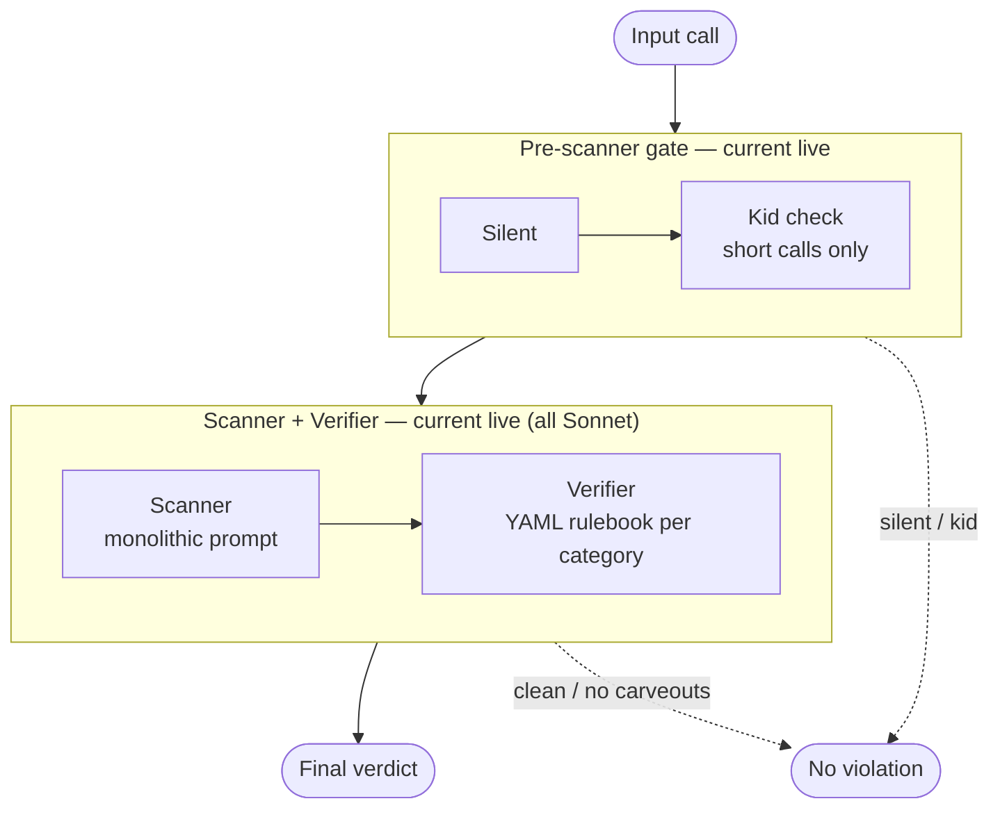
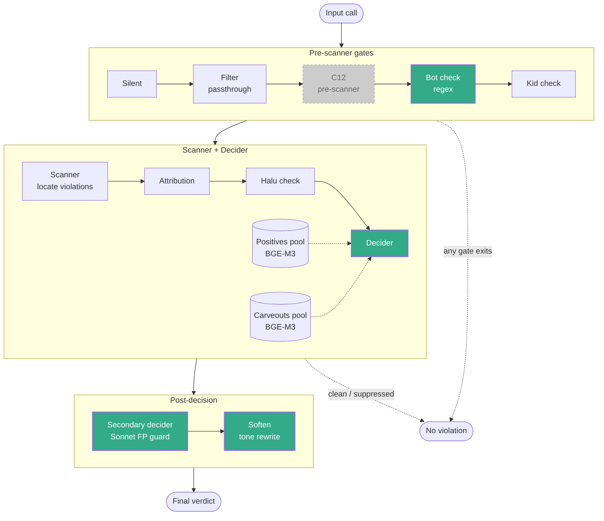

# DAB — Sentiment_Agent Pipeline Go-Live

**Release scope:** update the `sentiment_agent` case of the QC pipeline. Other cases are unchanged and out of scope for this DAB.
**Primary goal:** raise QC coverage on ambiguous, edge-case, and IVR calls; enable optional two-pass verification and reason-tone softening; **modularise the pipeline into small single-responsibility stages** so issues trace to a specific prompt rather than a monolithic one; cut LLM spend via multi-model routing.
**F1 measured on 1 700-call pilot round:** **0.836**.
**Projected LLM cost:** **~$2.0–2.5 k / month** vs current live baseline **~$30 k / month** (Sonnet everywhere, no filter) — **~$27.5–28 k / month saving (~14× cheaper)**, driven by rebinding scanner + primary decider + soften to Gemini 3 Flash and scoping Sonnet to secondary decider only. See §4.4.

---

## Stage 1 — Use Case Scoping & Requirement Profiling

### 1.1 Requirement Analysis

**Use-case objective**

Deploy the updated `sentiment_agent` pipeline for batch QC scoring of Vietnamese collection calls. The update:

- Replaces the previous scanner + YAML-rulebook verifier chain with a scanner + **retrieval-fused decider** — the decider reads BGE-M3-retrieved positives + carveouts + taxonomy + evidence in one LLM call instead of dumping the entire per-category YAML ruleset verbatim into the verifier's context.
- Adds three **dedicated pipeline stages** for edge cases the previous flow either missed or mislabelled: IVR / voicemail pickup (bot check), false-positive re-verification (secondary decider), and reason-tone softening for the QC business audience (soften). A C12 pre-scanner is also present in code but disabled for this release (deferred to next phase).
- Introduces **multi-model routing** so each stage can bind to the LLM tier appropriate for its cost / quality budget.

**Pipeline objective**

Per input call, the pipeline emits: `violation ∈ {true, false}`, `category` (Vietnamese taxonomy code), `evidence` turn indices, and `reason` (softened for high-severity verdicts).

**Use-case applications**

| In scope | Out of scope |
|---|---|
| `sentiment_agent` case only | Six other QC cases (hangup, raba, disclosure, card_number, phone_source, sentiment_customer) — unchanged |
| Batch QC scoring on completed calls | Real-time / per-turn inference |
| Multi-model routing across pipeline stages | Pre-filter subgraph enablement (env vars unset for this release; code present but passthrough) |
| Rollback to the prior pipeline via alias flip | Retraining any underlying LLM weights |

**Final Requirement Summarisation**

| Aspect | Specification |
|---|---|
| Function | Vietnamese collection-call QC scoring — violation verdict + category + evidence + softened reason per call |
| F1 acceptance bar | ≥ 0.80 internal target on the pilot round; achieved **0.836** |
| Multi-model routing | Per-stage LLM resource keys, independently overridable via env |
| Latency | Batch inference; no per-turn SLO |
| Hardware | No new infra; runs on existing pipeline pods |
| Rollback | Single-line alias revert to prior pipeline; optional stages independently disable via env unset |
| Data residency | Unchanged from prior pipeline — Sonnet / Gemini via existing Databricks endpoint |
| Downstream contract | Same category codes and row schema as before |

### 1.2 Environment

**Data source**

| Dataset | Purpose | Size |
|---|---|---|
| Parakeet TDT ASR transcripts | Runtime input | Streaming per batch |
| QC-labelled pilot round | Pipeline evaluation (F1) | **1 700 calls** |
| Production traffic | Batch inference target | 20–30 k calls/day |

**Mode**

- Batch inference, request-response per call.
- Trigger: batch runner sweeps completed calls at end-of-shift.
- Multi-stage LLM chain per call, dispatched by the graph runtime.

**Upstream input environment**

- Vietnamese ASR transcripts from Parakeet TDT (WER ≈ 7 % on Win telephony).
- Mixed regional accents, code-switching, ASR artefacts on robot voices, background noise.
- Handled at the pipeline layer (bot check regex for IVR variants, prompt-level rules for ASR fragments).

**Mandatory constraints**

| Constraint | Value / Rationale |
|---|---|
| Rollback within one env change | Alias flip reverts to the prior pipeline in a single file edit |
| No new hardware or capex | Runs on existing pipeline pods and existing Databricks endpoint |
| Multi-model routing available | Per-stage LLM resource key via env — no code change to swap models |
| Downstream schema preserved | Row output shape and category codes unchanged; downstream QC/IT parsers keep working |
| PII handling unchanged | Same routing via Databricks endpoint as the prior pipeline; no new external endpoints |

**Other constraints**

- Optional stages (secondary decider, soften) must degrade gracefully when their env vars are unset — pipeline emits the decider's verdict directly, without secondary FP re-check or reason softening, no code change.
- Pre-filter code is present but gated on env; leaving env unset keeps the runtime behaviour identical to a filter-less pipeline.

### 1.3 Pipeline Architecture

**Architecture overview**

The proposed pipeline follows a **separation-of-concerns** design: each stage owns one narrow responsibility with its own targeted prompt, rather than one monolithic prompt trying to do everything. This makes bugs traceable to a specific stage and prompt tuning independent per stage.

**Core stages (the sentiment_agent decision path):**

| Stage | Responsibility | Model tier |
|---|---|---|
| **Scanner** | Locate candidate violation turns in the transcript | Gemini 3 Flash |
| **Retrieval — positives pool** (BGE-M3) | Pull top-K violation samples from the corpus, ranked by similarity to the evidence turn | ONNX (local) |
| **Retrieval — carveouts pool** (BGE-M3) | Pull top-K exclusion samples from the corpus, ranked by similarity to the evidence turn | ONNX (local) |
| **Decider** | Judge violation / clean using evidence + both retrieval pools + taxonomy in one call | Gemini 3 Flash |
| **Secondary decider** (optional) | Re-check flagged verdicts as a false-positive guard against Gemini 3 Flash over-flagging | Sonnet 4.5 |

**Auxiliary side-detectors** (each small, single-purpose, running only when its gate condition applies):

- **Bot check** — regex gate for IVR / voicemail / `trợ lý ảo` pickup.
- **C12 pre-scanner** — *disabled for this release.* Small LLM on the first 2 AGENT turns for pre-greeting slur. Diagnostic on a full-day scan showed **Gemini 3 Flash** over-flagged AGENT identity-verification turns as C12 violations; deferred to next phase pending prompt / corpus rewrite.
- **Kid check** — small LLM on short calls for child pickup.
- **Halu check** — verifies scanner attribution when substring anchor is missing.
- **ASR check** — tone-continuity check on heavy-keyword evidence.
- **Soften** (optional post-processing) — reason-tone rewrite for high-severity verdicts.

**Current live pipeline (baseline)**

**Proposed pipeline (this release)**

**Legend.** In the **proposed** diagram: green nodes are new in this release; **grey / dashed** = code present but disabled for this release (**Gemini 3 Flash** over-flagged AGENT identity-verification turns on a full-day scan; deferred to next phase); `Filter` is passthrough (env unset in this CR). The decider consumes **two separate retrieval pools** — top-K positives and top-K carveouts, both BGE-M3 indexed over the corpus — as reference material for its verdict. In both diagrams, solid arrows = happy path; dotted arrows = early exits collapsing into "No violation". Side-by-side, the current-live pipeline (a) has no bot check, no C12, no filter — only Silent and Kid check gate the scanner; (b) has no BGE-M3 retrieval at all — the Verifier receives the entire YAML rulebook for the flagged category verbatim, no similarity-ranked reference material; (c) has no post-decision stages — the Verifier's output is the final verdict; (d) runs Sonnet on every LLM stage.

**Design rationale**

| Change | Rationale |
|---|---|
| **Separation of concerns across stages** | Each stage owns one narrow responsibility (scanner locates, retrieval pulls corpus samples, decider judges, secondary decider guards FPs, side-detectors handle specific edge conditions). Bugs trace to a specific stage prompt; tuning is independent per stage rather than untangling a monolithic prompt. |
| **Secondary decider as safety net against Gemini 3 Flash over-flagging** | Cheap Gemini 3 Flash primary handles the bulk of decisions; Sonnet 4.5 secondary re-checks flagged verdicts only. Guards against Gemini 3 Flash over-flagging without paying strong-tier cost on every call. |
| Decider consumes both retrieval pools + taxonomy + evidence in one call | Replaces the prior YAML-rulebook verifier that received the entire per-category ruleset verbatim (attention diluted on irrelevant rules). The decider now gets top-K similarity-ranked positives + top-K carveouts + taxonomy + evidence in one LLM call — no verbatim rule dump, no downstream re-check needed. |
| Bot check (regex gate) | ~2.4 % of live calls hit an IVR / voicemail / `trợ lý ảo` pickup. Prior flow scored the AGENT's frustration reaction as a violation. Regex detection skips the case entirely — no LLM call, no false alarm. |
| Secondary decider (optional) | Two-tier LLM cascade: cheap primary decides, strong secondary re-verifies only flagged rows. Enabled via env — off = single-tier behaviour. Purpose: FP guard on high-severity verdicts without paying strong-tier cost on every call. |
| Soften (optional) | Rewrites the reason field for high-severity verdicts into descriptive (non-accusatory) language for the QC business audience. F1 is unaffected — only the free-text reason changes. Enabled via env. |
| Retrieval — new capability | Retrieval itself is new in this release (current live has no retrieval — verifier reads verbatim YAML). Corpus entries carry multiple `sample1 \| sample2` variants sharing one description; each variant is embedded independently (avoids embedding dilution) and grouped at prompt time by parent id (one context block per corpus entry). |
| Legacy strong-VP regex bypass → default OFF | Keywords like `cố tình` / `trốn tránh` legitimately appear in echoed customer speech, negation, and self-defence turns. Regex is a syntactic tool for a semantic decision; the decider handles context correctly. Env fallback preserves the prior bypass if a FN spike appears. |
| Multi-model routing (per-stage env resource keys) | Each stage has different cost / quality trade-offs. Routing lets the scanner and primary decider run on a cheaper tier while the secondary decider runs on a strong tier, without code changes. |

**Architecture comparison — current live vs proposed**

| Aspect | Current live | Proposed |
|---|---|---|
| Post-scanner LLM step | Scanner + separate YAML-rulebook verifier (verbatim per-category ruleset dumped in) | Scanner + **retrieval-fused decider** (top-K BGE-M3 positives + carveouts + taxonomy in one call) |
| IVR / voicemail handling | None — scored as if human | **Bot check** regex gate, skips eval |
| False-positive guard | None | **Secondary decider** (optional, cheap→strong cascade) |
| Reason-tone rewrite | None | **Soften** (optional post-processing) |
| Retrieval | None — verifier reads verbatim YAML rulebook for the flagged category | BGE-M3 top-K positives + top-K carveouts, variant-grouped by parent id |
| Strong-VP regex bypass | ON | OFF by default (env fallback available) |
| LLM resource routing | Single resource key for all stages | Per-stage resource key (scanner / decider / secondary / soften) |

**Dataset**

- **Evaluation dataset:** 1 700-call pilot round from `qc-monitor`, held out from prompt iteration.
- **Ground truth:** QC-labelled violation verdict + category per call.

**Final architecture summary**

Adopt the proposed pipeline: retrieval-fused decider, three new dedicated stages (bot check, secondary decider, soften), variant-grouped retrieval, and per-stage LLM routing. F1 = 0.836 on the pilot round.

---

## Stage 2 — Benchmark Mechanism: Technical Pre-Scoring

**Principle.** Evaluate the proposed pipeline against the 1 700-call pilot round with QC labels. Report F1 as the headline metric, behaviour deltas by call class, and specification / operational readiness alongside.

**Metric table**

| Category | Metric | Target | Achieved |
|---|---|---|---|
| Performance | F1 on 1 700-call pilot round | ≥ 0.80 | **0.836** |
| Robustness | Behaviour delta by call class | No net regression | See "Behaviour delta" below |
| Deployment | Hardware / infra footprint | No new infra | Runs on existing pods and Databricks endpoint |
| Deployment | Rollback surface | ≤ 1 file change | Alias flip — one file, one line |
| Operational | Optional stages degrade gracefully | Env unset → prior behaviour | Confirmed: unsetting the resource env for any optional stage disables it at graph build time |
| Governance | Downstream contract preserved | Row schema unchanged | Row shape and category codes match prior release |
| Security | External endpoints unchanged | No new PII destination | Same routing via Databricks endpoint as prior release |

**Behaviour delta by call class**

| Call class | Prior behaviour | Proposed behaviour |
|---|---|---|
| Bot / IVR picks up | AGENT reaction to robot voice may score as violation | Skipped entirely at the bot check regex gate |
| Evidence contains strong-VP keyword (`cố tình`, `trốn tránh`, …) | Regex bypass — verifier skipped | Decider evaluates full context |
| Ambiguous case with negation / echo / self-defence | Sometimes over-flagged | Decider disambiguates using both retrieval pools + context |
| High-severity verdict (C* / N*) reason field | As emitted by verifier | Optionally softened to descriptive tone; F1 unaffected |
| Flagged verdict on cheap-tier decider | Final | Optionally re-verified by strong-tier secondary decider |

**Multi-model resource matrix**

| Env var | Stage | Recommended tier | Behaviour when unset |
|---|---|---|---|
| `LLM_RESOURCE_KEY` | Scanner, kid check | Cost-efficient tier | Required — pipeline errors at build time |
| `DECIDER_LLM_RESOURCE_KEY` | Decider, halu check, ASR check | Cost-efficient tier | Falls back to `LLM_RESOURCE_KEY` |
| `SECONDARY_DECIDER_LLM_RESOURCE_KEY` | Secondary decider (post-verdict FP guard) | Strong tier | Secondary decider disabled — flagged verdicts pass through untouched |
| `SOFTEN_LLM_RESOURCE_KEY` | Soften (reason rewrite) | Cost-efficient tier | Soften disabled — reason field passes through unchanged |
| `SENTIMENT_FILTER_LLM_RESOURCE_KEY` | Pre-filter LLM (opt-in, out of scope this release) | — | Filter disabled — passthrough |

**Specification**

| Item | Value |
|---|---|
| Pipeline entrypoint | `verify_sentiment_agent` alias in `src/cases/sentiment_agent/__init__.py` |
| Retrieval index | BGE-M3 ONNX + FAISS FlatIP over corpus positives and carveouts |
| Retrieval schema | Variant-grouped: `sample1 \| sample2` split, embedded independently, prompt-grouped by parent id |
| Row schema | Unchanged from prior release (violation, category, evidence, reason) |
| Category taxonomy | Unchanged from prior release |
| Trace surface | `result["_trace_meta"]` carries scanner / retrieval / decider / secondary / soften traces for audit |

**Deployment / Serving**

- **Inference engine:** unchanged — same Databricks endpoint integration as the prior release, same pod topology.
- **Topology:** existing batch runner pods on the sentiment infrastructure; no new nodes provisioned.
- **Multi-environment:** identical container image runs on dev / staging / prod; per-environment tuning via `.env` and `resources.yaml`.
- **Rollback:** alias flip in `src/cases/sentiment_agent/__init__.py` reverts the entrypoint to the prior pipeline. Optional stages independently disable via env unset without a redeploy.

**Container image**

| Aspect | Value |
|---|---|
| Base image | Unchanged from prior release |
| Runtime patches | None |
| Container security | Non-root user, minimal base, Trivy scan in CI (inherit standard) |
| New runtime dependencies | None — all new stages reuse existing Databricks endpoint and BGE-M3 retriever |

**Operational**

| Dimension | Today |
|---|---|
| Observability | Structured logs for pipeline events; `_trace_meta` on each result payload records every stage that fired for post-run inspection |
| Rollback path 1 | Full pipeline: single-file alias flip |
| Rollback path 2 | Individual optional stage: unset the corresponding env var |
| Regression detection | Batch runner emits violation-rate and category-level counts per run — compare against pilot distribution. Full F1 re-measurement requires periodic QC re-labelling. |
| Retune cadence | Prompt review on QC feedback; corpus additions reviewed on demand |

**Governance & Risk**

| Risk | Description | Mitigation |
|---|---|---|
| F1 regression on production traffic | Pilot F1 (0.836) may not hold on live distribution | Track violation-rate and category distribution per batch against the pilot baseline; periodic QC re-labelling for full F1 re-measurement; alias flip reverts on regression |
| Secondary decider over-suppresses valid violations | Strong-tier re-verifier disagrees too often | Env unset disables secondary decider without redeploy |
| Soften alters meaning of reason | Free-text rewrite could shift the meaning, not just the tone | F1 is unaffected by soften (only reason text changes); disable via env if QC business flags issues |
| Decider degrades on strong-VP cases | Removing the regex bypass could FN on evident-slur turns | `QC_ENABLE_STRONG_VP_BYPASS=true` env restores the prior bypass |
| Bot check false-positive skips a real customer | Regex might match a human utterance | Regex patterns are IVR-specific phrases and ASR variants only, validated on live call samples |
| Databricks endpoint outage on a specific tier | A stage-specific resource key becomes unreachable | Multi-model routing lets ops repoint that stage to the main resource key |

**Compliance & Security**

| Area | Status |
|---|---|
| Data residency | Unchanged — same routing via Databricks endpoint as prior release |
| PII handling | Unchanged — no new external endpoints |
| Downstream contract | Preserved — row schema and category codes match prior release |
| Model artefacts | No new model weights introduced |
| Network / container | No new listener, no new secret, non-root, minimal image |
| Audit surface | Enhanced — every stage that fires records a trace on the result for post-run inspection |

---

## Stage 3 — Selection Logic & Comparison with Baseline

### 3.1 Selection Logic

| # | Gate | Criterion | Result |
|---|---|---|---|
| 1 | Governance | No new PII destination, downstream schema preserved, model artefacts unchanged | **PASS** |
| 2 | Deployment | Runs on existing infra, no new hardware, rollback = single-file alias flip | **PASS** |
| 3 | Compatibility | Row schema and category codes unchanged; downstream QC/IT parsers unaffected | **PASS** |
| 4 | Performance | F1 ≥ 0.80 on pilot round — achieved 0.836 | **PASS** |
| 5 | Optional stages degrade gracefully | Each optional stage disables via env unset, no code change | **PASS** |
| 6 | Rollback | Alias flip reverts to the prior pipeline; kill-switch on individual optional stages | **PASS** |

**Conclusion.** The proposed pipeline passes all gates.

### 3.2 Current live vs proposed — comparison table

| Dimension | Current live | Proposed | Δ |
|---|---|---|---|
| Post-scanner LLM stages | Scanner + YAML-rulebook verifier | Scanner + retrieval-fused decider | YAML dump → similarity-ranked retrieval |
| IVR / voicemail | Scored as if human | Skipped at regex gate | FP class removed |
| High-severity FP guard | None | Optional secondary decider | New capability |
| Reason tone for high-severity | Verifier text | Optional softened rewrite | QC UX improved |
| Retrieval | None (YAML rulebook per category, verbatim) | BGE-M3 top-K positives + top-K carveouts, variant-grouped | New capability |
| Strong-VP short-circuit | Regex ON | Regex OFF (env fallback) | Semantic decision by decider |
| LLM routing | Single resource key | Per-stage resource keys | Cost / quality flexibility |
| Downstream schema | Row shape v1 | Row shape v1 (unchanged) | None |
| Measured F1 | Not tracked | **0.836** on pilot round | Baseline established |

---

## Stage 4 — DAB Decision Template

### 4.1 Use Case Summary

| Field | Value |
|---|---|
| Project | Sentiment_agent pipeline update — retrieval-fused decider + three new dedicated stages + multi-model routing |
| Business domain | Collection QC — batch scoring of completed calls |
| Business requirement | Improve coverage on ambiguous and IVR calls; enable optional FP guard and reason softening; preserve downstream contract |
| Traffic profile | Batch — 20–30 k calls/day, existing infrastructure |
| Owner | DS2 — Win AI Center |
| Proposed change | Alias entrypoint switches to the updated pipeline; three new stages enabled by default (bot check, secondary decider, soften); C12 detector code present but disabled pending next-phase prompt / corpus rewrite; pre-filter env vars remain unset |

### 4.2 Pipeline Selection Logic

- **Selected pipeline:** retrieval-fused decider with dedicated bot check, secondary decider, soften, and multi-model routing.
- **Decision path:** Governance → Deployment → Compatibility → Performance → Optional-stage degradation → Rollback.
- **Why a retrieval-fused decider instead of retaining the YAML-rulebook verifier?** The prior verifier received the entire per-category ruleset verbatim — attention was diluted on rules irrelevant to the specific evidence turn. The decider now gets top-K similarity-ranked positives + carveouts + taxonomy + evidence in one call, so relevant reference material dominates its context.
- **Why regex bot check instead of an LLM detector?** IVR / voicemail phrases are a small, stable, well-known signature set. Regex is precise, zero-cost, and needs no LLM budget on the ~2.4 % of calls it catches.
- **Why optional secondary decider?** Cheap primary handles the bulk of calls; strong-tier re-verification only fires on flagged rows, giving FP guard without strong-tier cost on every call.
- **Why optional soften?** QC business consumers of the reason field prefer descriptive tone. F1 unaffected — enable / disable is a UX decision, not an evaluation decision.
- **Why pre-filter env vars remain unset?** Pipeline architecture change is already the release-scope decision; keeping the pre-filter passthrough isolates the risk surface for this release.

### 4.3 Benchmark Evidence

**Dataset:** 1 700-call pilot round from `qc-monitor`, held out from prompt iteration.

| Metric | Target | Achieved |
|---|---|---|
| F1 | ≥ 0.80 | **0.836** |

### 4.4 Financial Impact

> ⚠ **Estimated, not billing-grade.** Per-call cost is derived from published model pricing + per-stage prompt token counts + fire rates walked from the graph. Validate against real Databricks endpoint spend after one live billing cycle.

**Baseline.** Current live pipeline (Sonnet on every stage, no filter) costs **~$30 k / month** on the sentiment_agent case at production traffic (implied ~500 k calls / month at ~$0.06 per call).

**Where the saving comes from.**

1. **Primary tier switch (Sonnet → Gemini 3 Flash).** Gemini 3 Flash is ~1/10 the input cost and ~1/6 the output cost of Sonnet 4.5. Scanner, kid check, decider, halu check, ASR check, and soften all rebind to Gemini 3 Flash.
2. **Sonnet retained only on secondary decider.** Sonnet fires only on flagged verdicts (post-suppression), a small share of input calls — not on the whole population.
3. **Bot check short-circuits.** ~2.4 % of input calls exit before scanner via the bot check regex gate; no scanner or decider LLM cost on those.

**Per-call cost derivation** (Gemini 3 Flash: $0.30/M input, $2.50/M output; Sonnet 4.5: $3/M input, $15/M output; transcript median ~1 000 tokens)

| Stage | Model | Fires on | Prompt tok | Output tok | Per-fire $ | Weighted per-call $ |
|---|---|---|---|---|---|---|
| Scanner | Flash | ~87 % | ~5 000 | 400 | $0.00280 | $0.00244 |
| Kid check | Flash | ~18 % | ~2 300 | 200 | $0.00149 | $0.00027 |
| Halu check | Flash | ~4 % | ~900 | 200 | $0.00086 | $0.00003 |
| Decider | Flash | ~10 % | ~2 500 | 300 | $0.00180 | $0.00018 |
| ASR check | Flash | ~1 % | ~2 400 | 200 | $0.00131 | $0.00002 |
| **Secondary decider** | **Sonnet** | **~6 %** | ~5 000 | 300 | $0.01950 | $0.00117 |
| Soften | Flash | ~3 % | ~500 | 200 | $0.00065 | $0.00002 |
| **Total per call** | | | | | | **~$0.0041** |

**Projection at $30 k baseline traffic (~500 k calls/month)**

| Configuration | Est. monthly cost | vs current |
|---|---|---|
| Current live (Sonnet everywhere) | ~$30 k | 1.00× |
| **Proposed (multi-model routing)** | **~$2.0–2.5 k** | **~0.07–0.08×** |
| **Estimated monthly saving** | — | **~$27.5–28 k / month, ~$330–336 k / year** |

**Notes**

- **The primary tier switch is the load-bearing driver of the cost saving.** The ~14× cost cut comes from re-tiering the primary path off Sonnet onto Gemini 3 Flash. The architecture changes together (retrieval-fused decider + new stages + variant-grouped retrieval + strong-VP bypass removal) are what deliver the measured F1 of 0.836 — attribution to any single change is not claimed here.
- **Secondary decider (Sonnet) cost is ~$0.001 per input call**, the single biggest line item in the proposed pipeline. If detection rate on live traffic is materially higher / lower than ~15 %, this line scales linearly.
- Fire rates assume: silent ~5 %, bot ~2.4 %, short ~20 %, kid-of-short ~30 %, scanner detection ~15 % (per `project_live_20260629_baseline.md`: 848 / 5 054 = 16.78 %), halu suppress ~50 %, ASR route ~10 %.
- No infra spend delta — runs on existing pipeline pods and existing Databricks endpoint.
- **Confirm actual per-stage bindings in `resources.yaml` before go-live** — projection assumes `LLM_RESOURCE_KEY` = `DECIDER_LLM_RESOURCE_KEY` = `SOFTEN_LLM_RESOURCE_KEY` = Gemini 3 Flash and `SECONDARY_DECIDER_LLM_RESOURCE_KEY` = Sonnet 4.5. Different binding shifts the ratio.

### 4.5 DAB Scoring

Scoring: each criterion 1–10, weighted, aggregated. Pass threshold: weighted total ≥ 7.0 / 10 and no Compliance / Security / Performance pillar below 6.

| Criteria | Weight | Score | Weighted | Rationale |
|---|---|---|---|---|
| Business requirement mapping | 20 % | 9 | 1.80 | Direct coverage improvement on identified edge classes; QC UX improvement via soften |
| Performance (F1) | 25 % | 9 | 2.25 | 0.836 on 1 700-call pilot round vs 0.80 bar |
| Behaviour deltas | 10 % | 9 | 0.90 | Bot / strong-VP / reason-tone deltas addressed by design, not by tuning |
| Deployment | 10 % | 10 | 1.00 | No new infra, no new dependencies, alias-flip rollback |
| Operational readiness | 10 % | 8 | 0.80 | Trace metadata on every result; kill-switch per optional stage; batch violation-rate + category distribution tracking |
| Governance & risk | 10 % | 9 | 0.90 | Env-driven kill-switch on every optional stage; strong-VP regex fallback env available |
| Compliance | 10 % | 10 | 1.00 | No new PII destination, downstream contract preserved, no new secrets |
| Security | 5 % | 9 | 0.45 | Unchanged listener surface and image posture from prior release |
| **TOTAL** | **100 %** | — | **9.10 / 10** | Above 7.0 threshold, no pillar below 6 |

### 4.6 Board Submission Checklist

| Field | Details |
|---|---|
| Change category | Pipeline architecture update — sentiment_agent case only |
| Primary goal | Improve QC coverage on ambiguous and IVR calls; enable optional FP guard and reason softening; consolidate post-scanner LLM stack |
| F1 evidence | **0.836** on 1 700-call pilot round |
| Critical risks | F1 regression on live distribution; secondary decider over-suppression; strong-VP regex removal FN spike |
| Mitigations | Alias-flip rollback; env unset per optional stage; `QC_ENABLE_STRONG_VP_BYPASS=true` env restores prior regex |
| Cost impact | Projected **~$2.0–2.5 k / month** vs current live **~$30 k / month** (Sonnet everywhere) — **~$27.5–28 k / month saving, ~14× cheaper**. Driver: scanner + primary decider + soften rebound to Gemini 3 Flash; Sonnet retained only on secondary decider (fires on ~6 % of input calls). See §4.4. |
| Hardware fit | No new infra; runs on existing pipeline pods |
| Downstream contract | Row schema and category codes unchanged |
| Deployment env vars | Set at go-live: `LLM_RESOURCE_KEY`, `DECIDER_LLM_RESOURCE_KEY`, `SECONDARY_DECIDER_LLM_RESOURCE_KEY`, `SOFTEN_LLM_RESOURCE_KEY`. Leave unset: `SENTIMENT_FILTER_LLM_RESOURCE_KEY`, `SENTIMENT_FILTER_KEYWORD_ENABLE`. Fallback available: `QC_ENABLE_STRONG_VP_BYPASS`. |
| Recommendation | **Board sign-off: YES — approve go-live of the updated sentiment_agent pipeline.** |
