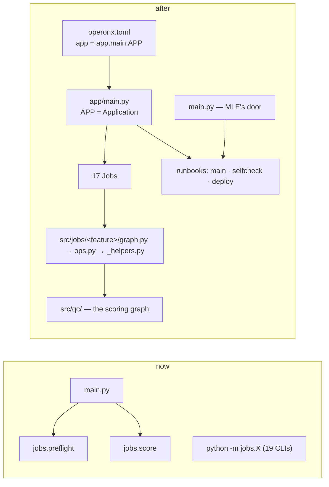

# Plan — sentiment on operonx 1.10's flow

**Status:** phases 1–5 built, 2026-09-28, branch `refactor/operonx-1.10` (not pushed).
Phase 6 — the run on the VPN — is yours. Every offline gate passes; see *Built* at the end.

## Summary

| | now | after |
|---|---|---|
| operonx | 1.7.0 from a local checkout (`D:\Operonx`, unreleased branch); the image pins **1.6.10** and cannot import `jobs/` | **1.10.0** from PyPI, everywhere |
| where jobs are declared | 19 packages under `jobs/`, each its own CLI (`python -m jobs.X`) | one `APP = Application(...)` in `app/main.py`; `operonx-run X` |
| `operonx-run --list` | `no jobs` | 18 jobs (17 + `smoke`) + 3 runbooks |
| graph code | `src/cases/*`: mostly clean; `format_<id>`, a config loop and 7 smoke `main()`s sit in `graph.py` | `graph.py` wires only |
| silent-failure gotchas | 3 real hits (one wrong today), 5 fragile sites | fixed, each with a test |
| MLE contract (`python main.py`, env, output files) | — | **unchanged**, byte for byte |

Upgrading alone changes one thing: the local tracer now nests a job's traces
under `jobs/<job>/<run>/`. Output files are identical (measured below).

## The ladder, before and after



| rung | thing | now | after |
|---|---|---|---|
| op | `src/**/ops.py`, `jobs/*/ops.py` | op | op, all under `src/` (tooling under `src/jobs/`) |
| graph | `orchestrator`, case graphs, job graphs | graph | same graphs, moved per feature |
| Job | score, preflight, rag_*, corpus_*, qc_*, scan_report, probes, selfcheck parts | `Job` + own `__main__` | `Job` in `APP` |
| Runbook | deploy, selfcheck; `main.py` hand-rolls preflight → score | 2 `Runbook`s + a script | 3 `Runbook`s in `APP` (`main` added) |
| Service | — | none (nothing is served) | none — `operonx-serve --list` stays empty |
| Application | — | missing | `app/main.py` |
| `operonx.toml` | `[project]`, `[[graph]]`, `[studio]` | no `app` | `app = "app.main:APP"` |

## Target layout

```text
analyze/
├── operonx.toml          [project] app = "app.main:APP", src = ["."]
├── resources.yaml        unchanged — every secret already ${VAR}
├── models.yaml           unchanged — stage → resource, null = stage off
├── main.py               MLE's command; same flags, env, exit codes, files
├── app/
│   ├── main.py           APP: every job and runbook, and what each runs  ← read first
│   └── deploy.py         MLE secrets → .env, then the deploy runbook      ← jobs/_deploy_env.py
├── src/
│   ├── core/  cases/  corpus/        shared modules (stay)
│   ├── qc/            graph.py ops.py  ← src/graph.py, src/ops.py — THE PRODUCT: the scoring graph
│   └── jobs/          THE TOOLING: one folder per graph a Job in app/main.py runs
│       ├── _shared/     _store.py _seed.py _schema.py _selfcheck.py _argv.py  ← jobs/_*.py
│       ├── score/       graph.py ops.py _tracing.py _calls.py      ← jobs/score        } main.py
│       ├── preflight/   graph.py ops.py                             ← jobs/preflight    }
│       ├── rag/         graph.py ops.py schema.sql  ← jobs/rag_schema, rag_seed, seed_race  } deploy
│       ├── selfcheck/   graph.py ops.py  ← score_fixtures, selfcheck_compare, baseline_write } runbooks
│       ├── corpus_admin/ graph.py ops.py _import.py ← corpus_export, corpus_import, corpus_stamp_ids
│       ├── qc_review/   graph.py ops.py _*.py      ← qc_prepare, qc_compare, qc_f1, scan_report
│       ├── probes/      graph.py ops.py _*.py      ← probe_llm, probe_embedder
│       └── smoke/       graph.py ops.py            ← the 7 `main()` blocks in src/cases/*/graph.py
├── knowledge/        QC data (stays)
├── deployment/       MLE's (untouched except requirements pin)
└── tests/
```

**Why `src/jobs/`:** src/ holds two kinds of code — the product (`qc/`,
`cases/`, `core/`, `corpus/`: what the pods run per call) and the tooling
that operates on it. Grouping the tooling keeps that line visible, and
keeps the rule `tests/test_jobs_layout.py` already enforces: the product
never imports the tooling (`nothing outside src/jobs/ imports src/jobs/`).
A folder there holds a graph, not a `Job`; the `Job`s are declared in
`app/main.py`.

### Every file → where it goes

| now | goes to | note |
|---|---|---|
| `jobs/<name>/job.py` (17) | one `Job(...)` each in `app/main.py` | `description=` replaces the `__init__` docstring |
| `jobs/<name>/graph.py`, `ops.py`, `_*.py` | `src/jobs/<feature>/` per the tree above | several related jobs share one feature's `graph.py` |
| `jobs/_store.py`, `_seed.py`, `_schema.py`, `_selfcheck.py`, `_argv.py` | `src/jobs/_shared/` | helpers more than one job feature uses |
| `jobs/<name>/__main__.py`, `__init__.py`, `README.md` | deleted | `operonx-run X --help/--show/--set` covers them; usage lines live in `app/main.py`'s docstring |
| `jobs/deploy/runbook.py`, `jobs/selfcheck/runbook.py` | `Runbook`s in `app/main.py` | `with Runbook(...)` form |
| `main.py`'s preflight → score | `Runbook("main")` in `APP` | `main.py` keeps its flags and exit rule, and runs it |
| `jobs/_deploy_env.py`, `jobs/deploy/__main__.py` | `app/deploy.py` | must run before `src` is imported |
| `jobs/README.md` | a table in `README.md` | |
| `src/graph.py`, `src/ops.py` | `src/qc/graph.py`, `src/qc/ops.py` | `operonx.toml [[graph]] entry` follows |
| `format_<id>` in `src/cases/<id>/graph.py` (6) and `sentiment_agent/__init__.py` | `src/cases/<id>/_format.py` | `CASES` registry imports it |
| `CASE_IDS` in `src/cases/__init__.py` | `src/core/case_ids.py` | so `core` stops importing `cases` (upward) |
| `src/cases/*/graph.py` `main()` (7) | `src/jobs/smoke/` + `Job("smoke")`, `--set case=hangup` | two of them crash today (below) |
| `requirements.txt`, `deployment/score_sentiment/requirements.txt` | pin `operonx==1.10.0` | the image is broken without this |
| `Dockerfile` COPY list | + `app/`, `operonx.toml`; − `jobs/` | `tests/test_dockerfile_copies.py` follows |

## What the audit found

### operonx API

| what | status in 1.10 | action |
|---|---|---|
| `operonx.core.jobs` — 22 imports | alias that already warns it is gone "in 1.8.0" | `operonx.app.jobs` |
| `LocalConsumer` default `layout="origin"` | traces move to `<root>/jobs/<job>/<run>/<id>/` | pin `layout="flat"` in `QCLocalConsumer` |
| `Job(trace=None)` inside an `Application` | gets a default **unredacted** `LocalConsumer` → full transcripts in `.operonx/runs` | `trace=[]` when tracing is off |
| job engines' root name | auto-named `params` (from a line inside operonx's `job.py`) | pin `name=` on each job graph |
| `tests/_engine.py` root `qc_flow` | correct only because of the variable name | pin `name="qc_flow"` |
| `GraphOp.loop`, `ask()/chat()`, `Service(inputs=)`, old tracers | not used | — |
| `item_input=` (doorless per-item graphs) | public 1.10 API (`app/jobs/job.py:87`) | keep — nothing here is served, so no doors |
| private reach-ins: `OpenAISDKModel.generate` patch, `_pg.get_pool`, `graph._ops` in tests | present, unchanged | keep; listed under risks |

### Gotchas (04-gotchas.md)

| gotcha | hits | detail |
|---|---|---|
| Ref vs Ref in `if_()` | 0 | 35 chains checked |
| missing `.else_()` / `.build()` | 0 | |
| `and`/`or` on Refs | 0 | two `or`s are on build-time constants |
| `user=` / Ref in `validators=` | 0 | 26 `LLMOp.of` calls |
| **None into an input with no default** | **2** | `raba/graph.py:83` — detector parse failure → `response` LLMOp gets `None` fields → PromptError → a `_decide` violation comes out **"Không vi phạm". Wrong today.** · `card_number/ops.py:152` `llm_result` no default → op error (verdict unchanged) |
| loop state outside `PARENT.declare` | 0 | no loops |
| read without `>>` / unreachable | 0 | |
| **dynamic return dict** | **1 real, 3 fragile** | `prefilter/ops.py:246` never returns `n_chunks` → `no_chunks_pass` can never run (fail-open if ever 0 chunks; latent) · `exit_fn`, `l3 return empty`, `l4 _empty_inputs()` |
| also | 5 + 2 | `START >> if_(...)` at 5 sites (guide: put a real op first) · smoke `main()` in raba/disclosure crash before any LLM call |

## Phases and gates

Every phase is one commit (or a few), no `Co-Authored-By`, never pushed.
Every gate runs these, and reports the numbers:

| gate | command | pass |
|---|---|---|
| **T** tests | `uv run pytest tests/ -q -p no:cacheprovider` | all pass (1601 + the new ones), 12 xfail |
| **S** snapshot | `uv run python -m tests._snapshot` | 90/90 outputs byte-identical to `tests/sample/snapshot.json`, same trace layout |
| **W** warnings | `uv run pytest tests/ -q -W error::DeprecationWarning` | passes |
| **L** listing | `uv run operonx-run --list` · `uv run operonx-serve --list` | the expected jobs · no services |

`tests/sample/snapshot.json` was recorded on the **1.7** code: the score job
over all 90 fixture calls, models replayed from the recording (offline),
each output hashed, plus the trace tree of one traced call.

| # | phase | behaviour change | gate |
|---|---|---|---|
| 1 | **1.10 in place.** pin 1.10 (pyproject, lock, both requirements.txt); `core.jobs` → `app.jobs`; `layout="flat"`; `trace=[]`; pin root names | trace op names read `score…` instead of `params…` | T S W |
| 2 | **Gotcha fixes**, each with a regression test: raba None, card_number default, prefilter `n_chunks`, `START >> if_` ×5, the 3 fragile returns | only on the failure paths listed | T S |
| 3 | **`src/` layering:** `format_<id>` → `_format.py`; `CASE_IDS` → `core/case_ids.py`; the corpus readers `retrieval/_corpus.py` → `src/corpus/loader.py`, so reading the corpus builds no graph; `src/graph.py`+`ops.py` → `src/qc/`. New tests: a `graph.py` defines only `@graph`s; `src.corpus` / `src.core.config` load no case package | none | T S |
| 4 | **Application.** `jobs/*` → `src/jobs/<feature>/` + `app/main.py`; `operonx.toml app=`; `app/deploy.py`; `main.py` runs `APP`'s `main` runbook; Dockerfile; delete `jobs/` | commands: `python -m jobs.X` → `operonx-run X` | T S W L (17 jobs, 3 runbooks; `--show` on each offline job) |
| 5 | **smoke job + docs:** 7 `main()`s → `Job("smoke")`; CLAUDE.md, README, skills, this plan's status | none | T L |
| 6 | **On the VPN — you run it** (commands handed over) | — | `python main.py` on `samples/`; `operonx-run selfcheck` ≥ 0.85 and the flagged subset checked; `operonx-run probe_llm` |

## Measured now (the "before")

| | value |
|---|---|
| `pytest tests/` on 1.7 · on 1.10 | 1601 passed, 12 xfailed, ~34 s · same |
| snapshot on 1.7 · on 1.10 | 90/90 recorded, 15.8 s · **90/90 identical, trace layout different** |
| DeprecationWarnings on 1.10 | 1 (`operonx.core.jobs`, stands for all 22 sites) |
| `operonx-run --list` / `operonx-serve --list` | `no jobs` / `no [[serve]] entries` |

## Decided (say if you disagree)

| decision | why |
|---|---|
| group the tooling under `src/jobs/`, not beside `src/qc/` | the product/tooling line is the one that matters most here; 05's "one feature, one folder" still holds inside it |
| keep `src.` imports and `src = ["."]`, not `src = ["src", "."]` | the folders follow 05; only the import root differs. Changing it rewrites ~170 imports and adds `src/` to `sys.path`, where `src.core.config` and `core.config` could load as two modules — a monkeypatch on one misses the other. Pass `src=["."]` to `Application` too |
| the `QC_ENABLE_*` switch stays in `src/qc/graph.py` | `node.enabled` is set where each case node is built; operonx has no public way to reach a built graph's child from outside (only `_ops`) |
| keep `models.yaml` | `null` switches a stage off, and a test forbids env overrides; `resources.yaml` has no "off" |
| keep jobs doorless (`item_input=`) | documented 1.10 Job API; doors are for graphs a client talks to, and nothing is served |
| selfcheck stays a runbook, not an `Eval` | `Eval` scores a pass rate per case; selfcheck's gate is a HARD-field match rate with SOFT fields reported — a different metric |
| `Application(resources=None)` | `src/core/_bootstrap.py` already installs the hub (env choice, models.yaml checks, the timeout patch); a second bootstrap would replace it |
| MLE's deploy command becomes `python -m app.deploy` | secrets must reach `.env` before `src` is imported; `operonx-run deploy` imports the app first. `python -m jobs.deploy` was never handed to MLE |

## Risks

| risk | how it's caught |
|---|---|
| the image's index (Win PyPI proxy) may not serve 1.10.0 yet | first image build; I can't reach that index from here |
| `Application` or `operonx-run` bootstraps or traces differently from `Job.main` | gate L + `--show` per job in phase 4; phase 6 on the VPN |
| op names in traces change (`params.` → pinned names) | nothing in the repo reads them (checked); the studio shows the new names |
| private operonx APIs (`OpenAISDKModel.generate` patch, `_pg.get_pool`) | unchanged in 1.10; a future bump can break them — tests cover both |
| moving `jobs/` breaks an import no test drives | `tests/test_no_undefined_names.py` (pyflakes) + `operonx-run X --show` on every job |

## Open — yours

1. **Tell MLE:** the image needs `operonx==1.10.0` from their index, and the deploy step becomes `python -m app.deploy`. `python main.py` does not change.
2. **`t/` (untracked, not ignored)** holds transcripts whose filenames carry phone numbers. Delete it; I'll add `t/` to `.gitignore` in phase 1.

## Built

| # | commit | gate, measured |
|---|---|---|
| 1 | `5b52acf` | 1606 passed, 12 xfail · no DeprecationWarning · snapshot 90/90, same trace layout |
| 2 | `675f8ac` | 1619 passed · snapshot 90/90 · 3 regressions failed before the fix, pass after |
| 3 | `5cff183` | 1829 passed · snapshot 90/90 |
| 4 | `4c91dd9` | 1548 passed (per-file convention tests: fewer, merged files) · snapshot 90/90 · `operonx-run --list` 17 jobs + 3 runbooks, `--show` exit 0 on all 20 · `operonx-serve --list` empty |
| 5 | this commit | smoke job + docs; redundant files removed |

Where the build differs from the plan above, and why:

| plan said | built | why |
|---|---|---|
| pin `name=` on every job graph | only `score_call` (and the test engine's `qc_flow`) | nothing reads the other roots' names, and they trace nothing (`trace=[]`) |
| `main.py` runs `APP`'s `main` runbook | `main.py` takes `preflight` from `APP` and builds `score` with the same factory, in one event loop | keeps its tested exit rule (1 only when preflight fails) and progress events byte-for-byte; `operonx-run main` is the runbook |
| per-job READMEs deleted | one README per feature under `src/jobs/` | `operonx-run <name> --help` prints flags only; the README is the usage doc |
| (not planned) | `src/core/_bootstrap.py` drops keys `operonx-run` preloaded from `.env` when `local.env` is chosen | 1.10's `operonx-run` loads `./.env` first; on the local stack that merged the two files |
| (not planned) | no `[resources] overlay` in `operonx.toml` | with it, operonx installs a hub resolved against `.env` before `src` can choose |

Removed as redundant: `jobs/` (moved), `src/pipeline/` and `jobs/` bytecode leftovers, `t/`
(stray traces), and five docs describing code that no longer exists —
`PLAN_jobs_runbooks.md`, `pipeline_flow.md`, `selfcheck_context.md`,
`MLE_INGEST_RUNBOOK.md`, `RAG_INGEST.md` (all in git history).
