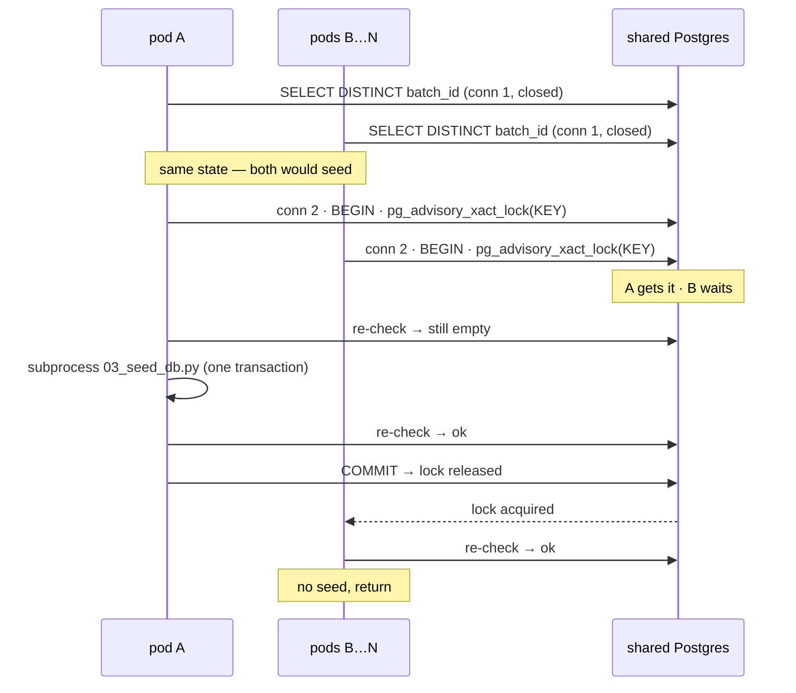

# Plan — auto-seed the shared corpus store on startup

**Status:** proposal. Branch `dev`.
**Trigger:** 2026-09-21 live failure — `knowledge_policy` empty on the prod
cluster, every worker pod died at `main.py:125`.

## Summary

The seed (`03_seed_db.py`) has never run against production. `check_corpus_freshness()`
refused to score, correctly — an empty store returns a well-formed empty pool
and every call would read as `Tích cực`.

MLE cannot run a standalone command on prod, so the seed moves into `main.py`
startup. `main.py` is the per-worker process and Postgres is shared, so it has
to be opt-in and single-flight.

| | |
|---|---|
| Files changed | 1 modified, 1 new test |
| New env vars | `CORPUS_AUTO_SEED` (bool, default `false`), `CORPUS_SEED_WAIT_S` (default 900) |
| Lock | `pg_advisory_xact_lock` — holds under any pooling mode |
| Default behaviour | unchanged: refuse and raise, exactly as today |
| `main.py` | not touched — call site already exists |

> Does not fix tonight's batch by itself: landing it still needs a deploy that
> sets `CORPUS_AUTO_SEED=true`. A one-off `python -m scripts.rag` gets there
> sooner if anyone can reach the cluster.

---

## 1. What changes on disk

```
analyze/
├── src/corpus/                       NEW package — the store, and making it match
│   ├── __init__.py                     what callers import
│   ├── state.py                        classify / read the rows / messages
│   ├── ensure.py                       the opt-in, the lock, the repair
│   └── _scripts.py                     the one place that invokes 03_ and 04_
├── src/cases/sentiment_agent/
│   └── _retrieval.py                 MODIFIED  now only resolves the DSN and delegates
├── tests/
│   └── test_corpus_autoseed.py       NEW       unit only — no DB, no VPN
├── scripts/
│   └── sim_multipod.py               NEW       dev tool: N pods against one store
└── docs/
    └── PLAN_corpus_autoseed.md       this file
```

No change to `main.py`, `sentiment.py`, `scripts/rag/**`, `resources.yaml`
or the Dockerfile.

### Why a package rather than more of `_retrieval.py`

The first cut put all of it in `_retrieval.py`, which grew that file by a
third and left two problems: seeding logic living in a module about
retrieving, and *two* places that knew which ingest steps to run with which
flags — `scripts/rag/ingest.py` for the operator flow, and the startup path
for its own subset.

| module | owns |
|---|---|
| `src/corpus/state.py` | what the rows say. `classify` is pure, so the interesting logic tests in CI |
| `src/corpus/ensure.py` | `ensure_seeded()` — the whole decision: pass, repair once under the lock, or raise |
| `src/corpus/_scripts.py` | how `03_seed_db.py` and `04_check_config.py` get invoked — cwd, env, flags, in one place |
| `src/cases/sentiment_agent/_retrieval.py` | which database, because only the resource config knows that. Three lines |
| `scripts/rag/` | the operator's full ingest — schema, FAISS index, seed, verify. Unchanged |

## 2. Store states

| state | condition | proposed |
|---|---|---|
| `ok` | one sha, equals `current` | pass |
| `empty` | table present, zero rows | **seed** when opted in |
| `mismatch` | one sha, not `current` | **seed** when opted in |
| `multi` | more than one sha | raise |
| `no_schema` | `UndefinedTable` | raise — needs DDL privilege we may not hold, and prod is not in this state |
| `unreachable` | connect / auth / network | raise |

Policy is a two-way split: seed on `empty` and `mismatch`, raise otherwise.
The other names exist so the log says something useful.

### 2.1 Why the seed prunes

`--prune` deletes `knowledge_policy` rows the corpus no longer has. Earlier
draft kept it manual; that was wrong, and wrong in the more damaging
direction:

| corpus edit | without `--prune` | with `--prune` |
|---|---|---|
| add / edit entry | self-heals | self-heals |
| **delete entry** | the old row keeps the old sha → `multi` → **every pod raises, the batch dies** until a human intervenes | row removed, matches yaml, run continues |

`corpus.yaml` *is* the source of truth today, so pruning is just applying it.
Three guards already exist: `report_orphans` refuses to prune more than 50% of
the table without `--force-prune` (which catches a truncated or mis-built
yaml), the seed is one transaction, and the lock means one pruner.

## 3. Protocol



1. Read `DISTINCT batch_id`, classify. `ok` → return. Not seedable, or not
   opted in → raise as today.
2. `BEGIN` on a second connection, `SET LOCAL lock_timeout`, then
   `pg_advisory_xact_lock(KEY)`. Returns at once if free, blocks if held,
   raises on timeout. One path, no retry loop.
3. Timeout → raise. Scoring against an unseeded store is the thing being
   prevented, so waiting too long is fatal.
4. **Re-check under the lock.** `ok` → another pod did it; commit, return.
   This is the path N−1 of N pods take.
5. Run the seed. Re-check. `ok` → return, else raise naming the new state.
6. `COMMIT`. A rollback, dropped connection or killed pod releases it too.

Before seeding, run `04_check_config.py` (config only — no embedding, no DB)
and refuse on non-zero exit. §5 says why.

**Transaction scope, not session scope.** A transaction-mode pooler pins one
server connection for the length of a transaction — that pinning is the whole
guarantee the mode offers, so a transaction-scoped lock holds under RDS Proxy,
pgbouncer or a direct connection without us needing to know which is deployed.
A *session* lock is the one that silently evaporates under transaction pooling.

## 4. Why concurrency is safe

| conflict | prevented by |
|---|---|
| Two pods seeding at once | the lock |
| A reader seeing a half-updated store | **the seed is already one transaction** — `get_pool` (hush) never sets `autocommit`, so psycopg defaults to `False` and every write commits once at the end |
| Write–write deadlock | one writer at a time; and see below |
| Duplicate rows | upsert by primary key |

**The lock is an optimisation, not the safety property.** If every pod seeded
at once anyway, the data would still be correct: each seed is one transaction
over the same corpus in deterministic order (`groups_of()` and `store.rows()`
both follow file order, `SIDES` is a module dict), so row locks are taken in
identical order — concurrent seeds block rather than deadlock, and each writes
what the other wrote. Concurrency costs N × 1,611 embedding calls on one
deploy, not integrity. That is why nothing in this plan waits on an
infrastructure answer.

## 5. The one gate that matters

Prod selects backends with four env vars. Setting three of them — stores
flipped to `-pg`, `CORPUS_EMBEDDING_RESOURCE` left on the ONNX default — is a
state the pod can genuinely be in, because `sentiment.py` downloads an ONNX
model from S3 regardless.

Auto-seeding in that state writes ONNX vectors into the shared database while
queries arrive from Triton. Both are unit-norm and 1024-d, the pool comes back
full and plausible, nothing raises — permanently, for every consumer of that
cluster. `04_check_config.py` catches exactly this, and is confirmed safe to
run on a pgvector pod with no index directory.

It has to run **config-only**, which takes a trick. Given a DSN the checker
also inspects the seeded rows and calls an empty `positive_embedding` a
problem — the very state being repaired — so the gate would refuse every
first seed. `PG_DSN` is therefore passed to the child as an empty string, not
removed: the child imports `src._bootstrap`, whose `load_dotenv()` restores a
*deleted* key from `.env` but skips one already present, empty included.
Deleting it looked like it worked, because the child re-read `.env` and
checked a different database that happened to be seeded.

## 6. Tests — `tests/test_corpus_autoseed.py`

| test | needs |
|---|---|
| `_classify` over all six states | nothing |
| opted-in × state matrix: only `empty` and `mismatch` seed | nothing |
| `CORPUS_AUTO_SEED` parsing — true/false/unset/garbage/case | nothing |
| `_run_seed` puts the DSN in `env`, not `argv` | monkeypatched `subprocess.run` |
| default mode still raises today's exact strings | nothing |

Splitting `_classify` out as a pure function is what puts the interesting
logic in CI, which has neither VPN nor a database. The integration case (two
processes racing the local stack) and the manual case (`TRUNCATE`, then
`main.py`) stay out of CI.

## 7. Rollout

1. Merge to `dev`.
2. MLE set `CORPUS_AUTO_SEED=true`, and confirm all four backend env vars are
   flipped together: `CORPUS_VECTOR_STORE_POS`, `CORPUS_VECTOR_STORE_CVO`,
   `CORPUS_DOC_STORE`, `CORPUS_EMBEDDING_RESOURCE`.
   **The variable has to reach `scripts/selfcheck/run.py`, not only the
   pods.** Its `_preflight_corpus_freshness()` calls `check_corpus_freshness()`
   directly and runs before any pod starts, so selfcheck is what will
   actually do the seeding — one process, no race, the lock never contended.
   Set on the pods alone, selfcheck hits the empty store first, raises, and
   blocks the deploy.
3. First batch after deploy: exactly one pod logs a seed, the rest log the
   wait. More than one seeding means the lock is not holding — harmless (§4),
   but worth knowing.

## 8. Known limits

| limit | reading |
|---|---|
| Two overlapping jobs on different images | pod-old seeds the old corpus, pod-new seeds the new one, and they fight. **Does not apply here** — this is a daily batch, so one job means one image, one corpus, one sha across all N pods |
| N−1 pods idle during a seed | only on runs where the corpus changed. `embed_all` uses `BATCH = 16` sequentially, so ~1,611 variants is ~101 serial Triton round-trips — order of a minute against a multi-hour batch |
| **Manual seeds are invisible to the lock** | someone running `python -m scripts.rag` by hand takes no lock. Same corpus → converges; a different corpus → ends as `multi`, which raises |
| **`corpus.yaml` is a snapshot, never a delta** | The seed upserts by stamped id and then `DELETE ... WHERE NOT (id = ANY(ids))`, so a partial yaml deletes everything it omits. `report_orphans` refuses a prune above 50% of the table, which catches the wrong-file case; a yaml missing *less* than half is deleted silently, because nothing distinguishes it from a deliberate bulk removal. Decided 2026-09-21 to leave the threshold alone: the file is maintained whole today, and the KB UI replaces this model rather than tuning it |
| **When the KB management UI lands, revisit** | `corpus.yaml` is the source of truth today, so seeding *and pruning* on `mismatch` is right. The day QC edits policy in the database, this would overwrite their edits on the next batch. Deliberately not designed around now — a mode nobody sets, for requirements that do not exist yet |
| `CORPUS_SEED_WAIT_S=900` is a guess | settle it with one timed seed against the local stack |
