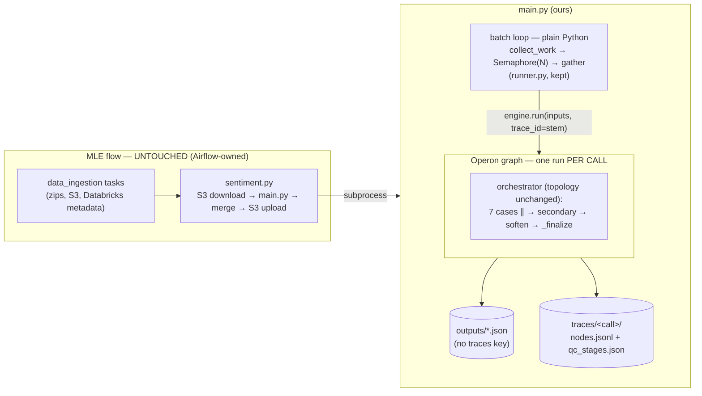

# Operonx migration plan

Replace the three vendored `hush-*` packages with `operonx` and migrate the QC
scoring pipeline onto it. **The unit of flow is one call**: everything that
happens to a call is one operonx graph (the orchestrator), exactly the way
`educa-reminder-agent` makes one run = one phone call — while its accept-loop
stays transport code, not a graph. Our batch loop is the analogous transport
and stays plain Python.

**Boundary rule:** an operonx flow is where there are LLM ops, per-item
fan-out, or branching worth tracing per item. Sequential glue — S3 download,
Databricks metadata pull, merge/upload — stays plain Python. **MLE's flow
(`deployment/data_ingestion/`, `sentiment.py`, `metadata.py`) is untouched in
this migration**; Airflow already owns its sequencing, retry, and
checkpointing, and wrapping a second orchestrator inside it buys nothing.

**Scope decision (user, 2026-09-22): v4 sentiment_agent only.** v3 is not
ported. It stays untouched on `main` (hush + v3), which remains the rollback
target; this branch deletes `src/cases/sentiment_agent/v3/` because un-imported
hush code cannot even load once hush leaves the tree. Rolling back the
migration = deploying `main`, not flipping a flag on this branch.

**And with v3 gone, the `v4` label goes with it** — one implementation needs
no version suffix. See §1b; the manifest, the module paths and the prompt keys
all carry the canonical name.

---

---

## Status — 2026-09-23 (verified)

**The migration is done and measured.** Against a baseline scored
pre-migration on the same corpus and the same prompts:

| gate | result |
|---|---|
| G4 selfcheck | **87/90 = 97% HARD match** (threshold 0.70) |
| G5 F1 | **identical** — precision 0.917, recall 0.367, F1 0.524, delta +0.000 |
| P5 packaging | **closed** — pins at `==1.6.4`, Nexus `pypi-proxy` serves the wheel |

Packaging needed one thing the repo could not answer for itself: whether
the Nexus proxy would fetch operonx from upstream PyPI. It does — a
`pip download` on VPN pulled `operonx-1.6.4-py3-none-any.whl` through
`registry.aws.platform.win.dev/repository/pypi-proxy`. So the image
installs the framework like any other package, and the three vendored
hush wheels are gone with nothing taking their place.

**No baseline rebuild is owed.** Do not run `scripts.selfcheck.build`.

The SOFT drift is the quieter evidence: `decider.cited_p` moved on 2 of
90 calls, against 79 of 90 on the first attempt. Retrieval returns the
same pool run to run, which is what says the port is faithful rather
than merely scoring the same.

### What it took: four operonx defects, each hiding the next

| # | defect | fixed in |
|---|---|---|
| 1 | a branch merge deadlocked — `scanner` waited on an arm that never ran, so every call returned a default row | 1.6.1 |
| 2 | completion content arriving as blocks, not a string: the parser died, `result` went None, and None reads as "no violation" | 1.6.2 |
| 3 | gRPC channels never closed — `POLLER` noise under every run | 1.6.3 |
| 4 | no retry on embeddings; a transient deadline failed a scored call | 1.6.4 |

Plus two in this repo: an empty retrieval pool scoring a call clean
(`545472c`), and `_failed_case_ops` looking only at top-level case ops so
nothing inside a case could ever fail a call (same commit).

**They are all the same bug.** A transport or parse failure becomes
`None`, and every consumer downstream reads `None` as "the model found
nothing". The output is well-formed, the file is written OK, the batch
reports success, and a violation the model actually flagged is reported
as a clean call. Nothing raises. This shape cost a full day and it will
recur — see [[feedback_silent_failure_shape]] before adding an op that
can return None.

The first F1 run measured −0.074 and it was entirely this: 11 of 90 calls
retrieved nothing after Triton degraded, all of them in the last twelve
files of the batch. Fixing the trigger (retry) and the aftermath (guard)
took the delta to zero.

### Open

1. **Three dead pins in the image.** `deployment/score_sentiment/requirements.txt`
   still installs `faiss-cpu`, `faiss-gpu` and `onnxruntime`. Nothing in
   the image imports any of them now that FAISS has left the ingest flow
   — the one surviving `onnxruntime` import is `triton_shim.py`, a dev
   script that never ships. Dropping them changes what the image
   contains, so it wants its own build and smoke test rather than riding
   along with something else.
2. **A latent raba bug, unrelated to the migration.** Its time detector
   asks for `has_actionable_time_mention`; the model returns
   `has_time_mention` + `mentions`. Silent for as long as
   `QC_ENABLE_RABA=false` has been set, and it will surface the moment
   the case is switched on. The field has been missing long enough that
   the prompt may be what moved.
3. **operonx, not urgent.** A retry holds its concurrency slot — `_pump`
   keeps `_sem` across the whole op run, backoff included. Policy belongs
   in the op, the slot belongs to the scheduler: op raises
   `Retryable(after=...)`, `_pump` releases, waits, re-dispatches. Own
   change, own tests. Only matters once retries are common.

### Deliberately left undone

`validators=_verify_result_ok` is carried but **not wired**
(`sentiment_agent/graph.py:153`). hush consulted `validator` only on the
fallback path and these sites have no fallback, so the predicate has
never run in production. Wiring it changes verdicts, which is a separate
change with its own F1 check — not part of a port.

---

## 0. At a glance

| # | Workstream | What changes | Size | Risk |
|---|---|---|---|---|
| P0 | **Provider ports into operonx** | oauth2, `db-anthropic`, `db-gemini`, `generation_extras`, transport retry, Triton embedding, callable validator, `ResourceHub.alias` | 8 features, 7 with hush reference code | Low — port, not design |
| P1 | **Mechanical migration** | imports, `Hush`→`Operon`, `get_hub()`→`ResourceHub`, `ChainOp`→`LLMOp` (26 sites), drop v3 + faiss/onnx/yaml runtime, `operonx.toml` | 44 tracked .py files | Low — compiler-checkable |
| P2 | **Filter fan-out rewrite** | `MapOp`+`Each` (removed in operonx) → generator-op streaming fan-out | 1 file + tests | **Medium** — semantics spike first |
| P3 | **Tracing** | custom `Consumer` with redaction; `traces` key leaves output .json → local traces dir | new module + selfcheck compare | Medium — interface change |
| P4 | **Runner rewire** | `engine.run` API swap + `traces` pop to sidecar; semaphore dispatch, `score_one` error handling, whitelist grouping all stay | light edit of `runner.py`/`engine.py` | Low |
| P5 | **Packaging + verify** | drop 3 hush wheels → `operonx==1.6.0` pin from PyPI (vendored wheel = fallback), sim rerun, selfcheck baseline rebuild | deployment + LLM cost | Baseline needs VPN |

Version gap being crossed: we vendor `hush-core 0.2.0 / hush-providers 0.4.0 /
hush-telemetry 0.1.3`; operonx is at **1.5.2**, a descendant of hush through
the April 2026 Hush→Operon migration plus five breaking releases
(`MIGRATION.md` in `D:\Operonx` documents 1.0.0 and 1.2.0).

---

## 1. Symbol map

### Renames (mechanical)

| hush | operonx |
|---|---|
| `Hush(graph)` | `Operon(graph, trace=[...])` |
| `hush.core` → `START END PARENT GraphOp graph op if_` | `operonx.core` — identical |
| `get_hub()` | `ResourceHub.instance()` (installed once via `operonx.bootstrap(resources=..., env=False)`) |
| `EmbeddingFactory` | `create_embedding()` |
| `setup_logger`, `LogConfig` | same names, `operonx.core.loggings` |
| `FaissVectorStore`, pgvector store, `_pg.get_pool` | present (we keep pgvector only; faiss import sites are deleted anyway) |
| `EmbeddingOp / VectorSearchOp / DocFetchOp` | present, same lineage — `_retrieval.py` wiring survives as-is |
| `state` iteration + `state.get(op, "error")` | identical (`MemoryState.__iter__` yields `(op, var)`) — `_failed_case_ops` ports unchanged |
| `op.enabled` | present — `apply_case_selection` ports unchanged |
| `resources.yaml` flat `llm:name:` keys, `${VAR}`/`${VAR:default}` | both supported unchanged (flat is "legacy" but parsed) |

### No 1:1 target — rewritten

| hush | Status in operonx | Replacement |
|---|---|---|
| `ChainOp` (21 files / 61 sites) | Merged into `LLMOp` | `template=` → `prompt=`, `extract=` → `fields=`, per-site audit (§4) |
| `MapOp` + `Each` (`sentiment_agent/_filter.py`) | **Removed** | Generator op fan-out (§5) |
| `LocalTracer` / `RedactingLocalTracer` | **Removed** — V3 `Consumer` model | `QCLocalConsumer(LocalConsumer)` (§6) |
| `YamlDocStore` + `split_variants`/`variant_id`/`parent_id` | **Removed** (`DocStoreType` = postgres/mongo/redis/memory) | Move into this repo — they are *our* corpus semantics (§7) |
| `hush.providers.triton.close_all` | Gone; `TritonClient.get(url)` pools per URL | Delete the two call sites |

---

## 1b. De-versioning sentiment_agent

`v4` was only ever meaningful next to `v3`. With v3 deleted there is one
implementation, so the suffix stops naming anything and starts being noise —
in module paths, in the manifest the studio draws, and in every prompt key.
Same convention already applied to handover docs: canonical name, no version
suffix.

Done as **one rename-only commit** inside P1, separate from the operonx sweep,
so `git log --follow` stays readable and a bisect can tell a rename from a
behaviour change.

| From | To |
|---|---|
| `src/cases/sentiment_agent/v4/*.py` | `src/cases/sentiment_agent/*.py` (flattened — the package already owns `format_sentiment_agent`) |
| `verify_sentiment_agent_v4` | `verify_sentiment_agent` (the public name today is already this alias; the alias becomes the definition) |
| `filter_sentiment_agent_v4` | `filter_sentiment_agent` |
| `.prompts/sentiment_agent/v4/*_V4.prompt` | `.prompts/sentiment_agent/*.prompt` |
| `SCANNER_PROMPT_V4`, `DECIDER_PROMPT_V4`, `FILTER_PROMPT_V4`, `KID_DETECTOR_PROMPT_V4`, `HALU_CHECK_PROMPT_V4`, `ASR_CHECK_PROMPT_V4`, `C12_DETECTOR_PROMPT_V4` | same keys, `_V4` dropped (`PROMPTS` keys are file stems, so the file rename *is* the key rename) |
| `CORPUS_YAML_V4` | `CORPUS_YAML` |
| `.prompts/sentiment_agent/v4/{corpus,keyword_filter}.yaml` + `index/` | `.prompts/sentiment_agent/…` — 4 path strings in `resources.yaml`, 1 in `_retrieval.py` |
| `CORPUS_YAML_V3`, v3 corpus + faiss blocks, `doc_store:corpus-v3` | deleted with v3 |

**The corpus move does not force a re-ingest.** `corpus_hash` is
`sha1(text)` — content only, no path component — so the seeded
`knowledge_policy.batch_id` still matches after the file moves. `--ingest`
classifies the store as `ok` and does nothing. Verified by reading
`_retrieval.py:72`; a deliberate check at G3, since the opposite would mean a
silent re-embed of the whole corpus on next deploy.

**What does move:** selfcheck's recorded `prompt_hashes` are keyed by prompt
stem, so every key changes. Irrelevant in practice — G4 rebuilds the baseline
anyway for the trace-field change — but it means the rename cannot land
*after* a baseline rebuild without invalidating it. Rename first, rebuild last.

Out of scope for this rename: `queue_id`/`call_code` semantics, `CASES`
registry ids (`sentiment_agent` already has no suffix), and anything MLE
reads — no env var, no output field, no S3 key carries `v4`.

## 2. Provider parity audit (P0 — the "lặt vặt" list)

Checked feature-by-feature against `D:\Operonx` source. Everything below is
**missing** in operonx 1.5.2 and must be ported (reference implementation =
our hush 0.4.0 tree at `D:\platform.hush-ai`):

| Feature | hush location | Why production breaks without it |
|---|---|---|
| `oauth2:` token provider (Databricks SP, background refresh) | `providers/auth/oauth2.py` | `oauth2:databricks` is how every `db-*` LLM authenticates. operonx auth has keycloak only |
| `api_type: db-anthropic` (`DatabricksAnthropic`) | `providers/llms/databricks.py` | Secondary decider runs on it. Carries `cache_control` breakpoint validation — Anthropic prompt caching through the Databricks proxy (`src/prompts.py` + `_secondary_decider.py` set `cache_control`) |
| `api_type: db-gemini` (`DatabricksGemini`) | same file | Primary + decider (`db-gemini-3-flash*`). Flattens message shapes the AI Gateway rejects |
| `generation_extras` on `LLMConfig` (incl. null-strip: `top_p: null` removes the key) | `llms/config.py` + `base.py` | `thinking`, `reasoning_effort` ladder, `response_format`, top_p-strip for Claude 4.6 — all of `resources.yaml`'s per-model tuning rides on this |
| **Transport retry** — `_call_with_retry`: 429 (`retry-after` honored), 5xx, `APITimeoutError`, `retry_on_empty`; knobs `max_retries / retry_base_delay / retry_min_delay / retry_max_delay` | `providers/ops/llm.py:332` | operonx `LLMOp.max_retries` is **semantic-only** (parser/validator re-ask). No transport retry at all. Databricks flips/stalls are why `.env` runs `max_retries: 10` — without this the pipeline dies on the first 429 |
| Triton embedding backend (`EmbeddingType.TRITON`; config fields `input_name`, `ssl`, `output_name`, `tokenizer_path`, `max_length`, `embed_batch_size`) | `providers/embeddings/triton.py` + the BYTES dtype entries | `embedding:corpus-triton` is the production embedder, TEXT-input mode included (2026-09-21 change). operonx has a generic `TritonClient` (pooled gRPC, dtype map) — build the backend on top of it rather than porting hush's client |
| `validator=` as a **callable over the parsed dict** | `ops/chain.py` (`ChainValidator`) | `_verify_result_ok` guards scanner output in `sentiment_agent/graph.py` + `_matcher.py`. operonx `validators=` only takes `{field: [allowed values]}` lists. Small port: let `apply_validators` accept a callable and feed the semantic-retry loop |
| `ResourceHub.alias(key, target)` — in-memory, non-persisting | new (no hush equivalent) | Names a *role* at a call site without `register()`, which persists and strips comments from `resources.yaml`. Not used by this migration — see §3b |

Two things that are **ours**, not operonx's, and just re-target:

- `_bootstrap` monkey-patch (usage counters, cache-hit cost math, the
  `LLM_CALL_TIMEOUT_SECS` deadline+retry wrapper) → patch
  `operonx.providers.llms.openai.OpenAISDKModel.generate` instead. Same body.
- `src/pipeline/_log.py` logger-name routing: `"hush", "hush.core",
  "hush.providers"` → `"operonx", ...`.

All P0 work lands in `D:\Operonx` (public repo — Win endpoints stay in our
`resources.yaml`; the ported features are generic OAuth2/Databricks-gateway/
Triton code). Bump to **1.6.0** and release to PyPI; the image then pins it
through the Nexus proxy like any other dependency (§10).

---

## 3. Target architecture — one flow **per call**

The per-call orchestrator graph is the flow; the batch loop around it is
transport. Deliberately **not** one graph per batch, for reasons that bite at
production scale (~20k calls/day across pods):

| One-graph-per-batch would mean | At 20k calls |
|---|---|
| `WorkflowTrace` holds every `OpExecution` until end-of-run flush | 20k × ~40 ops ≈ 800k executions in RAM, one multi-GB `nodes.jsonl` |
| One run = one `trace_id` | No per-call trace directory — the exact layout §6 needs |
| One failure domain | Today a bad file = one `{"error"}` json + `skip_if_exists` rerun. Mid-batch crash in a single run loses per-file retry semantics |
| `apply_case_selection` mutates `op.enabled` between whitelist groups | Impossible mid-stream on a running graph |



Kept exactly as-is:

- `main.py` stays the entrypoint; every CLI flag survives, including `--ingest`.
- `runner.py` dispatch: `asyncio.Semaphore` + `gather`, whitelist grouping,
  `score_one` try/except, `restore_unselected_verdicts` — all stay. The edit
  is the engine API swap plus popping `traces` to the sidecar (§6).
- Corpus ensure (`src/corpus/` — advisory lock, classify, seed) is pure psycopg;
  untouched. Only `_scripts.py`'s child scripts change imports.
- `orchestrator.py` topology, `CASES` registry, `apply_case_selection` — port
  verbatim (`op.enabled` and `state` iteration are API-identical in operonx).
- `sentiment.py` / `metadata.py` / `deployment/data_ingestion/`: **zero
  changes.** The only thing MLE sees is the wheel swap (§10).
- No serve layer (`[[serve]]` kinds are websocket/http/asgi — none apply to a
  batch job). But the project **does** get an `operonx.toml` manifest — see
  §3b: it is what makes the repo loadable in operonx-studio.

## 3b. `operonx.toml` + studio conventions (educa parity)

educa-reminder-agent is the reference project; its `operonx.toml` is read by
four tools (`operonx-studio`, `operonx-lint`, `operonx-extract`,
`operonx-serve`) and is the reason the whole callbot renders as a canvas.
Ours, batch-shaped — `[[graph]]` without `[[serve]]` is the documented shape
for "graphs nothing serves":

```toml
[project]
name = "sentiment"                  # the git repo's name, not "analyze"
description = "Vietnamese call-center QC scoring — 7 violation/sentiment cases per call."
src = ["."]

[resources]
overlay = "resources.yaml"

[[graph]]
name  = "qc_flow"
entry = "src.orchestrator:orchestrator"      # @graph → params are input ports

[[graph]]                                    # subgraphs worth linting/drawing alone
name  = "sentiment_agent"
entry = "src.cases.sentiment_agent.graph:verify_sentiment_agent"

[[graph]]
name  = "retrieve_corpus"
entry = "src.cases.sentiment_agent._retrieval:retrieve_corpus"

[studio]
traces = "./traces"                 # QCLocalConsumer root — studio's Traces tab
                                    # reads nodes.jsonl per run dir natively,
                                    # which is why §6 keeps LocalConsumer's layout
```

Conventions the lint enforces (`operonx-lint` joins gate G1), and where we
stand:

| Rule | Meaning | Our status |
|---|---|---|
| C3 | node identity = single-name assignment; no unstable/duplicate names in `@graph` bodies | Already clean — orchestrator assigns every node a name |
| C5 | no op construction/wiring inside loops | Clean today; the §5 filter rewrite must stay generator-based, not loop-built |
| C6 | `resource=` should be a **literal** so the UI can repoint an op in place | Flagged at all ~30 LLM sites (`resource=LLM_RESOURCE_KEY`) — **and left that way**, see below |
| — | one project per process; import roots declared in `[project] src` | `src.` package imports fine; extraction runs under this repo's interpreter + `local.env` |

**C6 is not acted on, deliberately.** The first plan called for literal
stage names (`resource="scanner"`) with a `ResourceHub.alias()` hop in
`_bootstrap` mapping each stage to the env-selected block. Reading the rule
itself killed it:

```python
severity="warning",    # lint.py — not an error
```

```
# A warning, not an error. Extraction builds the graph, so the resolved key
# always reaches the IR — callbot's `resource=agent.llm_resource` is a
# deliberate injection that keeps its graph agent-agnostic, and demanding a
# literal would mean hardcoding what the design keeps pluggable.
# What is genuinely lost is in-place editing: the UI cannot repoint this op
# without touching the thing that supplies it.
```

Three consequences:

- `operonx-lint` exits 1 only on **error**-severity findings
  (`cli.py:125`), so a lint-clean gate needs no change here.
- The studio still *reads* the resource: extraction builds the real graph,
  so the resolved key reaches the IR either way.
- What is actually forfeited is repointing an op from the UI — which
  nobody has asked for.

And the rule names our exact pattern as legitimate. `LLM_RESOURCE_KEY` is
how an operator moves the whole pipeline to another model with one
variable, and MLE's `settings.py` writes that variable onto the pod.
Replacing it with a literal plus an alias would trade one readable
indirection for two, so that "which model is this op on" needs two lookups
instead of one — to silence a warning.

`ResourceHub.alias()` still ships in P0. It is the right primitive when a
role genuinely needs naming; this is not that case.

Style conventions carried over from educa (adopted, not enforced):
nested `resources.yaml` layout (`llm:\n  scanner:` — both formats parse, the
reference project uses nested); op docstrings with a one-line Vietnamese
summary first (the studio shows them on node inspection); trace-formatter
keys = graph variable names, so node names are treated as a public interface
(renaming one silently reverts its `view.txt` line to the default arrow).

---

## 4. `ChainOp` → `LLMOp` (30 call sites, 21 files)

Standard translation:

```python
# hush                                      # operonx
ChainOp.of(                                 LLMOp.of(
    description="Detect bot template",          resource=LLM_RESOURCE_KEY,
    resource=LLM_RESOURCE_KEY,                  prompt=PROMPTS["VIOLATION_CASE1_BOT_DETECTOR"],
    template=PROMPTS["..."],                    fields=["is_bot: bool", "reason: str"],
    transcript=content,                         parser="json",          # pinned explicitly
    extract=["is_bot: bool", "reason: str"],    transcript=content,
)                                               name="bot", description="Detect bot template",
                                            )
```

Audit rules for the sweep (one row per site in the migration commit message):

1. **Pin `parser=` explicitly at every site.** hush sites that omitted it
   relied on hush's default; a silent default-mismatch produces `None` fields,
   not an error.
2. **`validator=_verify_result_ok` is currently dead code — porting it wakes
   it up.** Verified in hush source during P0: `validator` is consulted only
   inside `_should_use_fallback`, which is called only when `not is_last`.
   Our two sites (`sentiment_agent/graph.py`, `_matcher.py`) configure **no
   `fallback=`**, so the single resource is always the last one and the
   predicate has never run in production. operonx wires `validators=` into the
   parse result, so a rejection drives a semantic retry.

   That is a behaviour change, not a port: a scanner answer with a malformed
   `result` shape is passed downstream today, and would be re-asked after the
   migration. Land it **off** — carry the predicate across but leave
   `max_retries=0` at those two sites — then enable it as its own change with
   its own F1 check (G5). Otherwise a verdict move during P1 has two possible
   causes and no way to tell them apart.
3. No site uses `fallback=`, `ratios=`, `fallback_on_empty`, or
   `enable_thinking` (grep-verified) — nothing else to carry.
4. Prompt templates: same `{var}` / `{{literal}}` conventions both sides;
   `PROMPTS` dict is untouched. The static/dynamic split (`PROMPTS.split`)
   only feeds tracing (§6).

---

## 5. Filter fan-out rewrite (`sentiment_agent/_filter.py`) — DONE

The one graph that used `MapOp` + `Each`. **Resolved with `collect()`, not
with a fallback** — the plan's worry was wrong, and so was a first
attempt that hand-rolled `asyncio.gather` inside one op.

`.collect()` needs a source that emits exactly **one** end-of-stream
event. Two things qualify: a generator, and a **subgraph**. A bare
fanned-out op does not — it ends once per item, so a collect placed
directly on it flushes a one-element batch per item. That is measurable
and operonx's own `test_loop_generator_backedge` pins it.

So the fan-out is wrapped, and the collect sits on the subgraph boundary:

```python
@graph
def scan_chunks(transcripts) -> GraphOp:
    fan  = each_chunk(transcripts=transcripts)          # generator, NOT transient
    scan = LLMOp.of(..., transcript=fan["transcript"].parallel(max=WORKERS))
    START >> fan >> scan >> END
    scan["result"] >> PARENT["result"]

agg = aggregate_llm_result_fn(chunk_raws=scan["result"].collect(), ...)
```

Three things that bite, all now commented at the call site:

| | |
|---|---|
| `@op(transient=True)` on the generator | operonx **refuses** a collect on a transient source — the frames are released on consumption, so there is nothing left to buffer. Transience is for a stream that must not be retained (a call's audio); a handful of chunks is the opposite |
| Empty chunk list | A generator that yields nothing dispatches nothing, so the aggregator never runs and its `REASON_NO_CHUNKS` branch became unreachable. A `prep["n_chunks"] == 0` route now makes that decision in the graph, where it is visible |
| Order | Preserved by the collect, and irrelevant anyway: the aggregator is an OR reduction |

Per-chunk trace spans go. That is a **gain**, not a cost: each carried
`inputs.transcript`, a bare slice of the conversation, and the redactor
matches a `Conversation`-shaped dict, long float lists, and the system
half of a message pair — a plain string under `transcript` fell through
all three. A filtered call was writing its customer's words to disk once
per chunk. Per-chunk *verdicts* still reach the trace, as the collected
list on one record; only per-chunk timing is lost.

## 6. Tracing

Two layers exist today; both change shape, neither changes **content**:

| Layer | Today | After |
|---|---|---|
| Op-level (engine tracer) | `RedactingLocalTracer` — one redacted JSON per call under `PIPELINE_TRACER_LOCAL_DIR` | `QCLocalConsumer(LocalConsumer)` — V3 consumer, one **directory** per call: `meta.json`, `nodes.jsonl`, `view.txt` |
| Stage-level (`traces` key) | `_build_traces` assembles filter/exit/scanner/retrieval/halu_check/decider/asr_check/secondary_decider/soften from `_trace_meta` and **embeds it in the output row** | **Same builder, same 9 stages, same order, byte-identical dict** — the runner pops it from the row and writes it beside the op-level trace. The output .json no longer carries `traces` |

The stage block is **moved, not reshaped**:

```
# before — outputs/<call>.json
{"Sentiment": [{"Criteria": "...", "Result": "Thái độ cao", "Score_offset": -10,
                "traces": {"filter": {...}, "scanner": {...}, "decider": {...}}}], ...}

# after — outputs/<call>.json           (clean)
{"Sentiment": [{"Criteria": "...", "Result": "Thái độ cao", "Score_offset": -10}], ...}

# after — traces/<call>/qc_stages.json  (the same dict, one wrapper key)
{"traces": {"filter": {...}, "scanner": {...}, "decider": {...}}}
```

**Why the `{"traces": …}` wrapper rather than a bare stage dict:** selfcheck's
10 compare rules are literal paths rooted at that key —
`["traces", "filter", "should_scan"]`, `["traces", "secondary_decider",
"verdict"]`, … (`scripts/selfcheck/run.py:137`). Keeping the wrapper means
**not one rule path changes**; only `_pick`'s loader does — read the row, and
when `traces` is absent, read the call's `qc_stages.json`. That fallback also
keeps the old baseline readable, so the compare code can be migrated and
tested *before* G4 rebuilds.

Unchanged by design: the block is sentiment_agent's only (the other six cases
never emitted one), and `INCLUDE_TRACES=off` still means no stage block is
built — then no `qc_stages.json` is written either.

New module `src/pipeline/tracing.py` (pattern copied from educa's
`pipeline/tracing.py`, which registers a custom `_category` + factory):

- `QCLocalConsumerConfig(YamlModel)`, `_category = "trace_qc"`, declared in
  `resources.yaml` as `trace_qc:default: {root: ${PIPELINE_TRACER_LOCAL_DIR:./traces}}`.
- Redaction is **not** a 1:1 port — the hook moves and the detection changes.
  It becomes a `Consumer.sanitize()` override, applied *before* the row is
  built, not a post-hoc `flush()` rewrite. Same three reductions: transcript →
  `{"_redacted": "Conversation", "n_turns", "source"}` (via `source_path`),
  ≥64-dim float lists → `{"_redacted": "vector", "dim"}`, known static prompt
  halves → `{"_prompt": key, "sha", "chars"}`. Same result: 1.38 MB → ~0.05 MB
  per call, no transcript copies on disk.

  **Why it cannot be a straight port.** hush's collector ran
  `dataclasses.asdict` over each record (`core/tracing/collector.py:61`), so a
  `Conversation` reached the tracer already flattened to a dict — which is why
  the old redactor sniffed for `"vads" in value`. operonx deliberately does
  **not** `asdict` (`consumers/local.py:129` — it hand-builds the row to avoid
  deepcopy and Cython handles). Instead `Consumer.sanitize` replaces any
  non-primitive with `{"$unserializable": "<type>"}`.

  Consequence if we ported the dict-sniffing code unchanged: it would never
  match, and the base class would quietly write `{"$unserializable":
  "Conversation"}`. **Not a PII leak** — the transcript is dropped, not
  repr'd — but `source_path` goes with it, and that pointer is the only thing
  making a trace resolvable back to its input file. A silent loss of the
  feature `source_path` was added for. The override intercepts the real type
  instead of guessing at a shape, which is strictly better than what hush did.
  `test_trace_redaction.py` ports across as the regression guard, plus one new
  case asserting a `Conversation` never reaches the base fallback.
- Engine wiring: `Operon(qc_flow, trace=[consumer])` when
  `PIPELINE_TRACER_KIND=local`, else no consumer. Per-call directory named by
  `trace_id=f"{stem}_{uuid8}"` so a call's trace is findable by filename.

Per-call layout:

```
traces/
  <stem>_<uuid8>/
    meta.json        # workflow name, timings
    nodes.jsonl      # redacted op executions (op-level layer)
    qc_stages.json   # the former `traces` block, verbatim (stage-level layer)
    view.txt         # human rendering
```

**Interface change, stated loudly:** anything reading `traces` out of the
output .json stops seeing it — that is selfcheck's HARD-field compare, our
eval scripts, and the qc-batch skill's step-6 verification. All are ours; all
switch to reading `qc_stages.json`. The qc-monitor UI reads
`Result/Reasoning/Evidence/Score_offset/EvidenceIdxs`, which are untouched.
`INCLUDE_TRACES` keeps its meaning (whether stage traces are collected at
all), it just stops deciding output-JSON shape.

---

## 7. Corpus / retrieval / RAG scripts

- `_retrieval.py` graph (`EmbeddingOp` → 2× `VectorSearchOp` → `DocFetchOp` →
  assemble): ports with import renames only.
- **pg + triton become the only runtime backends** (finishing what the earlier
  "bỏ faiss/onnx" instruction started): delete
  `_LocalRetrievalStores` (the faiss/yaml runtime fallback),
  `CORPUS_ALLOW_LOCAL`, the faiss/onnx/yaml blocks in `resources.yaml`, and
  `require_remote_retrieval` simplifies to "resolve the four resources, assert
  pgvector/postgres/triton". Local dev keeps the proven local stack:
  pgvector container + `triton_shim.py` via `local.env`.
- `split_variants` / `variant_id` / `parent_id` / yaml flattening move from
  `hush.providers.doc_stores.yaml` into **`src/corpus/variants.py`** — they are
  QC corpus semantics (variant `|`-splitting, id stamping), not framework
  code. `scripts/rag/pipeline/02_build_index.py`, `03_seed_db.py`,
  `_retrieval.py` and the id-format tests all import from there. Seeding
  determinism (file order → identical row-lock order) is a property of that
  code, so the advisory-lock convergence argument in
  `PLAN_corpus_autoseed.md` is unaffected.
- `scripts/rag/_tokenizer.py`: TEXT-mode rule (`input_name` set → no local
  tokenizer) ports against the new operonx Triton embedding config.

---

## 8. Config & env

| Item | Decision |
|---|---|
| `HUSH_CONFIG` | Renamed `OPERONX_CONFIG`; `_bootstrap` reads the new name and falls back to `HUSH_CONFIG` with a deprecation line for one release, so MLE's `settings.py` (which writes `HUSH_CONFIG` into `.env`) keeps working until they swap one string |
| Two-file env (`local.env` / `.env`, `QC_LOCAL_STACK`) | **Unchanged** — see note below. `operonx.bootstrap(env=False)`: dotenv stays ours, single loader |
| Env-contract check | **New, free:** operonx's `YamlConfigStorage` scans `${VAR}` at hub construction and warns listing every unset variable, which resource key needs it, and which `.env` paths were searched. We have no equivalent today — a missing variable only surfaces when the resource resolves |
| `resources.yaml` | Same file, same flat keys, same `${VAR:default}`. Diff: faiss/onnx/yaml + v3 blocks removed; `llm:` menu blocks kept (they are a runtime-selected menu, not dead code) |
| `src/config.py` | Unchanged surface. `VERIFIER_LLM_RESOURCE_KEY` (v3 verifier) kept as a read-but-unused knob for one release so no deployed env explodes |
| `QC_ENABLE_<CASE>` toggles, `PIPELINE_*` knobs | Unchanged |

**Why the two-file design stays** (reconsidered against the reference
project). educa carries four env files and its app code does a bare
`load_dotenv()` — no selection logic in Python at all; GitLab CI picks
(`export ENV_FILE=.env_prod` → `env_file:` in the docker stack). That is the
better principle in the abstract: **selection belongs to the deploy layer**.
It does not transfer here for two concrete reasons:

- We do not own the deploy layer. MLE's Airflow/pod config picks the
  environment, and `.env` is a file **their `settings.py` writes** — an
  interface with a fixed shape, not something we can rename or restructure.
- The dev machine runs the same code with no deploy layer to choose for it.
  `os.name == "nt"` is doing exactly the job educa's CI does, and it is the
  only signal that does not move (IPs change on a 3G dongle, hostnames are
  per-pod, and the env file is the thing being decided about).

Rejected alternative, for the record: pushing deploy values into
`resources.yaml` as `${VAR:default}` so `.env` shrinks to secrets. A dev
machine missing `local.env` would then **silently talk to the cluster** —
precisely the half-local failure this design was built to end.

---

## 9. File map

```
D:\Operonx  (operonx 1.5.2 → 1.6.0)                      # P0
  operonx/providers/auth/oauth2.py            NEW  port of hush oauth2 provider
  operonx/providers/llms/databricks.py        NEW  DatabricksAnthropic + DatabricksGemini
  operonx/providers/llms/config.py            EDIT generation_extras + retry knobs + db-* enum
  operonx/providers/ops/llm.py                EDIT _call_with_retry (transport) + callable validator
  operonx/providers/embeddings/triton.py      NEW  on top of operonx TritonClient (TEXT + token-id modes)
  operonx/providers/embeddings/config.py      EDIT input_name/ssl/output_name/tokenizer_path/max_length
  operonx/providers/registry/*                EDIT register oauth2 + triton embedding

analyze (this repo)                                       # P1–P4
  operonx.toml                                NEW  manifest: [[graph]] entries + [studio] traces (§3b)
  src/_bootstrap.py                           EDIT operonx imports; patch target; bootstrap(env=False); stage-key aliases
  src/config.py                               EDIT drop CORPUS_ALLOW_LOCAL; keep surface
  src/orchestrator.py                         EDIT imports only
  src/cases/**/graph.py, _ops.py, detectors   EDIT ChainOp→LLMOp sweep + imports (mechanical)
  src/cases/sentiment_agent/v3/               DELETE (rollback = main)
  src/cases/sentiment_agent/v4/*  → ../       MOVE  de-version, rename-only commit (§1b)
  .prompts/sentiment_agent/v4/*   → ../       MOVE  prompt files + corpus.yaml + keyword_filter.yaml
  src/cases/sentiment_agent/_filter.py        REWRITE MapOp → generator fan-out (post-move path)
  src/cases/sentiment_agent/_retrieval.py     EDIT imports; delete _LocalRetrievalStores
  src/corpus/variants.py                      NEW  split_variants/variant_id/parent_id (from hush yaml store)
  src/pipeline/engine.py                      REWRITE create_engine → Operon + consumer wiring
  src/pipeline/tracing.py                     NEW  QCLocalConsumer + config + registration
  src/pipeline/runner.py                      EDIT engine API swap; pop `traces` → sidecar; dispatch kept
  src/pipeline/_log.py                        EDIT logger names hush→operonx
  scripts/rag/**                              EDIT imports; _tokenizer TEXT rule; drop faiss/yaml paths
  scripts/selfcheck/run.py                    EDIT compare reads traces sidecar
  resources.yaml                              EDIT drop faiss/onnx/yaml/v3 blocks; add trace_qc:
  pyproject.toml / uv.lock                    EDIT hush-* → operonx
  requirements.txt                            EDIT + operonx[openai,pgvector]==1.6.0 (PyPI via Nexus proxy)
  deployment/pkgs/                            DELETE 3 hush wheels (vendored wheel only as fallback, §10)
  deployment/**  (everything else)            UNCHANGED — MLE's flow stays as-is
  tests/**                                    EDIT imports; filter fan-out tests; consumer tests replace tracer tests
```

---

## 10. Packaging

**operonx is on PyPI** (1.5.2, 2026-09-20, same repo/owner as `D:\Operonx`).
That removes the reason hush was vendored — hush was private, wheels were the
only channel. A public indexed package belongs in `requirements.txt` with a
pinned version, resolvable through the Nexus pypi-proxy the image already
uses. Tier-1 deps are tiny (`orjson`, `pydantic`, `pyyaml`, `rich`); providers
pull in via extras.

Primary path:

1. P0 ports land in the Operonx repo → release **1.6.0 to PyPI** before any
   image build (hard dependency: the pin below must be installable).
2. `requirements.txt`: add `operonx[openai,pgvector]==1.6.0`. `psycopg` /
   `tritonclient[grpc]` / `numpy` are already pinned there today; no other
   additions expected.
3. Delete all three hush wheels from `deployment/pkgs/`; if that leaves the
   directory empty, the Dockerfile's `pip install /app/pkgs/*.whl` step goes
   with it (one line, flag to Huy).
4. Verify the *installed* package, not the version string (lesson from the
   hush 0.4.0 wheel): in the built image or a clean venv,
   `python -c "from operonx.providers.llms.databricks import DatabricksAnthropic"`
   plus grep for `oauth2`, `input_name`, `_call_with_retry`.
5. Note to Huy: hush wheels removed, one requirements line added, optional
   `HUSH_CONFIG`→`OPERONX_CONFIG` rename in `settings.py` (our side reads both
   for one release). Pod args, env, S3, DAG placement — theirs; nothing on
   our command line changes (`main.py --ingest` as today).

Fallback (either trigger): the Nexus proxy refuses to serve `operonx`
(whitelist policies exist — one `pip install operonx==1.5.2` through the proxy
settles it), or 1.6.0 isn't published in time. Then vendor a locally-built
`operonx-1.6.0-py3-none-any.whl` in `deployment/pkgs/` exactly as hush is
today, and move to the requirements pin later. Same code either way.

---

## 11. Verification

| Gate | What | Cost |
|---|---|---|
| G0 | operonx unit tests green in `D:\Operonx` after P0 ports | none |
| G1 | This repo's ~500 unit tests green after each phase (imports are compiler-checked; filter + tracer tests rewritten) + `operonx-lint` reports no **error**-severity findings (C3/C5; C6 warnings on `resource=` are accepted, §3b) + `operonx-extract` renders every `[[graph]]` entry | none |
| G2 | Local batch on local stack (pgvector container + triton shim + e4b or a db-* key if VPN): every output row identical in shape, `traces` absent from .json, sidecar present per call | small |
| G3 | 4-pod sim (`scripts/sim_multipod.py`) — ingest path re-verified with operonx imports; all five scenarios PASS again | none (local) |
| G4 | **Selfcheck baseline rebuild** — mandatory: trace fields moved (HARD diff on every call otherwise). Compare rules updated to read `qc_stages.json` first, then `build`. Needs VPN + LLM spend → commands handed over, not run by me | ~90 calls × full pipeline |
| G5 | F1 guard on a QC-labeled batch (e.g. 425-call UAT set) — compare against **ground truth**, never against the prior run (27% Databricks Result-flip makes run-vs-run meaningless). Accept = F1 within noise of the hush baseline | one labeled batch |

Order of phases is also the rollback ladder: every phase ends green and
committable — the branch can pause after P1 (pure port, hush-shaped tracing
still absent) or after P3/P4 without hostaging the rest.

---

## 12. Design review — assumptions checked before starting

Verified against source, so they are not re-litigated mid-migration:

| Assumption | Verdict |
|---|---|
| `@op` output inference — MIGRATION.md warns a non-literal return "BUILDS fine but fails at runtime". We have **8** non-literal returns (`exit_fn` returns a variable, `build_secondary_inputs_fn` returns a call, …) | **Safe.** `return_keys` is byte-identical in both (`func_op.py`: "return_keys explicit > AST parsing"), and every affected site already passes it. No change needed |
| `prompt=` accepts our cached templates | **No** — it takes a template (str/dict) and refuses a list; `messages=` takes a list and never formats it. Ours are both. `PROMPTS.pair()` returns the dict form, which formats while `_format_value`'s recursion leaves `cache_control` intact. `chat()` deleted with its last caller |
| Provider ops resolve lazily | **No** — `Operon.__init__` warms every op, so a resource the graph *names* must exist at startup even on a branch production never takes. Measured: a bad key is now fatal at construction (it used to surface only when that op ran, i.e. never); a **blank** env var still slips through to call time. Guarded by `tests/test_graph_resources_exist.py` |
| `resource=` key shape | **Plan was wrong, fixed** — bare name, the op prepends `llm:` (§3b) |
| `Conversation` redaction | **Plan was wrong, fixed** — `sanitize()` override, not a `flush()` port (§6) |
| `state` iteration + `state.get(op,"error")` for `_failed_case_ops` | Identical API — ports unchanged |
| `op.enabled` for `apply_case_selection` | Present (`ops/base.py:344`) |
| `resources.yaml` flat `llm:name:` keys + `${VAR:default}` | Both parsed; flat is "legacy" but supported |
| `Operon.run(trace_id=…)` to name the per-call trace dir | Present in the signature — the runner controls directory naming |
| `latest` symlink on a Windows dev box | Guarded — `except OSError: pass`, documented as best-effort |
| Does a batch job need `operonx.toml`? | `[[graph]]` without `[[serve]]` is the documented shape for graphs nothing serves |

Sequencing constraints that fall out of the above:

1. **P0 before P1.** P1 cannot compile without the ported providers. During
   P1, local dev installs operonx from the working tree (path dep on
   `D:\Operonx`); the PyPI pin lands in P5 once 1.6.0 is published.
2. **De-version (§1b) before the selfcheck rebuild (G4)**, never after —
   prompt-hash keys change with the file stems.
3. **Selfcheck compare migrated before G4**, using the row→sidecar fallback,
   so the new compare code is tested against the *old* baseline first.

## 13. Known costs / open edges

- **Selfcheck + eval scripts must move to the sidecar in the same commit** as
  the `traces` removal, or G4 reads garbage. Listed in P3, not optional.
- **Filter chunk order** (§5 spike) is the one place operonx semantics could
  silently differ from hush; the spike is scheduled before the rewrite, and
  the fallback costs 10 lines.
- **`db-anthropic` cache_control through the V3 tracer**: prompt-cache
  breakpoints ride message dicts; the redactor already indexes rendered
  prompts both `{{`-escaped and collapsed — port that test
  (`test_trace_redaction.py`) as-is to the consumer.
- **v3 deletion** removes the in-tree rollback; `main` keeps it. The DAB/BU
  docs that name v3 as rollback stay true because rollback = redeploy `main`.
- Baseline rebuild + labeled-batch scoring are the only LLM-spend items;
  both come last and both are hand-off commands (VPN).
