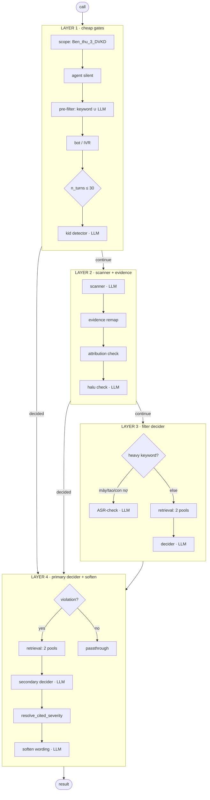

# Refactor plan — sentiment_agent as four layers

## Status — 2026-09-24: done

Every step is complete. Verified without calling a model:

| | |
|---|---|
| replay | **80 recorded calls, verdict-identical** |
| op inventory | no functional op lost — the four names that differ are auto-generated branch labels, renumbered inside their new subgraphs |
| suite | 741 passed, 12 xfailed |

Three routing tables changed, all the same boundary shift: a branch whose
continue-arm pointed at an op now in another layer points at that layer's
`proceed` exit. Every condition is unchanged.

**Owed:** one selfcheck on live models to confirm what the replay already
shows offline. Needs VPN.

### Resolved — the stall was a NameError, not the endpoint (2026-09-24)

`uv run python -m scripts.selfcheck` died with five
`[llm timeout] system.ai.gemini-3-flash exceeded 90s` — five being the
concurrency, so every call in the first batch. It cost most of a day and
the endpoint was healthy the whole time.

**Cause.** `ea11776` (lift the pool helpers out of `_matcher`) dropped the
context-window block. Six undefined names shipped:

| file | missing |
|---|---|
| `l2_scanner/_evidence.py` | `_window_for`, `_build_verifier_context`, `format_mmss`, `SKIP_MATCHER_CODES` |
| `l3_decider/_decider_ops.py` | `_WINDOW_BY_CODE`, `_DEFAULT_WINDOW` |

`_decider_ops.py` had kept verbatim *copies* of both functions without the
table they read; `_evidence.py` kept neither. Fixed in `ff0234f` — the
window logic is now one shared `_context.py`, imported by l2, l3 and
`_asr_check` rather than copied.

**Why it looked like an LLM problem.** `needs_matcher_fn` raised on its
category check, operonx logged the op as failed and carried on, `l2`
produced no evidence, and the decider was reached with nothing to judge —
a 4,211-character prompt *identical on all five files*, five different
transcripts. The model stalled on a question with nothing in it.

Only flagged calls reach that line; `needs_matcher_fn` returns early for
clean ones. So the blast radius was exactly the flagged subset — which is
also why the fix changes nothing in the replay.

**Why nothing caught it.**

| | |
|---|---|
| the suite | 741 tests pass with all six missing — they are `NameError`s inside op bodies, and `tests/_replay.py` stubs op *cores*, so the bodies never run |
| the replay | its 80 passing calls never enter `l2`'s flagged path; the 12 that do were already xfail for the unrecorded-secondary-pool reason, unchanged before and after the fix |
| `_failed_case_ops` | **would** have fired — it reads `state[op, "error"]` and raises, naming the op. But it is post-hoc: a call that *hangs* never returns, so the error prevented its own reporting |
| `report.log` | selfcheck inherited the subprocess's stderr, so operonx's `Error in op needs_verify` line reached the console and nothing else. Three killed runs left a log ending at "starting main.py subprocess" |

**Fixed as a result:**

- `919dff8` — the timeout line names the op and the prompt shape (the model
  string alone cannot distinguish `db-gemini-3-flash` from `-high`), and
  selfcheck merges the subprocess stderr into `report.log`. This is what
  found the bug, one run after it went in.
- `tests/test_no_undefined_names.py` — pyflakes over `src/` and `tests/`.
  Catches all six in one second, and carries a self-test so a silently
  broken checker cannot leave it green.

**Still open, worth doing separately:**

- Nothing bounds a whole call. `LLM_CALL_TIMEOUT_SECS` bounds one LLM
  request; a stalled graph holds its concurrency slot indefinitely and
  never reaches the `_failed_case_ops` guard.
- selfcheck's match rate is one global number. The recorded baseline holds
  78 clean calls and 12 flagged, so a fault that clears *every* flagged
  call still reads 78/90 ≈ 87% — within a call or two of the 0.85
  threshold in `local.env`. Restricted to baseline-flagged calls the same
  fault reads 0/12. The threshold is calibrated for uncorrelated noise;
  this class of fault is correlated by construction.

**Found along the way**, each fixed in operonx and released:

| | |
|---|---|
| `if_(check, …)` wired `check >> check` | an op waiting on itself — 90 empty output files, reported OK (1.6.7) |
| `GraphOp.run` ignored `enabled` | a disabled case still called its model (1.6.9) |
| a disabled op returned without yielding | every successor waited forever (1.6.10) |
| `cost_per_*_token` declared, read by nothing | per-call cost restored (1.6.6) |
| `health_check` meant "it constructs" | `require_reachable` — 3s instead of a batch of timeouts (1.6.8) |

The last two defects cancelled each other out: nobody hit the stall
because the only thing anyone disabled was subgraphs, which ran anyway.

---

## Executive summary

`verify_sentiment_agent` is one 40-op graph with nine terminals, and two more
stages (`secondary_sa`, `soften_sa`) that live in `orchestrator.py` and wrap its
result. Nothing names the structure, so the only way to see the shape is to read
350 lines of wiring.

This plan reorganises it into **four layer subgraphs**, named after the blocks in
`docs/FLOW_sentiment_agent_end_to_end.html`, and brings the two orphaned stages
inside. **No logic changes. No verdict changes.** The op bodies, their order and
their conditions are carried across untouched; only composition moves.

| | now | after |
|---|---|---|
| ops in `verify_sentiment_agent` | 40, flat | 4 subgraphs |
| terminals | 9 × `>> END` | 1 per layer, 1 for the case |
| stages outside the case | 2 (`secondary_sa`, `soften_sa`) | 0 |
| `_finalize` kwarg | `soften_sa["result"]` — the odd one out | `sentiment_agent["result"]`, like the other 6 |
| lines of wiring in `graph.py` | ~60 | ~6 |
| files in `sentiment_agent/` | 11 flat | 4 layer packages + 3 shared |
| trace files per call | 4+ (`meta`/`nodes.jsonl`/`view`/`media`) plus the row block | **1** — the QC audit block (§8) |
| per-call LLM cost | dropped in the port, config still declared | computed again, summed per call (§8 P1) |

**Why now:** the e2e flow doc already describes the pipeline in these blocks, for
an audience that includes QC and IT. Code that does not match the diagram the
business reads is a standing tax on every conversation about it.

**The one thing that must not regress:** `resolve_cited_severity` runs in layer 4
and decides `Score_offset`. Layer 4 is not post-processing — see
[§2](#2-why-secondary-and-soften-were-outside).

---

## 1. Target shape



Every path reaches layer 4, and layer 4 short-circuits anything that is not a
violation. **That is exactly today's behaviour** — the orchestrator already
sends every result, early exits included, through `secondary_sa` and
`soften_sa`, which gate on `violation == true`.

### What changes vs the e2e diagram

The diagram omits one live route and mis-ranks one stage. Both are fixed here,
in the code and in the drawing:

| | |
|---|---|
| **ASR-check branch missing** | heavy keywords (`mày` / `tao` / `con nợ`) skip the decider for a dedicated LLM. A real production path with no box |
| **"VERIFY · primary decider" drawn as a refinement** | it resolves cited severity, which outranks the scanner's category and *is* `Score_offset` |

---

## 2. Why secondary and soften were outside

Recorded because it is the question this refactor has to answer, and the answer
constrains the design.

| reason | still true after? |
|---|---|
| **Nine terminals.** Inside the flat graph, layer 4 would have to hang off every one | **No** — layers give each stage one exit, so there is a single place to attach |
| **Reversible experiment** (`c2e97b0`, 2026-07-29, after a 969-call FP diagnostic). Env kill-switch so removal meant unsetting a variable | **Yes, preserved** — `SECONDARY_DECIDER_LLM_RESOURCE_KEY` unset still makes the layer a passthrough |
| **Different model tier** — Claude Sonnet on ~1–2% of traffic vs Gemini Flash in the body | **Yes** — own resource key, own `no-cache` prompt decision, unchanged |

The nine-terminal reason is the only structural one, and the layer split is
precisely what removes it. The other two are properties of layer 4's internals
and survive the move.

### A defect this fixes

`apply_case_selection` ([runner.py:44](../src/pipeline/runner.py#L44)) disables
the op named exactly `sentiment_agent`. `secondary_sa` and `soften_sa` are not
in `CASES`, so `QC_ENABLE_SENTIMENT_AGENT=false` does not disable them — they
stay in the graph consuming a result that was never produced.

Whether operonx skips them via the disabled upstream is **unverified**, and it
is the same shape as the 2026-09-23 defects: absent reads as negative. Once both
are inside the case op, one `enabled = False` covers all of it.

---

## 3. Layer membership — all 40 ops

Nothing is dropped, nothing is merged, nothing is reordered.

### Layer 1 · cheap gates — 16 ops

| op | kind |
|---|---|
| `fmt` | format |
| `exit_code`, `quiet`, `filter_exit`, `exit_bot`, `exit_kid` | terminals |
| `filter` (subgraph), `apply_gate` | pre-filter |
| `bot_check` | regex |
| `short_gate` | branch on `n_turns ≤ KID_DETECTOR_TURN_CAP` |
| `kid_check` (LLM), `is_kid_fn` | kid detector |
| `route_2`, `route_3`, `route_4`, `route_5`, `route_6` | branches |

### Layer 2 · scanner + evidence — 11 ops

| op | kind |
|---|---|
| `scanner` | LLM |
| `mapping`, `remap` | evidence expansion + deterministic re-map |
| `attr_check` | substring attribution |
| `halu_check_inputs`, `halu_check` (LLM), `is_halu_fn`, `halu_suppress` | hallucination gate |
| `needs_verify`, `skip_verify` | verify gate + terminal |
| `route_7`, `route_8`, `route_9` | branches |

### Layer 3 · filter decider — 10 ops

| op | kind |
|---|---|
| `route_check`, `route_10` | heavy-keyword routing |
| `asr_check_inputs`, `asr_check` (LLM), `apply_asr_check` | ASR-check branch |
| `retrieval_query`, `retrieval` (subgraph), `matcher_inputs` | retrieval |
| `decider` (LLM), `apply_decider` | verdict |

### Layer 4 · primary decider + soften — from `orchestrator.py`

| op | kind |
|---|---|
| `secondary_sa` (subgraph: own gate, own `retrieval`, LLM, `resolve_cited_severity`) | strict re-verify **+ severity** |
| `soften_sa` (subgraph) | wording only, never changes the verdict |

---

## 4. How the layers chain

Each layer subgraph exports `result`. A layer that has already reached a verdict
is detected by a signal that **already exists** — `exit_fn` stamps
`result["_trace_meta"]["exit"]["stage"]` for every terminal that passes
`exit_stage=`.

```python
@op
def is_decided(result: dict = None) -> bool:
    """True when an upstream gate already ended the call."""
    if not isinstance(result, dict):
        return False
    return bool((result.get("_trace_meta") or {}).get("exit"))
```

Composition in `graph.py` becomes:

```python
l1 = l1_gates(conversation=conversation, call_code=call_code, name="l1")
l2 = l2_scanner(conversation=conversation, result=l1["result"], name="l2")
l3 = l3_decider(conversation=conversation, result=l2["result"], name="l3")
l4 = l4_verify(conversation=conversation, result=l3["result"], name="l4")

START >> l1 >> if_(is_decided(result=l1["result"]), l4).else_(l2)
l2 >> if_(is_decided(result=l2["result"]), l4).else_(l3)
l3 >> l4 >> END
```

Two gaps to close first, both trace-only:

| op | today | needs |
|---|---|---|
| `halu_suppress` | no `_trace_meta.exit` | `exit_stage="halu"` |
| `skip_verify` | no `_trace_meta.exit` | `exit_stage="no_violation"` |

That is an improvement on its own terms: the `qc-batch` skill's verification
table says a result with neither `scanner.violation` nor `exit.stage` is
"unexplained — investigate". These two are exactly that today.

**Not a HARD selfcheck field.** HARD is `Result`, `Score_offset`,
`EvidenceIdxs`, `filter.*`, `scanner.violation`, `decider.verdict`,
`secondary.verdict`. Adding `exit.stage` moves no HARD field.

---

## 5. New folder structure

```
src/cases/sentiment_agent/
├── __init__.py                     # verify_ + format_ exports (unchanged API)
├── graph.py                        # 4-layer composition, ~60 lines total
│
├── _retrieval.py                   # SHARED — layers 3 and 4 both retrieve
├── _pools.py                       # SHARED — _format_indexed_pool, _parse_cited,
│                                   #   pool_id_map, remap_cited  (from _matcher.py)
├── _coerce.py                      # SHARED — _coerce_violation (today duplicated
│                                   #   in _ops.py and _matcher.py)
│
├── l1_gates/
│   ├── __init__.py
│   ├── graph.py                    # @graph l1_gates
│   ├── _bot_check.py               # moved as-is
│   ├── _kid_detector.py            # moved as-is
│   ├── _filter.py                  # moved as-is
│   └── _keyword_filter.py          # moved as-is
│
├── l2_scanner/
│   ├── __init__.py
│   ├── graph.py                    # @graph l2_scanner
│   └── _evidence.py                # attr_check, halu, remap, needs_matcher,
│                                   #   skip_matcher  (split from _matcher.py)
│
├── l3_decider/
│   ├── __init__.py
│   ├── graph.py                    # @graph l3_decider + query/inputs/apply ops
│   └── _asr_check.py               # heavy-keyword branch, moved as-is
│
└── l4_verify/
    ├── __init__.py
    ├── graph.py                    # @graph l4_verify + gate, pools, apply
    ├── _severity.py                # resolve_cited_severity — the scoring path
    └── _soften.py                  # wording rewrite, moved as-is
```

Two names are deliberately **not** carried across. `_decider.py` inside
`l3_decider/` stutters, and its three ops (`build_retrieval_query_fn`,
`build_matcher_inputs_fn`, `apply_decider_result_fn`) are small enough to sit
beside the graph they serve. `_secondary_decider.py` inside `l4_verify/` is
worse than redundant: the layer mapping says this *is* the primary decider, so
the old name preserves the exact confusion the e2e naming removes. Its one
non-obvious piece — `resolve_cited_severity`, which decides `Score_offset` —
gets its own file so it is findable.

### What must keep the old name

The word "secondary" survives in three places that are **not** ours to rename:

| | why |
|---|---|
| `SECONDARY_DECIDER_LLM_RESOURCE_KEY` | a deploy env var; renaming silently disables the layer |
| `traces.secondary_decider.*` | a **HARD** selfcheck rule key — renaming invalidates the baseline |
| `SECONDARY_DECIDER_PROMPT` | prompt stem, keyed flat by filename |

So: files and folders get the new vocabulary, the wire format keeps the old.
That split is the whole reason this refactor can claim "no result change".

`_matcher.py` (30 KB) is the only file that splits. It currently holds three
unrelated concerns; the split follows the layer they belong to, and the pool
helpers that layer 4 also imports move to `_pools.py`.

Prompts stay flat in `.prompts/sentiment_agent/` — `PROMPTS` is a flat namespace
keyed by file stem, and re-foldering them changes no key.

---

## 6. The guarantee, and how it is checked

**Invariant:** for any input, the final `result` dict is byte-identical to
today's, modulo the two `_trace_meta.exit` additions in §4.

What makes that credible:

| | |
|---|---|
| op bodies | moved, not edited — `git log --follow` proves it per file |
| op order | each layer preserves its internal wiring verbatim |
| branch conditions | copied unchanged |
| every path still reaches layer 4 | matches today, where the orchestrator wraps all results |
| retrieval called twice | unchanged — layers 3 and 4 each retrieve, as now |

### Why the live gates are the wrong instrument

Selfcheck and F1 need VPN, cost LLM calls, and sit on a ~27% Result-flip noise
floor. They can say *close enough*; they cannot say *identical*. For a refactor
whose whole claim is byte-identical output, that is the wrong tool — a real
regression under 27% noise is invisible, and a clean run proves little.

So the guarantee is carried by **offline equivalence tests**, and the live gates
become confirmation rather than proof.

### T1–T3 — free, offline, no LLM

| tier | asserts | catches |
|---|---|---|
| **T1 topology** | the built graph's leaf ops, terminals and reachability match a golden snapshot (modulo the `l1.`–`l4.` prefixes) | an op dropped, duplicated, or orphaned by the move |
| **T2 routing** | every branch, fed synthetic upstream outputs, selects the same target as before | a condition copied wrong, an arm swapped |
| **T3 op behaviour** | each moved pure op replays a recorded input→output table | a body edited during a "move-only" cut |

T2 is the one that would have caught the 2026-09-23 merge deadlock, and T3 is
what makes "moved, not edited" checkable instead of asserted.

### T4 — replay equivalence, the actual guarantee

`tests/sample/fixtures/outputs/` already carries, for all 90 calls, a decision
trace committed to git:

| stage | recorded |
|---|---|
| `filter` | `should_scan` · `kw_hit` · `llm_verdict` · `applied` |
| `scanner` | `violation` · `category_raw` · `reason` · `evidence` · `evidence_idxs_raw` |
| `retrieval` | `top_k` · `positives` · `carveouts` |
| `decider` | `verdict` · `reason` · `cited_positives` · `cited_carveouts` · `pool_map` |
| `secondary_decider` | `verdict` · `cited_*` · `severity_final` · `enabled` |
| `soften` | `before` · `after` · `enabled` |

Stub those LLM ops from the recording, run the new graph on the 90 fixture
inputs, and assert the final row — `Result`, `Score_offset`, `Evidence`,
`Reasoning`, and the whole `traces` block — is **equal, not close**. No network,
no cost, runs in CI, repeatable forever.

**Gap:** `kid_check`, `halu_check` and `asr_check` are not in the committed
recording, so calls routed through them cannot be replayed from it today.
§8 P2 adds all three to the block, which closes the gap for every run after it
lands — no special traced run needed, because the block *is* the cassette.

Until the fixtures are refreshed, T4 replays exactly for calls that skip those
three and asserts-and-skips the rest, falling back to T1+T2 there. Coverage
improves for free the next time the baseline is rebuilt for any reason.

### T5 — live confirmation

| gate | command | pass |
|---|---|---|
| G1 unit | `uv run pytest tests/` | 564 + new pass |
| G2 build | graph builds, op count 40 → 42 | no orphan ops |
| G4 selfcheck | `uv run python -m scripts.selfcheck` | ≥ 0.70, expect ≈ 0.97 |
| G5 F1 | `uv run python scripts/eval_f1.py` | delta 0.000 |

Needs VPN — hand over, do not run here. If T4 passes and G5 moves, the cause is
the noise floor, not the refactor; if T4 *fails*, stop, because no amount of G5
will explain it.

---

## 7. Risks

| risk | why it bites | mitigation |
|---|---|---|
| **Trace op paths all change** | `qc_flow.sentiment_agent.scanner` → `...l2.scanner`. The `qc-batch` skill greps terminal names; `tests/test_scanner_trace_completeness.py` may assert paths | update the skill + test in the same commit; G3 catches a missed one |
| ~~Selfcheck baseline holds old paths~~ | **Checked — does not apply.** See below | — |
| **`_matcher.py` split** | the only file whose contents are edited rather than moved | split by move-only cuts; no line rewritten |
| **Layer 4 env gate** | `SECONDARY_DECIDER_LLM_RESOURCE_KEY` unset ⇒ no severity resolution ⇒ no `Thái độ warning` | unchanged by this refactor, but the layer boundary makes it worth an explicit startup log |
| **`is_decided` on a `None` result** | absent reads as negative — the 2026-09-23 shape | returns `False` for non-dict, so a lost result flows to layer 4 and gates out. Add a unit test asserting exactly that |

### Checked: the selfcheck baseline survives the move

The question was whether any HARD rule reads an **operonx op path**, which this
refactor changes for every op. It does not. All ten read a *curated* trace block
whose keys are written by op bodies:

| HARD rule root | written by |
|---|---|
| `traces.filter.*` | `apply_filter_gate_fn` → `filter_meta` |
| `traces.scanner.*` | `_matcher.py` → `_trace_meta["scanner"]` |
| `traces.decider.*` | `_matcher.py` → `_trace_meta["decider"]` |
| `traces.secondary_decider.*` | `_secondary_decider.py:233` |

Those keys are string literals in code that this refactor **moves but does not
edit**. So:

- **G4 stays a real regression gate.** A layer move that changes a HARD field is
  a bug, not an artefact.
- **No baseline rebuild is owed.**
- The `qc-batch` skill's trace check reads the same curated block, so it is
  unaffected too. Only raw `traces/*.json` op paths change, and nothing gates on
  those.

---

## 8. Pre-phase — one trace file per call, and cost

Independent of the layer refactor and shippable on its own.

The curated block never came from the tracer: op bodies write it into the
result dict, and `_write_stage_trace` pops it out of the output row and writes
a file. Its only dependence on tracing is a `consumer is None` early return.
Remove that and the op trace is not needed at all — **no custom consumer, no
`nodes.jsonl`, no `meta.json`**.

```
$PIPELINE_TRACER_LOCAL_DIR/                  e.g. traces/drift_check/
├── E_tuoipt1_…_518955295_a1b2c3d4.json      one flat file per call
├── E_anhtth15_…_516940521_b2c3d4e5.json
└── …
```

```json
{
  "request_id": "E_tuoipt1_…_a1b2c3d4",
  "workflow_name": "qc_flow",
  "session_id": "3f9c…",
  "cost_usd": 0.0138,
  "traces": { "filter": {...}, "scanner": {...}, "kid_check": {...},
              "halu_check": {...}, "retrieval": {...}, "asr_check": {...},
              "decider": {...}, "secondary_decider": {...}, "soften": {...} }
}
```

Four envelope keys, so the file identifies itself once copied off the machine.

| switch | effect |
|---|---|
| `INCLUDE_TRACES=on` | builds the block **and** writes the file |
| `PIPELINE_TRACER_KIND=none` | no op trace — the default |
| `PIPELINE_TRACER_KIND=local` | operonx's op trace **as well**, for the rare deep debug |

The op trace stays available; it stops being the thing that decides whether the
QC audit file exists.

### P1 · operonx — put the cost computation back

`operonx/providers/llms/config.py:64` declares `cost_per_input_token` and
`cost_per_output_token`. Grep across operonx finds **no reader** — a resource
can set them today and nothing happens. hush computed it in `LLMOp`:

```python
cost_usd = input_tokens * (cost_input or 0) + output_tokens * (cost_output or 0)
```

The config survived the port, the body did not. **Third instance of that shape**
after the content-block parser and the auto-soften base case — worth a look at
what else came across as surface without substance.

| | hush | here |
|---|---|---|
| token source | `outputs["tokens_used"]` | `outputs["usage"]` (already normalised) |
| where it lands | a bare `cost_usd` state cell | an **LLMOp output**, so it rides in `OpExecution.outputs` with no special-casing |

Summed per call into the envelope's `cost_usd`, which answers "what did this
batch cost" without a second system. Unpriced resource ⇒ `None`, never `0.0` —
zero is a claim, absent is not.

### ~~P2 · the block carries every LLM decision~~ — dropped

Checked against the code and it was smaller than assumed, then unnecessary:

| stage | recorded? |
|---|---|
| `asr_check` | **already** — `apply_asr_check_result_fn`, every ASR-branch call |
| `halu_check` suppressed | **already** — `halu_suppress_fn` |
| `kid_check` exited | **already** — `_trace_meta.exit.stage = "kid"` |
| `halu_check` / `kid_check` **ran and cleared** | lost |

Only the cleared sides are missing, and recording them is structurally
expensive: the cleared path crosses a branch, so the verdict would have to be
threaded into a terminal — and wiring `halu_check["result"]` into
`apply_decider` makes the decider *wait* on an op that does not run when
attribution passes. That is the branch-merge deadlock from 2026-09-23.

**T4 does not need them.** Every gap is derivable:

- `attr_check_fn` is pure Python over the scanner result. Recompute it from the
  recorded `scanner` block: passed ⇒ halu never ran; failed ⇒ halu ran, and
  since `traces.decider` exists, it cleared.
- `short_gate` is a comparison on `n_turns`, which is in the input file.
- `is_kid_fn` only routes — nothing downstream reads its value.

So the cassette works on what is committed today: no new keys, no fixture
rebuild. The two cleared-path stamps stay worth doing for QC *readability* —
a reviewer seeing "kid detector ran and cleared" rather than inferring it — but
that is its own change, not a blocker for anything here.

### P3 · one switch, not two

Today `_write_stage_trace` fires only when a consumer exists, so the block lands
in the row under `PIPELINE_TRACER_KIND=none` and in a sidecar under `local`.
Both selfcheck scripts pin `none` **so it stays in the row** — seven of ten HARD
rules read it from there.

Two switches governing one thing, failing silently: turn tracing on in selfcheck
and those rules compare `None` to `None` and "pass". `_trace_blindness` guards
it; not having the footgun is better than guarding it.

After: the file is written whenever `INCLUDE_TRACES=on`, whatever the tracer
kind, and selfcheck reads one path in every mode.

### P4 · update the readers

| | |
|---|---|
| `selfcheck/run.py` | `_pick` loads the block from `<root>/<trace_id>.json` rather than the row |
| `qc-batch` skill | its terminal check reads op names from the op trace; rewrite against the block + `_trace_meta.exit.stage`, which covers the same ground |
| `CLAUDE.md` | the tracing paragraph names the new layout |

### Gates

| gate | pass |
|---|---|
| P-G1 | operonx suite green; cost tests pass (priced, unpriced, one-sided, zero tokens) |
| P-G2 | a scored call writes exactly **one** file, carrying the stage block and `cost_usd` |
| P-G3 | selfcheck runs with `PIPELINE_TRACER_KIND=local` **and** `none`, same HARD rate |
| P-G4 | `cost_usd` is non-null on a priced resource and absent, not zero, on an unpriced one |

P-G3 proves P3: today it is impossible.

---

## 9. Steps

Pre-phase first — see §8. It ships on its own and the cassette depends on it.

| # | step | gate |
|---|---|---|
| P1 | operonx: cost computation back in `LLMOp` | P-G1, P-G4 |
| ~~P2~~ | dropped — the block already has what T4 needs (§8) | — |
| P3 | one file per call, written on `INCLUDE_TRACES` alone | P-G2, P-G3 |
| P4 | update selfcheck reader, `qc-batch` skill, `CLAUDE.md` | P-G3 |
| 0a | **build the T1–T4 harness against the *current* graph** and prove it passes old-vs-old | T1–T3 |
| 0b | *(optional)* refresh the fixtures so T4 also replays kid/halu/asr calls (VPN, yours) | T4 full coverage |
| 1 | add `exit_stage` to `halu_suppress` + `skip_verify`; add `is_decided` + tests | G1 |
| 2 | create `_pools.py`, `_coerce.py`; split `_matcher.py` by move-only cuts | G1, G3 |
| 3 | `l1_gates/` — move 4 modules, write `graph.py`, wire the 16 ops verbatim | G1, G2 |
| 4 | `l2_scanner/` — same, 11 ops | G1, G2 |
| 5 | `l3_decider/` — same, 10 ops | G1, G2 |
| 6 | `l4_verify/` — move both subgraphs in from the orchestrator | G1, G2 |
| 7 | rewrite `graph.py` as the 6-line composition | G1, G2, G3 |
| 8 | `orchestrator.py`: drop `secondary_sa`/`soften_sa`, `_finalize` takes `sentiment_agent["result"]` | G1 |
| 9 | update the `qc-batch` skill, `CLAUDE.md`, and the e2e flow doc (ASR-check box, 768/959 counts) | — |
| 10 | hand over G4 + G5 | G4, G5 |

Steps 3–6 are independently revertible: each leaves the graph buildable and the
tests green, because a layer is wired only when it is complete.

---

## 10. Open questions

1. ~~HARD rules vs op paths~~ — **answered in §7: they read curated keys, not op
   paths. G4 holds, no rebuild owed.**
2. **Should `is_decided` be one shared op or one per layer?** Shared is fewer
   ops; per-layer gives each a distinct trace entry showing why it skipped.
   Leaning shared — the branch's `matched` already records the reason.
3. **Does `apply_case_selection` need to change?** Once layer 4 is inside, the
   single `enabled = False` covers it. Confirm operonx propagates `enabled`
   through a subgraph rather than only the top op.
