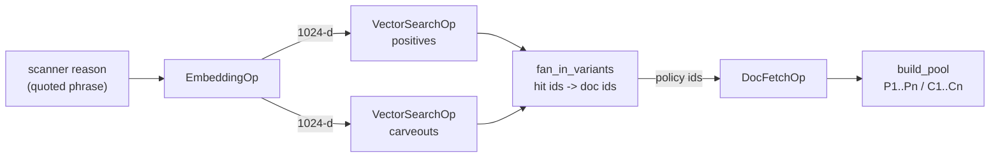

# Retriever refactor — hush.ai ops + swappable local ↔ pgvector

## Executive summary

`v4/_retriever.py` is a raw FAISS implementation that bypasses hush
entirely: no ops, no ResourceHub, sync `search()`, its own ONNX session,
its own `.npy` cache. It works, but the backend is welded to the logic, so
moving to Postgres means rewriting the retrieval logic rather than
changing a resource key.

This plan rebuilds it on hush ops with **one contract and two backends**,
so local and production differ only in `resources.yaml`.

| | Today | After |
|---|---|---|
| Embedding | local ONNX session inside the retriever | `EmbeddingOp` → resource (`onnx` local / `triton` prod) |
| Vector search | `faiss.IndexFlatIP` in-process | `VectorSearchOp` → resource (`faiss` local / `pgvector` prod) |
| Content | held **inside** the index items | `DocFetchOp` → resource (`yaml` local / `postgres` prod) |
| Switch cost | rewrite `_retriever.py` | edit `resources.yaml` |
| Wiring | hand-rolled Python | graph fragment, traced per hop |

**Non-goal:** changing what the decider sees. Pool shape, ordering and the
`P1..Pn` slot ids stay byte-identical — the BU FP-report tooling resolves
policies through those slots.

> **Status (2026-08-19): Phases 1–3 done, Phase 4 gated on running the
> checks against real services.** The switch cost above is now literally
> true — retrieval runs as a graph over `faiss` + `yaml`, and the
> production path is four commented blocks in `resources.yaml`. What is
> left is execution, not design: §11 has the detail, §13 the running
> order.

---

## 1. Architecture



Backends are resource config only:

| Op | resource | local | production |
|---|---|---|---|
| `EmbeddingOp` | `embedding:bge-m3` | `onnx` (local model dir) | `triton` (gRPC) |
| `VectorSearchOp` | `vector_store:corpus-pos` / `-cvo` | `faiss` | `pgvector` |
| `DocFetchOp` | `doc_store:corpus` | `yaml` | `postgres` |

---

## 2. Part A — cherry-pick into hush.ai

Ported from Operonx. APIs are identical (`BaseOp`, `Param`, `shorthand`,
`split_shorthand_kwargs`, `REGISTRY`); the port is `operonx.` → `hush.`
plus `resolve_hub()` → hush's `get_hub()`.

| # | Target | Source | Change |
|---|---|---|---|
| A1 | `core/configs/op_config.py` | — | add `"vector-search"`, `"doc-fetch"` |
| A2 | `providers/vector_stores/` | base, config, factory, faiss, pgvector, `_pg` | **+ metadata on FAISS** (§3.1) |
| A3 | `providers/doc_stores/` | base, config, factory, memory, postgres, `_reorder` | **+ `yaml` backend** (§3.3) |
| A4 | `providers/ops/vector_search.py` | as-is | rename only |
| A5 | `providers/ops/doc_fetch.py` | as-is | rename only |
| A6 | `providers/registry/{vector_store,doc_store}_plugin.py` | as-is | rename only |
| A7 | `providers/triton/` | client, dtypes, decode | rename only |
| A8 | `providers/embeddings/triton.py` | — | **new** (§4) |

`qdrant.py` is skipped — no use for it, and every extra backend is another
filter dialect to keep correct.

**Deliberate carry-over:** hush's `OpType` still lists `"milvus"`,
`"mongo"`, `"s3"` — backend names. Operonx removed them as *"named
backends, not semantics"*. Adopt the capability names; that rename is
precisely what makes the store swappable.

---

## 3. Part B — the swappability contract

This is the part that has to be right, or "switch by config" quietly
becomes "switch by if-statement".

### 3.1 FAISS must return metadata

`search()` returns `(ids, scores, metadata)`, index-aligned, best-first.
Operonx's FAISS returns an **empty dict per hit on purpose** — its
docstring says the store "holds only vectors and ids", and calls that a
"faithful check on the ids-only contract".

Right for Operonx, wrong for us. A vector row id is a row number; the
document is keyed by `policy_id`, and that mapping has to come back with
the hit. With metadata-less FAISS the local path needs a lookup the
Postgres path does not — two code paths, which is the thing being
removed.

**Decision: add a metadata sidecar to our FAISS store.**

The index build writes two files:

```
corpus-pos.faiss            IndexIDMap2, int64 ids
corpus-pos.faiss.meta.json  {"1": {"policy_id": "POS-331#2",
                                   "sample_type": "positive",
                                   "severity": "cao"}, ...}
```

`search()` loads the sidecar once and returns `[meta[str(i)] for i in ids]`
— the same shape pgvector produces from its `metadata_columns`. Cost is
trivial: 1,527 variants, well under 1 MB.

Two properties carry over from Operonx unchanged:

- **Filtering still raises.** FAISS has no metadata index; over-fetching
  and post-filtering in Python silently returns fewer than `top_k`, and a
  silent wrong answer is worse than a refusal.
- **The sidecar is derived** — written by the same step that writes the
  index, so it cannot drift from it independently.

Failure mode to guard explicitly: a sidecar missing a hit id must **raise**,
not default to `{}`. A missing `policy_id` would drop that hit from the
pool with no error anywhere.

### 3.2 Id types must match across backends

`reorder_by_ids` matches ids **by value**. An `int` from the index will
never match a `str` key from the doc store, and the failure is silent:
every row lands in `missing` and the pool comes back empty.

Rule, enforced in both backends:

| | type | example | source |
|---|---|---|---|
| vector row id | `int64` | `1`, `2`, … | FAISS `IndexIDMap2` / PG `BIGSERIAL` |
| entry id | `str` | `POS-001` | `metadata.policy_id` / `knowledge_policy.id` |

`fan_in_variants` is the only place the two meet. Nothing else crosses.

### 3.3 Local doc store — reading `corpus.yaml` through the op

**`corpus.yaml` does not change and is not replaced.** It stays the local
source of truth, byte for byte. `DocStoreType.YAML` is a backend *name* —
~40 LOC that reads that file — in the same way `LLMType.OPENAI` is how you
reach a model, not a replacement for your prompts.

The reading code already exists; it is just welded inside `BgeRetriever`:

```python
corpus_raw = corpus_path.read_text(encoding="utf-8")
corpus     = yaml.safe_load(corpus_raw) or {}
self.pos_items, self.neg_items = _flatten_corpus(corpus)
```

That is a yaml doc store. Moving it into a registered backend is what lets
`DocFetchOp` call it — and lets one config line point the same op at
Postgres instead:

```yaml
doc_store:corpus:            # local
  api_type: yaml
  path: .prompts/sentiment_agent/corpus.yaml

doc_store:corpus:            # production — same op, same graph, same pool
  api_type: postgres
  dsn: ${PG_DSN}
  collection: knowledge_policy
```

It loads the file once, flattens to rows keyed by entry id, and serves
`fetch(ids)`.

`memory` is unsuitable: its `documents:` list lives inside the resource
YAML, and 972 rows do not belong in a config file.

**Why YAML and not SQLite or JSON.** Locally, `corpus.yaml` *is* the source
of truth — it is what the qc-monitor corpus manager edits and what QC's
Excel maps back into. SQLite or JSON would be a derived copy, needing a
build step, which is a way for the two to disagree: edit the yaml, forget
to rebuild, and the retriever quietly serves stale text. That is the same
silent-drift failure §7 guards against for the vector index, and one such
artifact is enough.

The SQL-coverage argument for SQLite does not survive contact either:

| | Postgres | SQLite |
|---|---|---|
| id batch fetch | `WHERE id = ANY(%(ids)s)` — one bound array | needs `IN (?,?,?)` — a statement per batch size |
| DDL types | `JSONB`, `TIMESTAMPTZ`, `vector` | none exist |

SQLite would validate a third dialect we do not ship. Real SQL coverage
comes from a throwaway Postgres+pgvector container (§8), not SQLite.

Row shape is identical to a `knowledge_policy` row, so `build_pool` never
learns which backend answered:

```
{id, knowledge_id, sample_type, content, description, severity}
```

### 3.4 Metric must match the index opclass

Local FAISS today is `IndexFlatIP` over normalised vectors — mathematically
cosine. Production HNSW is `vector_cosine_ops`. Both configure
`metric: cosine`.

pgvector's `<=>` is cosine *distance*; the ported store converts to
`1 - distance` in the SELECT list so both backends report the same number
for the same pair. The `ORDER BY` keeps the **bare** operator — ordering by
the converted expression is equivalent arithmetic but opaque to the
planner, and silently drops the HNSW index to a sequential scan.

Mismatching opclass and metric fails the same silent way: Postgres does not
error, it just stops using the index.

---

## 4. Part C — the Triton embedding backend

The service takes **token ids, not text**:

| | value |
|---|---|
| URL | `aic-ds2-collector-assistant-embedding.aws.coreai.win.dev:443` (SSL) |
| model | `bge_m3` |
| inputs | `input_ids` INT64, `attention_mask` INT64 |
| output | `sentence_embedding` — already pooled |
| max len | 256 |
| post | L2-normalise client-side |

**The op contract stays `texts → embeddings`.** Tokenisation is a backend
detail, exactly as it already is for `onnx` and `hf`. Putting token ids in
the op signature would leak the backend into the graph and make `triton`
non-substitutable for `tei` / `vllm`, which take raw text — losing the
property this whole plan exists to gain.

### Our encoder is already the same code path

Verified against `_BgeEncoder` and the local ONNX export
(`D:/bge-m3-onnx`, which exports **both** `token_embeddings` and
`sentence_embedding`):

| | `_BgeEncoder` (ours, today) | partner's Triton script |
|---|---|---|
| tokenizer | `Tokenizer.from_file(tokenizer.json)` | same |
| max length | **256** | **256** |
| padding | manual zeros + mask | identical |
| output taken | **`sentence_embedding`** | **`sentence_embedding`** |
| normalise | `v / norm(v).clip(1e-12)` | identical |

So swapping ONNX → Triton changes **where** inference runs, not what it
computes. The mean-pooling risk applies to hush's `onnx.py` (which pools
`token_embeddings` client-side) — **not** to our retriever.

`TritonEmbedding` is therefore modelled on `_BgeEncoder`, not on hush's
`onnx.py`:

| | `triton.py` |
|---|---|
| execute | `await TritonClient.get(url).infer(...)` |
| pooling | **none** — request `sentence_embedding` |
| normalise | client-side, same formula |

New `EmbeddingConfig` fields: `api_type=triton`, `url`, `model`,
`tokenizer_path`, `max_length`, `ssl`, `output_name` (default
`sentence_embedding`). The endpoint reuses `base_url` rather than a new
`url` field — it is a gRPC `host:port` with no scheme, and `ssl` selects
the transport.

`max_length` falls back to **512, not 256** — an earlier draft of this
section said 256. 256 is our corpus setting, not a model limit, and ONNX
already falls back to 512. An unset value meaning 256 on one backend and
512 on the other is a vector mismatch produced by config, with no error
anywhere. Both resource blocks pin it explicitly instead.

Residual risk is small but non-zero: the *deployed* Triton model may not be
the same export as our local file. §8.2 covers it as a confirmation rather
than an investigation.

---

## 5. Part D — the variant model

Our corpus splits `content` on `" | "` and embeds each variant separately:

| | entries | embedded variants |
|---|---|---|
| positives | 522 | **702** |
| carveouts | 450 | **825** |

Search returns *variants*; the pool must show each entry once, with only
its matched variants — the corpus descriptions are written against the
matched phrasing, not the whole entry. So a hit has to answer two
questions: *which entry*, and *which phrasing*.

### 5.1 Decision: flatten — one variant is one document

**A variant is a document in its own right.** `knowledge_policy` gets one
row per variant, `content` is that single phrasing, and `policy_id` alone
identifies it. There is no second coordinate to carry.

```
knowledge_policy
  id           knowledge_id      content                              description
  POS-331#0    step12_20260711   hay chỉ đơn giản là chây ì…          AGENT gán trực tiếp 'chây ì'…
  POS-331#1    step12_20260711   chị đang chây ì không thanh toán     AGENT gán trực tiếp 'chây ì'…
  POS-331#2    step12_20260711   khách hàng chây ì                    AGENT gán trực tiếp 'chây ì'…

positive_embedding
  id=BIGSERIAL  policy_id='POS-331#2'  knowledge_id=…  severity='HIGH'  embedding=[…]
```

No `" | "` anywhere in the database, and no `variant_idx`.

#### The alternative, and why it lost

The earlier design kept `knowledge_policy` at entry grain (`content` =
the full `" | "` string) and added a `variant_idx` column to the
embedding tables to say which phrasing a vector was. It works, and it
keeps QC's stamped id as the primary key. It was rejected on two counts:

| | entry-grain + `variant_idx` | flattened |
|---|---|---|
| DDL vs the schema agreed with MLE | **+1 column, +1 constraint** | **unchanged** |
| add / remove one phrasing | rewrite + re-embed the whole entry | INSERT / DELETE one row |
| edit one phrasing | re-embed all N variants of the entry | re-embed one row |
| `status` per sample (NEW/UPDATE/…) | meaningless — an entry is many samples | one row, one status |

The second and third rows are the substance. The knowledge base changes
constantly — variants added, removed, reworded — and at entry grain the
unit of change is always the whole entry. The partner's schema already
says this is the intended grain: *"mỗi record = 1 content/sample, theo
nguyên tắc dữ liệu dạng item-level"*, and `status` is per row.

The DDL row matters too but is not the argument. `ALTER TABLE … ADD
COLUMN variant_idx SMALLINT NOT NULL DEFAULT 0` is additive and would
almost certainly have been accepted. Flattening is better on its own
merits; needing no schema change is the bonus.

#### Ids are derived, not stamped

`corpus.yaml` is untouched: entries keep their QC-stamped ids
(`POS-331`) and their `" | "` content. The `#n` suffix is **appended at
load time** by whatever reads the corpus — `YamlDocStore` and the seed
script both derive it from the same file, so both produce the same ids
with nothing to keep in sync and nothing new for QC to maintain.

Positional `#n` rather than a content hash: an edit to a phrasing keeps
its id, so it is an UPDATE in place rather than a DELETE plus INSERT.
Reordering variants inside one entry does shift the suffixes, but the
blast radius is that entry alone.

#### What this costs

**`description` is duplicated** across an entry's variants — 1,527 copies
instead of 972. Cheap in storage; the real risk is drift if a row's
description is edited without its siblings. `corpus.yaml` remains the
source of truth and holds it once, so a re-seed re-flattens and any drift
is corrected rather than accumulated.

**QC's id stops being a primary key.** Their spreadsheet has `POS-331`;
the database has `POS-331#0..2`. The join is a prefix match, and the same
prefix is what regroups the pool:

```python
parent_id = policy_id.rsplit("#", 1)[0]     # POS-331#2 -> POS-331
```

`_format_indexed_pool` groups by `parent_id` exactly as before, so one
entry with three matched phrasings still renders as one card. **The
decider prompt does not change** — which is the non-goal this whole plan
is written around, and is verified against a 99-query baseline snapshot
of the rendered pool.

### 5.2 What the ops do now

`fan_in_variants` no longer fans in — each hit is its own document, so
hydration is a straight fetch of the hit ids. It stays as the op that
reads `policy_id` off the metadata and fails loudly when a sidecar is
stale, but the dedupe is gone.

`assemble_side` no longer splits on `" | "` and indexes by
`variant_idx`. The doc row's `content` **is** the matched text. That
removes the fallback branch (`variants[idx] if 0 <= idx < len(variants)`)
that existed only to survive an index/corpus mismatch.

### 5.3 Top-K counts variants, not entries — and stays that way

Today `top_k=10` counts **variants**. Worked example:

```
rank  variant                        parent
 1    "anh chị đừng vòng vo"         POS-002
 2    "anh chị nói vòng vo"          POS-002   <- same entry, second slot
 3    "đừng trình bày lý do đấy nữa" POS-003
 ...
```

Three variants of one entry consume three of the ten slots, so the decider
sees **fewer than 10 distinct entries**. That is current behaviour.

The alternative — over-fetch, then dedupe to 10 distinct entries — is
defensible and probably better retrieval. It is also a **behaviour change**
that reaches past retrieval quality:

- The decider cites `P1..Pn` slot ids, and `build_bu_fp_report.py` resolves
  those slots back to corpus policies. Different pool composition means the
  same citation string denotes a different policy — and the BU
  inconsistency report is built on exactly that mapping.
- The corpus was tuned by observing which policies appeared in pools. A
  pool that suddenly holds more distinct entries changes decider behaviour
  in ways the current carveouts were never tuned against.

**Decision: preserve variant-counting in Phase 1.** The refactor must be
provably behaviour-neutral (§8.1) before anything is improved. Switching to
entry-counting becomes Phase 5, measured against QC labels, on its own.

### 5.4 Query caching — dropped, then measured

Today `_search_cached` is an `lru_cache(maxsize=2048)` on `(query, k)`,
because the decider and the secondary decider usually issue the *same*
query for a call — the quoted phrase from the scanner reason. It saves one
BGE encode, roughly 50 ms.

**Decision: drop it in Phase 1; measure; re-add deliberately if warranted.**

Why it does not port as-is:

| | problem |
|---|---|
| sync vs async | `lru_cache` wraps a sync method; the new path is async and spans three ops |
| wrong layer | caching the *retrieval result* spans `VectorSearchOp` + `DocFetchOp`, so a stale entry masks corpus edits — and the yaml doc store exists precisely to reflect edits instantly |
| wrong key | the expensive step is the embed, which is deterministic and content-addressable; retrieval is not |

If measurement shows it matters, the cache belongs **inside the embedding
resource** as `text → vector`, where every caller benefits and corpus edits
cannot be masked. Note the decider fires on ~17% of calls and the secondary
on ~1–2%, so the duplicate-query rate may not justify any cache at all.

---

## 6. Part E — schema mapping

Our corpus maps onto the partner's DDL **with no change to it at all** —
see §5.1 for why the corpus is flattened to variant grain to get there.

| corpus.yaml | table | key |
|---|---|---|
| group (`ra_lenh_ap_dat`) | `knowledge_info` | `id` = group key, `name`, `severity` |
| ` \| ` variant of an entry | `knowledge_policy` | `id` = `POS-331#2`, `sample_type`, `content` = that one phrasing, `description` |
| — | `POSITIVE_EMBEDDING` / `CARVEOUT_EMBEDDING` | `BIGSERIAL id`, `policy_id` FK, **1:1 with the policy row** |

The 1:N in the partner's ER diagram is still allowed by the schema; we
simply do not use it. One vector per document is the simpler case, and
`status` per row now means what it says.

QC's stamped ids remain the join key by prefix (`POS-331#*` → `POS-331`),
and `corpus.yaml` is not re-stamped — the suffix is derived at load.

`metadata_columns` for the vector stores: `policy_id, knowledge_id,
severity`. Filterable fields only; no content, and no `sample_type` —
it is constant per table, read by nothing, and the two backends spell it
differently (the sidecar carries the yaml side name `"positives"`, the
DDL's CHECK requires `"positive"`).

### 6.1 Keep the two-table split

The partner separates `POSITIVE_EMBEDDING` and `CARVEOUT_EMBEDDING`. The
alternative is one table with a `sample_type` column and
`filter={"sample_type": "positive"}`.

**Decision: keep two tables.**

| | two tables | one table + filter |
|---|---|---|
| selection | `collection="positive_embedding"` — already a `VectorSearchOp` input | a filter dialect, different per backend |
| FAISS parity | two indices, which is what we build today | FAISS **cannot filter** — needs pre-partitioning anyway |
| HNSW | two smaller graphs | one graph, filter applied around the search |
| DDL | matches the partner as written | requires diverging from it |

The FAISS row decides it. Filtering is unsupported there by design, so a
one-table design would force pre-partitioned indices locally and a filter
in production — different mechanisms per backend, which §3 exists to
prevent. `collection=` is one parameter both backends honour.

### 6.2 Severity — map to their scale, one-to-one

Their DDL allows only `LOW/MEDIUM/HIGH/CRITICAL` and
`knowledge_policy.severity` is NOT NULL.

**Decision: map onto their scale, one-to-one and order-preserving.** Since
QC's 2026-08-24 rebuild the corpus has exactly four tiers, so all four fit
and every entry round-trips exactly. No DDL change is needed and none is
wanted — their constraint stays as written, so the schema remains theirs.

| ours | variants | stored as | scores |
|---|---|---|---|
| `tich_cuc` | 904 | `LOW` | carveout — suppresses, never scores |
| `warning` | 517 | `MEDIUM` | 0 |
| `cao` | 61 | `HIGH` | -10 |
| `nghiem_trong` | 129 | `CRITICAL` | -25 |

The inverse is `_retrieval.corpus_severity`, applied where a retrieved row
is assembled. Corpus tiers pass through untouched, so the yaml backend is
unaffected and the two backends agree.
`tests/test_severity_roundtrip.py` asserts the maps are exact inverses and
that every tier the corpus uses is covered.

An **ungraded** entry has no slot left: it stores as `HIGH` and reads back
as `cao` — "at least as serious as cao" is the safe way to be wrong. The
corpus grades every entry today; the seed prints a warning if one does not.
A *fifth* tier is a schema conversation with MLE, not a code change, and a
test fails rather than letting it map silently.

#### Correction: severity **does** feed scoring

An earlier version of this section argued the opposite, and it was right
when written and wrong four days later. It said:

> `format_sentiment_agent` derives `Score_offset` from the scanner's
> category prefix, not from corpus severity ... Corpus severity never
> reaches the output — it is retrieval metadata only. There is no scoring
> path to protect.

`b13fe06` (2026-08-24) made corpus severity **outrank** the category:
`resolve_cited_severity` takes the most severe of the entries the secondary
decider cited, and `format_sentiment_agent` scores on that, falling back to
the category only when nothing resolves. That is the whole point of the
`warning` tier — QC needed a verdict that surfaces without penalising.

So there is now a scoring path to protect, and the lossy map was built on
the belief that there was not. Anyone reasoning from the quoted paragraph
would reintroduce the bug; it is kept here, marked, for that reason.

What the earlier argument got right is that the *vocabulary* need not be
theirs. It need only be **recoverable**, which one-to-one delivers without
touching their CHECK.

#### `severity_src`: still written, no longer load-bearing

Both embedding tables and `knowledge_info` carry
`metadata JSONB NOT NULL DEFAULT '{}'`, and the seed writes the source
value there:

```json
{"severity_src": "warning"}
```

With a one-to-one map this is no longer needed to reverse the mapping — the
column suffices. It stays because it is the only way to tell an *ungraded*
entry from a graded `cao` one, both of which store `HIGH`:

```sql
SELECT id FROM knowledge_policy p
JOIN positive_embedding e ON e.policy_id = p.id
WHERE e.metadata->>'severity_src' = 'unknown';
```

That set is the worklist for getting entries graded. It is empty today.

---

## 7. Part F — index sync

| | local | production |
|---|---|---|
| staleness signal | corpus sha1 in the cache filename | `knowledge_policy.status`, `embedding_model`, `embedding_version` |
| rebuild | automatic on hash change | explicit backfill job |

The local cache self-heals; Postgres will not. `upsert()` exists on the
store contract but **no op exposes it** — Operonx never shipped
`VectorUpsertOp`. The backfill is therefore a script calling the store
directly, and it must exist *before* cutover, not after.

Guard: refuse to serve when the index's `embedding_model` /
`embedding_version` disagrees with the configured embedder. A silently
stale index returns plausible-but-wrong neighbours — invisible in output,
which is the worst class of failure here.

---

## 8. Part G — verification

The refactor is only safe if the pool is provably unchanged.

1. **Golden pool test.** Freeze `(query, k) → pool` for a few hundred
   scanner reasons taken from existing UAT runs, against today's
   retriever. Phase 1 must reproduce them exactly on `faiss` + `yaml`.
2. **Embedder equivalence.** Embed the whole corpus through local ONNX and
   through Triton, compare per-entry cosine similarity. Expect ≈1.0 — the
   tensor contract is identical (§4); this confirms the *deployed* model
   matches our local export.
3. **Backend equivalence.** The same queries through `faiss+yaml` and
   `pgvector+postgres` must return the same entry ids. Score ties may
   reorder; entry *sets* must not.

   **Run 2026-08-19 against a real pgvector: 200/200 equivalent.** But
   "the same ids" needed sharpening first — the strict form of this check
   is unpassable in principle, and it took reading the scores to see why:

   | | 200 queries |
   |---|---|
   | same entry set | 197 |
   | same order | 184 |
   | byte-identical pool | 193 |
   | **equivalent (the gate)** | **200** |

   Every strict difference sat between entries scoring within `1.46e-07`
   of each other — float32 epsilon is `1.19e-07`. The two entries that
   swapped across the top-10 cutoff, `POS-468` and `POS-461`, scored
   `0.653600156` on **both** backends: an exact tie.

   Ranking is a partial order. Where scores tie, which entry a backend
   lists first is decided by index layout or query plan, not relevance,
   so demanding a byte-identical pool asserts information the scores do
   not contain — and leaves a gate that can never go green, where a real
   regression would arrive amid noise nobody reads.

   The criterion is therefore: **score profile matches rank for rank
   within tolerance**, entries may reorder within a tie, and the entry set
   may differ only at the cutoff. A wrong opclass or mismatched metric
   moves scores by far more than float32 noise and still fails.
4. **Existing suite.** 439 tests stay green throughout.

### Local stack — real services, not mocks

| target | approach | why |
|---|---|---|
| Postgres + pgvector | `pgvector/pgvector:pg16` container | ~400 MB; exercises the real SQL, HNSW and `<=>` we ship |
| Triton | local gRPC shim over the real ONNX | full `tritonserver` is ~10 GB; the contract is two INT64 tensors and the identical model is already on disk |

A mock store would validate our Python and nothing else — and the bugs that
matter here are SQL-shaped: `ANY(...)` binding, opclass/metric mismatch,
row ordering.

---

## 9. Phasing

| Phase | Scope | Risk | Reversible by |
|---|---|---|---|
| 1 | A1–A6 into hush; rebuild retriever on ops; `faiss` + `yaml`; facade kept | low — no behaviour change | git revert |
| 2 | A7–A8 Triton embedding + equivalence check (§8.2) | low — same tensor contract (§4) | resource key |
| 3 | Schema + backfill script; severity DDL change (§6.2) | medium | dual-run |
| 4 | Flip resources to `pgvector` / `postgres`; §8.3 | low if 1–3 held | resource key |
| 5 | *Optional:* entry-counting top-K (§5.1) | behaviour change | separate decision |

Phase 1 delivers the point of the exercise — after it, the backend is a
config line.

---

## 10. Decommissioning `_retriever.py`

**The file goes away entirely.** Every part of it has a destination:

| in `_retriever.py` today | moves to |
|---|---|
| `_BgeEncoder` | `embeddings/onnx.py` + `embeddings/triton.py` (resource) |
| `_normalize_entry`, `_entry_fields` | `doc_stores/yaml.py` |
| `_split_variants`, `_flatten_corpus` | `doc_stores/yaml.py` (flatten to variant rows) + index-build / seed |
| `_corpus_hash` | index-build (cache key) |
| `BgeRetriever._build_index` | index-build script (FAISS + meta sidecar) |
| `BgeRetriever.search` | `VectorSearchOp` + `fan_in_variants` + `DocFetchOp` |
| `get_retriever()` singleton | ResourceHub |
| `_search_cached` LRU | dropped (§5.2) |

### 10.1 It is not a one-file delete

There are **three copies** (v3 180 LOC, v4 201, v5 201 — v4 and v5 already
differ) and **~25 call sites**. Several depend on internals that have no
equivalent in an op-based design:

| consumer | depends on | issue |
|---|---|---|
| `_secondary_decider.py` | `from ._retriever import get_retriever` | **cross-version import** — v3 in production reaches into v4 |
| `optimizer/replay.py`, `verify_contract.py` | `BgeRetriever(corpus_path=X)` | replays against an **alternative corpus** |
| `_triage_tracer.py` | monkey-patches `BgeRetriever.search` | ops trace natively; tracer must be rewritten |
| `corpus_api.py` | `BgeRetriever()`, `get_retriever.cache_clear()` | qc-monitor reindex path |
| `selfcheck.py` | `_BgeEncoder`, `_INDEX_DIR` | deploy preflight |
| `optimizer/harvest.py` | `_corpus_hash`, `_CORPUS_YAML` | cache keying |
| `tests/test_retriever_edges.py` | module internals | rewrite against the stores |

The `_secondary_decider` → `v4._retriever` import is the same hazard that
nearly broke production when v1 was deleted (v3 read a prompt that lived in
v1). Deleting v4's copy without redirecting it breaks the secondary decider
for **v3 as well**.

The `optimizer/*` dependency is a real design constraint: it constructs
`BgeRetriever(corpus_path=candidate)` to replay against *proposed* corpora.
ResourceHub resources are named and static, so this needs an explicit
answer — most likely a helper that builds a `vector_store` + `doc_store`
pair ad hoc from a corpus path, bypassing the hub entirely. It blocks
Wave B only.

### 10.2 Retirement in waves, not one commit

Deleting 25 call sites at once is untestable. Instead:

1. **Phase 1** builds the ops and leaves a thin
   `get_retriever().search(query)` facade delegating to them, so every
   existing caller keeps working unchanged and the golden-pool test (§8.1)
   compares old vs new on identical inputs.
2. **Wave A** — pipeline callers (`v4/_matcher.py`, `v5/_matcher.py`,
   `v3/_verifier.py`, `_secondary_decider.py`) move to the graph fragment.
   The cross-version import dies here.
3. **Wave B** — scripts. `optimizer/*` needs the alternative-corpus story
   resolved first.
4. **Wave C** — delete the three `_retriever.py` files and the facade;
   rewrite `test_retriever_edges.py` and `_triage_tracer.py`.

Only after Wave C is the file gone. Any earlier deletion trades a working
system for an untested one.

---

## Appendix — what not to take from the partner repo

The logic and schema are sound; the implementation is not the model.

| Their approach | Why not | Ours |
|---|---|---|
| f-string SQL with manual quote-escaping (`knowledge_id = '{kid}'`) | injection surface, no plan cache reuse | bound params via `split_filter` |
| `psycopg2` sync driver | blocks the event loop inside an async graph | `psycopg` async pool, cached per DSN |
| retrieval logic hard-wired to pgvector | the thing this plan removes | backend behind `VectorSearchOp` |
| tokenizer + client rebuilt per call | connection setup on every request | `TritonClient.get()` caches the channel |

What to take: the DDL, the two-table positive/carveout split, the 1:N
policy→embedding relationship, and the verified connection formats.

---

## 11a. Status — 2026-08-25 (re-seeded on QC's rebuilt corpus; two defects fixed)

`d50b2d1` rebuilt `v4/corpus.yaml` from QC's reviewed workbook on 2026-08-24,
adding a per-entry `severity` key and a `warning` tier. The local stack was
stood back up and the whole path re-run against it. The mechanism held; the
data did not, and **running it found two defects that no local-only test can
see**.

| | 2026-08-19 | now |
|---|---|---|
| variant documents | 1,527 | **1,611** (pos 707 / cvo 904, from 919 entries) |
| groups | 80 | 81 |
| §8.3 L4 tie-aware | 200/200 | **200/200** |
| §8.3 L5 severity | *did not exist* | **200/200** |

### The schema now comes from MLE's file, not a copy of it

`001_schema.sql` was a hand-maintained transcription. It was verified correct
— applied to a scratch database beside their DDL, all 38 columns, 19
constraints and 15 indexes matched — but a transcription drifts silently the
moment they edit theirs.

It became `scripts/rag/sql/schema.sql`, one file in two clearly marked parts:

| part | |
|---|---|
| **PART 1** | extracted verbatim from the ```sql blocks of `collection.sentiment_violation.rag/docs/2. ddl_db.md`. Never hand-edited — re-extracted |
| **PART 2** | ours: `UNIQUE (policy_id)` on each embedding table, and the `positives` / `carveouts` views |

It was briefly *two* files, which was a mistake worth recording. The split
bought a diff against MLE's source doc; it cost an extra step at deploy time,
and both halves need the same DDL privilege at the same moment on an empty
table, so there was never a case where one ran without the other. Worse, the
step that could be forgotten was the one whose omission is **silent**: without
PART 2 the seed fails loudly (`no unique or exclusion constraint matching the
ON CONFLICT specification`), but retrieval just returns an empty pool, because
`DocFetchOp` asks for a relation named `positives` that does not exist.

The diff moved to `tests/test_schema_matches_partner_ddl.py`, which is where
it belonged: it compares PART 1 statement-by-statement against their doc,
normalising comments and whitespace, and fails if either side has a statement
the other does not. Verified against three drift scenarios — a widened column,
an index slipped into PART 1, a table gone missing — all caught.

Order is load-bearing and both failures are hard ones:

* the seed writes `ON CONFLICT (policy_id)`, which Postgres rejects unless the
  UNIQUE already exists;
* `ADD CONSTRAINT ... UNIQUE` **cannot be applied to a table that already
  holds duplicates**, so it has to precede any data.

So: `schema.sql` once on an empty database, then `seed_postgres.py`.

MLE apply the file by hand; from there this pipeline is the only writer, so
PART 2 is ours to decide. Revisit the UNIQUE only if a second embedding model
ever has to live beside the first — which is what their `embedding_model` /
`embedding_version` columns are for.

### Defect 1 — an entry that changes sides keeps its old vector

QC moved 55 entries between positives and carveouts without renaming them.
Ids are stable identifiers, so `POS-316` is a carveout now and `CVO-018` is a
positive; the prefix is history and nothing in the pipeline reads it as a
label (verified — no code branches on it).

The seed upserts within one table, so it wrote the new side and left the old
row untouched: **81 variants had a vector in both embedding tables**. Not
inert. A hit on the stale vector looks the policy up in the `positives` view,
the view no longer lists it, and the hit vanishes — the pool comes back a slot
short. A carveout, whose whole job is to *suppress* a finding, silently stops
being retrievable as one. `--prune` does not help: it deletes policy rows
absent from the corpus, and these are present, just on the other side.

`clear_other_side()` now deletes each side's ids from the opposite table.

### Defect 2 — severity did not survive Postgres, and the gate could not see it

Scoring reads the severity of the cited entry: `warning` 0, `cao` -10,
`nghiem_trong` -25. The partner's CHECK allows only LOW/MEDIUM/HIGH/CRITICAL,
so the seed mapped onto their scale — and **nothing mapped back**.

On `pgvector + postgres`, `resolve_cited_severity` was handed `HIGH`, which
`SEVERITY_RANK` does not contain, so every call resolved to `""`, the
corpus-severity override stopped applying, and scoring fell through to the
scanner's category. The forward map made it worse: it had two entries and
everything else took the HIGH default, so `warning` (517 variants, scores 0)
was indistinguishable from `cao` (-10), as was `tich_cuc`, which marks
carveouts and is not a violation at all. **1,421 of 1,611 variants collapsed
into one value.**

The map is now one-to-one and order-preserving — four corpus tiers onto the
four values their CHECK allows — and `_retrieval.corpus_severity` is its
inverse. Corpus tiers pass through untouched, so the yaml backend is
unaffected. `tests/test_severity_roundtrip.py` pins the two together.

An **ungraded** entry still has no slot: it stores as HIGH and reads back as
`cao`. The corpus grades every entry today, and the seed now says so out loud
when one does not.

The part worth remembering: **§8.3 reported 200/200 while this was broken.**
L1-L4 all compare the rendered pool, and `_format_indexed_pool` renders the
sample and its description — severity rides in `raw_items` and never reaches
the text. A new **L5** compares the severity attached to each retrieved entry,
keyed by id so legitimate tie reordering does not read as drift. Emptying the
inverse map fails L5 on 20/20 queries while L4 stays green, which is exactly
the shape of the bug it exists for.

### The 200/200 is exact-search parity, not HNSW parity

Worth knowing before reading any §8.3 result as a guarantee.

At 1,611 vectors the planner does **not** use the HNSW index — it seq-scans,
which for pgvector means *exact* nearest neighbours. FAISS `IndexFlatIP` is
exact too. So the gate has been comparing exact against exact, and the
approximate path production will eventually take was never exercised.

Forcing it (`ALTER DATABASE ... SET enable_seqscan = off`) fails the gate:

| `hnsw.ef_search` | L4 equivalent | L5 severity |
|---|---|---|
| 40 (pgvector default) | **189/200** | 200/200 |
| 100 | 198/200 | 200/200 |
| 200 | **200/200** | 200/200 |

The failures are textbook recall loss, not a mapping error — the graph walk
misses one true neighbour, everything below it shifts up, and one extra is
appended at the bottom. For `em để anh nói chưa`, the entry it missed was
`CVO-452` at **rank 1**. Nine of the eleven were carveouts, the larger of the
two tables — and a missed carveout is the expensive direction, because a
carveout exists to suppress a finding.

L5 stays 200/200 throughout, which is the useful part: severity is fine, the
*retrieved set* is what moves. The two failure modes are independent and the
gate now separates them.

Consequences:

* Nothing is wrong today. The planner's choice is correct at this size, and
  exact search is what makes the current parity real.
* The risk is **future and silent**. As the corpus grows the planner will
  switch to the index on its own, and retrieval will quietly stop matching
  the FAISS baseline everything was tuned against. No error, no log line.
* `ef_search` is the dial and 200 restores parity here, but that is a
  measurement on 1,611 rows, not a constant. It has to be re-measured
  against the production table, and it trades latency for recall.
* Worth raising with MLE: at this corpus size the HNSW index earns nothing
  and costs recall. Whether to keep it, tune `ef_search`, or let the planner
  keep choosing exact scan is their call — the index is in their DDL.

Re-running this is two settings and the gate:

```bash
docker exec sentiment-pgvector psql -U sentiment -d collectorassistant   -c "ALTER DATABASE collectorassistant SET enable_seqscan = off;"   -c "ALTER DATABASE collectorassistant SET hnsw.ef_search = 40;"
uv run python scripts/rag/_backends.py --limit 200
# then RESET both
```

### Entry ids are UUIDs now

`POS-006` / `CVO-001` were placeholders, and they had become actively
wrong. QC's rebuild moved 55 entries between sides without renaming them,
so `POS-316` was a carveout and `CVO-018` a positive — the prefix asserted
something an edit had made false, and it is what hid the double-vector bug
above for longer than it should have.

A UUID is also free insurance. `knowledge_policy.id` is a flat
`VARCHAR(150)` primary key and the seed writes `ON CONFLICT (id) DO
UPDATE`, so a colliding id is a silent overwrite rather than an error.
Nothing else writes these tables, so that is insurance and not a fix —
the side-move above is the reason the change was worth making.

The rule this encodes: **an id must carry no meaning**, because anything
it asserts can be made a liar by an edit.

| | |
|---|---|
| before | `POS-331#2` |
| after | `ef375b7d-3375-41fe-96f0-c55ab08ad540#2` |
| length | 38 of 150 |

**No schema changed.** Same column, same type, same constraints; only the
string written into it. `variant_id()` and `parent_id()` are untouched —
they split on `#`, and a UUID contains none — so no retrieval code moved.

`scripts/rag/stamp_ids.py` did it, rewriting only the `  - id:`
lines rather than round-tripping the YAML, which would have reflowed 365 KB
of QC-maintained text and normalised the line endings. Verified after:
3,750 lines before and after, 919 differing, **all of them id lines**, CRLF
intact. `corpus_id_map.tsv` records old -> new so QC's existing review
workbook still joins.

Examples elsewhere in this document still use the short `POS-331` form.
They are kept for legibility — a UUID makes a walkthrough unreadable — and
describe measurements taken when those were the live ids.

### Where Phase 4 stands

Unchanged, and both blockers are external:

* **§8.2** needs the VPN. The client half is already proven against the shim.
* **Seeding production** needs somewhere to run from. MLE create the tables
  by hand from `scripts/rag/sql/`; from there this pipeline is the only
  writer, so the schema questions are ours — but `deployment/` references
  `scripts/rag` nowhere, so the seed step still has no home.

The four env vars remain commented out in `.env`. `deployment/` still
references `scripts/rag` nowhere, so the production seed has no home in the
deploy pipeline yet — worth settling in the same conversation.

Local stack: `docker compose -f scripts/rag/local_stack/docker-compose.yml up -d`
plus `uv run python scripts/rag/local_stack/triton_shim.py`. The named volume
survives a Docker restart, but **it survives a corpus change too** — re-seed
rather than trusting what is in it.

---

## 11. Status — 2026-08-19

**Phases 1–3 are complete, and the Phase 4 gate is written.** `_retriever.py`
no longer exists in either version; retrieval is a subgraph whose backends
are resource config. 372 tests pass in analyze, 18 more in hush; both case
graphs build.

What remains is entirely **execution against real services** — the Triton
endpoint is VPN-only and no Postgres has been stood up — not design or code.

| commit | |
|---|---|
| `6c02e55` (hush, `feat/vector-doc-stores`) | stores, ops, plugins, triton client, embedding `output_name`/`max_length` |
| `3426b00` | `_retrieval.py`, index builder, resources, v4 composed |
| `f10e79f` | `_secondary_decider` — cross-version import removed |
| `bff8664` | v3 composed, on **its own** corpus |
| `97a1976` | ~15 scripts migrated (Wave B) |
| `40e169e` | both `_retriever.py` deleted (Wave C) |
| `c0f1bbb` | `corpus_api.py` + 141 MB of retired `.npy` deleted |
| `755daec` (hush) | **Phase 2** — `TritonEmbedding`, ssl-keyed client cache, extras |
| `7e61250` | **Phase 2** — §8.2 embedder-equivalence check |
| `e158ef4` | **Phase 3** — schema, backfill, §8.3 backend-equivalence check |

### Phase 2 — Triton

`TritonEmbedding` is modelled on the encoder that built the index, not on
hush's `onnx.py`: manual pad, `sentence_embedding` by name, no pooling,
L2-normalise with a 1e-12 floor. 18 tests assert the tensors that go on the
wire — INT64 dtype, batch width, mask, truncation cap, order across chunks —
because that is where the risk is, not in gRPC. Two silent failures now
raise: a missing output tensor (`infer` maps it to `None` and only logs,
which for an embedder means indexing a null vector) and a 3-D output.

### Phase 3 — Postgres

**The partner's base tables are used exactly as agreed with MLE.** The
first cut added a `variant_idx` column; it was replaced by flattening the
corpus to variant grain (§5.1), which is both a better fit for how the
knowledge base actually changes and needs no schema change.

One addition remains, and it touches no table:

| addition | why |
|---|---|
| `positives` / `carveouts` views | `DocFetchOp` is called with `collection="positives"` on both backends; on Postgres a collection is a relation. The views also alias `knowledge_id → group_id` and join `knowledge_info` for `group_name`, without which the pool renders with no category label |

`sample_type` is **not** in `metadata_columns`: constant per table, read by
nothing, and spelled differently on the two backends (the FAISS sidecar
carries `"positives"`, the DDL's CHECK requires `"positive"`). Cheaper to
stop returning it than to make two spellings agree.

Orphan rows are reported but **not** pruned by default. Nothing else writes
these tables, so an orphan is our own stale row — but a corpus loaded from
the wrong path would make every existing row look like one, and `--prune`
is the difference between noticing that and discovering it later.

#### The id bug that flattening also fixed

The first seed assigned embedding-row ids positionally, `1..N` in corpus
file order, so that FAISS and pgvector would return the same ids. Inserting
one policy near the top shifted every id below it, and `ON CONFLICT (id)`
then remapped a row to a *different* policy — the same positional
fragility this plan criticises in the retired retriever (§5.4), reintroduced.

Vector ids are now `BIGSERIAL` and meaningless: nothing looks a document up
by them. The upsert key is `policy_id`, so re-seeding an edited entry
touches that entry's rows and nothing else.

### The Phase 4 gate — run, and green

`check_backend_equivalence.py` ran against a real `pgvector/pgvector:pg16`
on 2026-08-19: **200/200 equivalent**. Full numbers and the reason the
criterion had to be sharpened are in §8.3.

Getting there exercised the whole path end to end, which is what the local
stack was for:

| step | result |
|---|---|
| schema through `psql` | clean — 4 tables, 9 indexes, 2 views |
| `seed_postgres.py` | 80 groups, 1,527 policy rows, 1,527 vectors |
| policy-id parity vs the FAISS sidecar | positives 702/702, carveouts 825/825, 0 discrepancies |
| §8.3 | 200/200 |

The Triton half is proven too, by a gRPC shim serving the local ONNX model
over the real wire protocol: **200/200 bitwise identical vectors**, max
elementwise difference `0.000e+00`. Same weights on both sides, so this
isolates the client — tokenising, padding, INT64 tensors, output selection
and the `EmbeddingOp` plumbing are correct, and a §8.2 failure on the VPN
can only be the deployed checkpoint.

Equivalence was checked at each step on `_format_indexed_pool` output —
the actual prompt text the decider receives, not just raw hits:

| check | result |
|---|---|
| v4 pools vs old retriever | 20/20 |
| v3 pools vs old retriever, own corpus | 20/20 |
| v4 decider input sets via the composed graph | 3/3 |
| v3 pools unchanged by id-stamping its corpus | 8/8 |

Those comparison scripts were throwaway: they diffed against the old
retriever, which is now deleted, so they cannot be re-run. What Phase 4
still needs is a *backend*-equivalence check (§8.3) — same queries through
`faiss+yaml` and `pgvector+postgres` must return the same entry ids.
That has not been written.

### v3 and v4 carry different corpora

Load-bearing and easy to forget. `.prompts/sentiment_agent/v3/corpus.yaml`
(673 entries) and `v4/corpus.yaml` (972) diverged during tuning, so each
version binds its own stores — `corpus-v3-*` vs `corpus-*` — built by
`_make_retrieve_graph`. Pointing v3 at v4's corpus would silently change
what the production rollback target retrieves. Both corpora are now
id-stamped; the yaml doc store keys rows by id and skips unstamped entries.

---

## 12. Gotchas paid for once

Four hush/graph behaviours that cost real debugging time. All silent —
none raised at build time, each surfaced somewhere unrelated.

| behaviour | how it shows up |
|---|---|
| A container **literal** around a graph ref (`texts=[query]`) hides the ref from the wiring | the op receives a placeholder, its output is `None`, and the error appears three ops later as `'NoneType' object is not subscriptable`. Build the list inside an op. |
| `@op` infers output keys from a returned dict **literal** | a wrapper that delegates (`return orig(...)`) declares *no* outputs; the graph drops the edge and fails downstream as a missing argument |
| A graph body resolves op names when it is **built** | patching attributes on an existing op object never reaches a node. Replace the module global, then rebuild (`reset_engine()`). |
| `ResourceHub.register()` **persists to disk** | it rewrote `resources.yaml` through hush's YAML serialiser, dropping all 74 comments and 137 lines. Never call it against the real config; edit the file by hand. |

Also, porting from Operonx: hush's `BaseOp` has no `bound` parameter (it
has `executor`, which only applies to *sync* cores), uses `self.core = fn`
rather than `_set_core`, and exposes `get_hub()` rather than
`ResourceHub.instance()`. Because ops with async cores are scheduled on the
loop directly, a blocking backend must move its own work off it — FAISS
search goes through `asyncio.to_thread` inside the store.

---

## 13. Open items

Everything left needs a service this machine cannot reach. The code is
written and, where it can be, tested.

| | |
|---|---|
| **Run §8.2** | The only check still outstanding, and the only one needing the VPN. `uv add "tritonclient[grpc]"` is already done. Confirms the *deployed* checkpoint matches `D:\bge-m3-onnx` — the client side is already proven against the shim (§11), so this is now a single-variable test. |
| **Phase 4** | Set the four env vars (§11 / `.env`). No file edits, no code changes. Gated only on §8.2, since flipping the embedder is what §8.2 covers; the store half is already green. |
| Seeding production | `seed_postgres.py` has to run *somewhere* before the first pod serves traffic, and `deployment/` references `scripts/rag` nowhere. MLE create the tables by hand from `scripts/rag/sql/`; this pipeline is the only writer thereafter, so what is missing is a deploy step, not an agreement. |
| v3 on Postgres | Not possible as things stand: v3 and v4 corpora both stamp `POS-001`, so seeding both into one `knowledge_policy` would have them overwrite each other. v3 stays on faiss + yaml, which costs nothing (lazy resources) but means **a Postgres-only image has no v3 rollback** unless its FAISS index ships too. |
| §7 staleness guard | Not implemented. `embedding_model` / `embedding_version` are now written and returned, so refusing to serve on a mismatch is a small addition — but nothing enforces it yet, and a stale index returns plausible-but-wrong neighbours. |
| Residual coupling | `_secondary_decider` still imports `_format_indexed_pool` / `_parse_cited` from `v4._matcher`. Pure formatting helpers, far lower risk than the retriever was, but the same class — move them alongside retrieval when convenient. |
| Scanner prompt | `SCANNER_PROMPT` still carries **five** instructions mandating over-flagging, the most permissive of the prompts. A tightened version derived from `FILTER_PROMPT` took flag rate 98% -> 86% and C8 from half of findings to a third on the UAT probe; recoverable at `310c4b9`, or regenerable (that recipe is the filter body plus v4's output block). Unrelated to this refactor, but it is the open finding with measured upside. |
