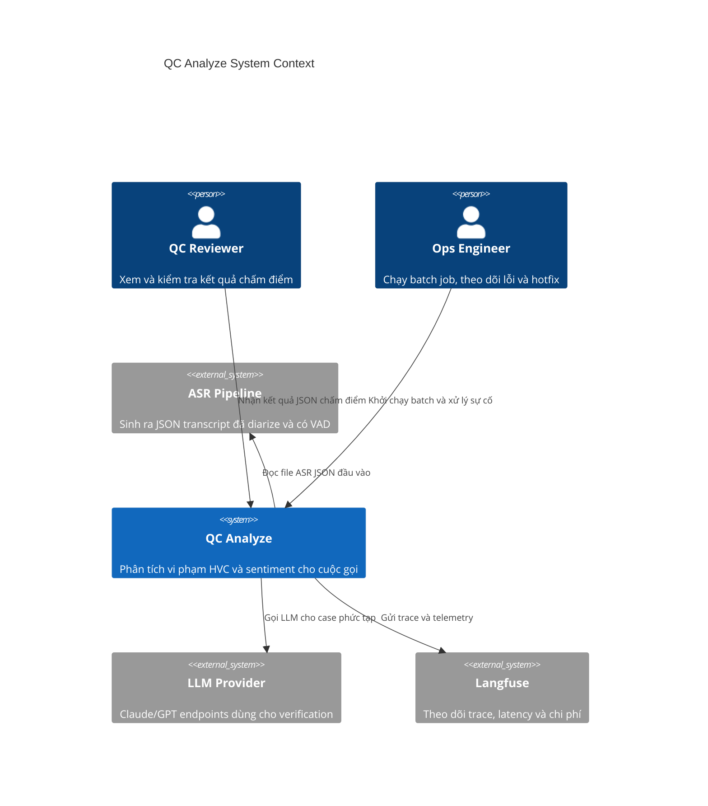
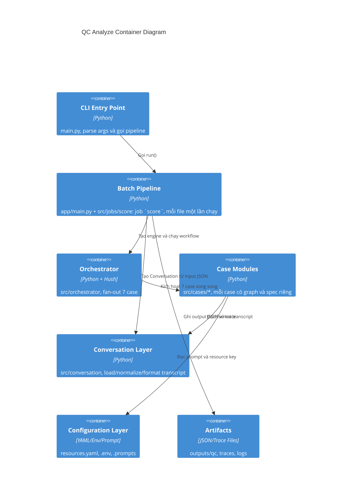
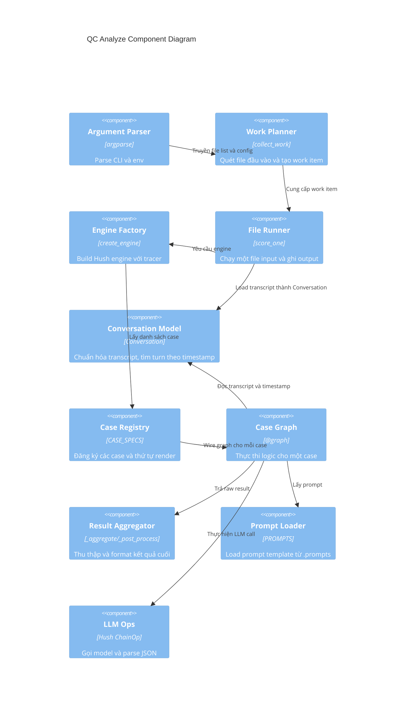

# Kiến trúc hệ thống theo mô hình C4

Tài liệu này tóm tắt kiến trúc hiện tại của hệ thống QC Analyze dựa trên code trong repo và luồng chạy từ entrypoint [main.py](../main.py).

## Mục tiêu hệ thống

Hệ thống nhận file ASR JSON của cuộc gọi, chạy các case kiểm tra vi phạm và phân tích sentiment, rồi ghi kết quả ra file JSON để dùng cho QC review.

## 1. Context diagram

## 2. Container diagram

## 3. Component diagram

## Luồng thực thi chính

1. Entry point [main.py](../main.py) đọc tham số, chạy job `preflight` rồi job `score` (khai báo trong [app/main.py](../app/main.py)).
2. [src/jobs/score/_calls.py](../src/jobs/score/_calls.py) liệt kê file đầu vào có `call_code`.
3. Job `score` chạy graph [src/jobs/score/graph.py](../src/jobs/score/graph.py) cho từng file và ghi output JSON.
4. Graph đó gọi [src/qc/graph.py](../src/qc/graph.py) — orchestrator.
5. Orchestrator fan-out 7 case.
6. Mỗi case dùng graph riêng và trả raw result.
7. Orchestrator tổng hợp kết quả thành cấu trúc Sentiment/HVC.

## Điểm nhấn thiết kế

- Registry-driven: thêm case mới chỉ cần đăng ký spec và cập nhật orchestrator.
- Async-first: các LLM call và workflow chạy trên event loop.
- Tracing-first: có thể bật Langfuse hoặc tracer local để debug.
- Config externalized: prompt, resource key và endpoint nằm ngoài code.
