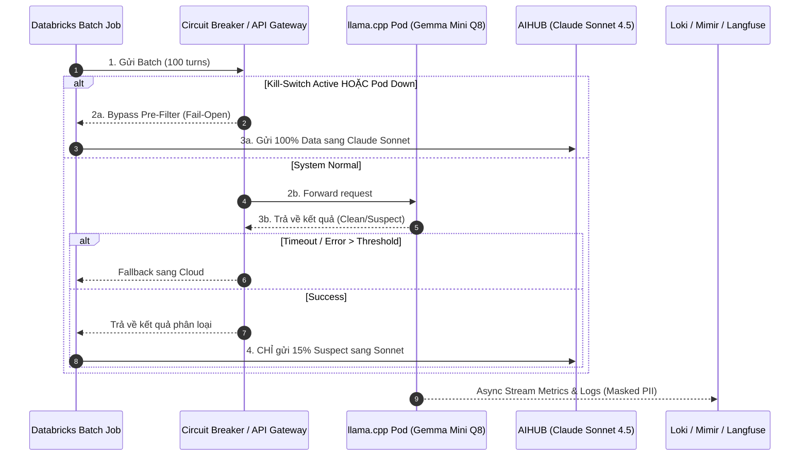
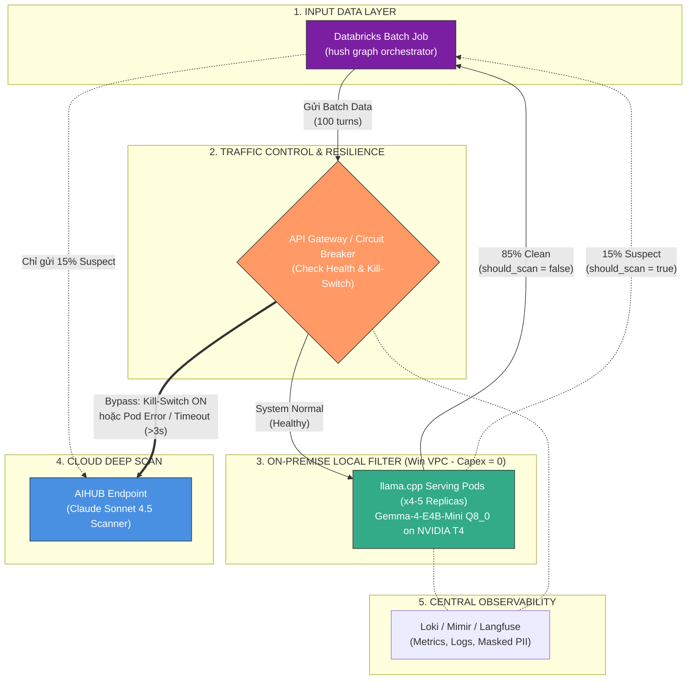

---
# Tài liệu mô tả: Kiến trúc đề xuất

## 1. Mục tiêu Nghiệp vụ Cốt lõi

* **Tối ưu chi phí:** Lọc bớt các cuộc gọi "sạch" ngay tại hạ tầng On-Premise bằng mô hình quantized gọn nhẹ (`Gemma-4-E4B-Mini Q8_0`), chỉ gửi ~15% cuộc gọi "nghi ngờ" lên Claude Sonnet 4.5. **Tiết kiệm ≥ 70% (thực tế đạt ~85–87% chi phí API Cloud)**.
* **Bảo mật PII & Chủ quyền Dữ liệu:** ~85% cuộc gọi chứa thông tin nhạy cảm của khách hàng được xử lý hoàn toàn trong nội bộ VPC ngân hàng.
* **Hạ tầng Capex = 0:** Tận dụng tối đa cụm GPU NVIDIA T4 16GB hiện có trên Databricks, không phát sinh chi phí mua sắm mới.
* **Rủi ro vận hành = 0:** Đảm bảo quy trình QC không bao giờ bị dừng gián đoạn nhờ cơ chế tự động chuyển luồng an toàn (**Fail-Open**) và nút dừng khẩn cấp (**Kill-Switch**).

---

## 2. Các Thành phần & Vai trò trong Kiến trúc

* **Databricks Batch Job:** Nơi khởi tạo và quản lý luồng xử lý dữ liệu theo từng đợt (ví dụ: batch 100 cuộc gọi).
* **Circuit Breaker / API Gateway:** "Người điều hướng & van an toàn" đóng các vai trò:
    * *Load Balancing:* Chia đều tải xử lý cho các Pod Local LLM.
    * *Fail-Open:* Tự động ngắt kết nối Local LLM và đẩy 100% traffic sang Claude Sonnet khi Pod Local gặp sự cố (sập Pod, quá tải VRAM, lỗi 5xx) hoặc phản hồi quá chậm (>3 giây).
    * *Kill-Switch:* Nút gạt tắt/bật khẩn cấp bằng cờ cấu hình (Flag) để bỏ qua bước lọc Local trong 1 giây mà không cần deploy lại code Job.

* **llama.cpp Pods (Local LLM):** Chạy mô hình Gemma Mini Q8_0 trên GPU T4, phân loại nhanh cuộc gọi thành `Clean` (Sạch) hoặc `Suspect` (Nghi ngờ).
* **AIHUB (Claude Sonnet 4.5):** Chỉ nhận 15% cuộc gọi nghi ngờ để quét vi phạm chuyên sâu.
* **Centralised Observability (Loki / Mimir / Langfuse):** Giám sát hiệu năng, log và các chỉ số (Tỷ lệ lọc, P99 Latency, False Negative) với dữ liệu PII đã được ẩn/masking.

---

## 3. Sơ đồ Luồng Triển khai (High-Level Deployment Architecture)

---

## 4. Diễn giải Luồng Vận hành Thực tế

Để dễ hình dung nhất, hãy tưởng tượng toàn bộ sơ đồ trên tương tự như **Luồng phân loại hành khách tại Cửa kiểm soát an ninh sân bay**:

* **Databricks Batch Job:** Đoàn khách 100 người (100 cuộc gọi).
* **Circuit Breaker / API Gateway:** Trưởng ca an ninh đứng ở cổng điều hướng.
* **llama.cpp Pod (Local LLM):** Máy quét An ninh nhanh On-Premise (chạy miễn phí, soi rất nhanh).
* **AIHUB (Claude Sonnet 4.5):** Phòng phỏng vấn/soi chiếu chuyên sâu (chính xác tuyệt đối nhưng đắt tiền).
* **Loki / Mimir / Langfuse:** Camera nhật ký ghi nhận hệ thống.

Diễn biến luồng vận hành chi tiết qua **4 kịch bản thực tế**:

### 1. Kịch bản Chuẩn: Hệ thống Bình thường (System Normal)

*Trạng thái vận hành 99% thời gian hàng ngày:*

* **Gửi dữ liệu:** Databricks Job gửi gói 100 cuộc gọi đến Cổng điều hướng (Gateway).
* **Chuyển tiếp:** Gateway thấy hệ thống khỏe mạnh, liền chuyển 100 cuộc gọi này sang Máy quét Local (`llama.cpp Pod`).
* **Phân loại nhanh:** Máy quét Local (Gemma Mini) kiểm tra xong trong 1–2 giây và trả kết quả về cho Gateway:
* **85 cuộc gọi "Sạch" (Clean):** Không có dấu hiệu vi phạm.
* **15 cuộc gọi "Nghi ngờ" (Suspect):** Có dấu hiệu gắt gỏng, vi phạm kịch bản.

* **Xử lý kết quả:** Gateway báo kết quả về cho Databricks Job:
* **85 cuộc gọi sạch:** Cho đi qua luôn, lưu trực tiếp nhãn "Đạt" vào Database nội bộ *(Tốn 0đ API, dữ liệu PII nằm nguyên trong ngân hàng)*.
* **15 cuộc gọi nghi ngờ:** Databricks Job chỉ gom 15 cuộc gọi này gửi lên Cloud cho Claude Sonnet soi kỹ lại *(Tiết kiệm 85% chi phí)*.

### 2. Kịch bản Khẩn cấp: Máy quét Local bị Lỗi / Quá tải (Timeout / Error)

*Xảy ra khi cụm GPU T4 bị tràn RAM, sập nguồn hoặc phản hồi quá lâu (>3 giây):*

* Gateway chuyển 100 cuộc gọi sang Máy quét Local.
* Máy quét Local bị treo hoặc báo lỗi `500 Internal Error`.
* **Kích hoạt Fallback (Fail-Open):** Gateway lập tức phát hiện sự cố, báo ngay cho Databricks Job: *"Máy quét Local hỏng rồi, chuyển sang phương án dự phòng!"*
* Databricks Job lập tức chuyển **toàn bộ 100 cuộc gọi** lên thẳng Claude Sonnet.
* **Ý nghĩa:** Tốn chi phí API trong chốc lát, nhưng Batch Job vẫn hoàn thành, quy trình QC không bao giờ bị dừng hay báo lỗi *(Zero Operational Downtime)*.

### 3. Kịch bản Chủ động: Bật Nút dừng khẩn cấp (Kill-Switch Active)

*Xảy ra khi Đội Vận hành (Ops) muốn bảo trì cụm GPU hoặc phát hiện mô hình Local đang phân loại sai:*

* Ops gạt công tắc `KILL_SWITCH = True` trên hệ thống.
* **Bypass ngay lập tức:** Khi Databricks Job gửi 100 cuộc gọi tới, Gateway thấy Kill-Switch đang bật sẽ **KHÔNG gửi sang Máy quét Local nữa**.
* Gateway trả lệnh cho Job: Bỏ qua bước lọc Local, đẩy trực tiếp 100% dữ liệu sang Claude Sonnet.
* **Ý nghĩa:** Tắt/bật tính năng lọc Local chỉ trong 1 giây mà không cần phải sửa hay deploy lại code của Databricks Job.

### 4. Nhánh Song song: Ghi nhận Nhật ký (Observability)

*Chạy ngầm liên tục ở phía sau:*

* Trong lúc xử lý, máy quét Local sẽ tự động đẩy các chỉ số (Tốc độ xử lý, dung lượng VRAM T4, số lượng cuộc gọi nghi ngờ) về cho bộ ba **Loki / Mimir / Langfuse**.
* **Đặc biệt:** Mọi thông tin PII (Số điện thoại, CCCD) trước khi ghi log đều đã được ẩn/masking hoàn toàn để đảm bảo an toàn thông tin.

---
