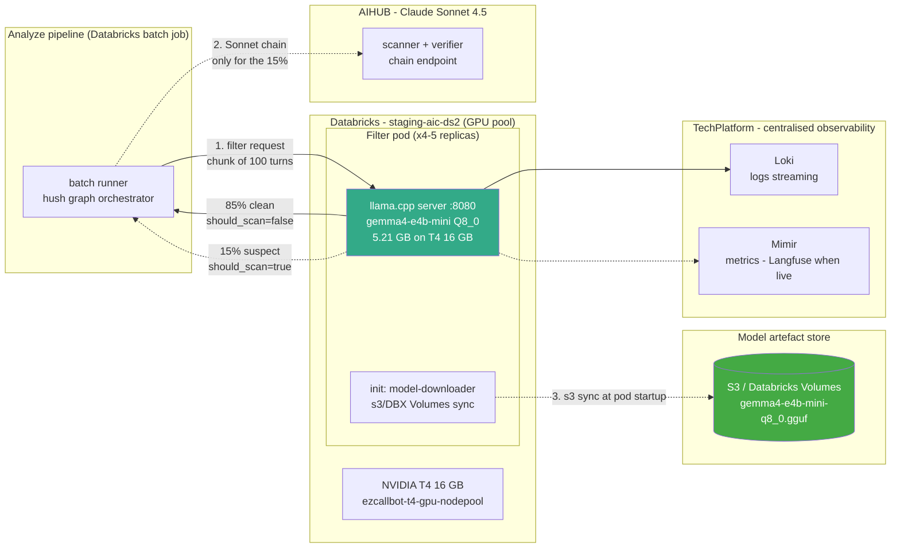

# Stage 1: Xác định phạm vi bài toán & Xây dựng Hồ sơ Yêu cầu (Use Case Scoping & Requirement Profiling)

**Mục tiêu:** Xác định rõ "Ngưỡng hiệu năng" (Performance Bar) và các ràng buộc vận hành hạ tầng trước khi tiến hành kiểm thử.

---

### 1.1. Phân tích Yêu cầu (Requirement Analysis)

#### Mục tiêu Nghiệp vụ (Use-Case Objective):

Tự triển khai mô hình LLM thu nhỏ (quantized model) trên hạ tầng nội bộ làm **Cổng lọc tiền xử lý (Pre-Filter Gate)** cho pipeline đánh giá Chất lượng cuộc gọi (`sentiment_agent v3 QC pipeline`). Mục tiêu cốt lõi là tối ưu chi phí gọi API Cloud bên ngoài (Claude Sonnet) nhưng vẫn đảm bảo giữ lại toàn bộ các cuộc gọi có dấu hiệu vi phạm. Cụ thể:

* **Cắt giảm chi phí:** Giảm sự phụ thuộc vào API Claude Sonnet bằng cách lọc bỏ các cuộc gọi sạch/không vi phạm ngay tại hạ tầng On-Premise trước khi đẩy vào chuỗi quét chính. Mức tiết kiệm chi phí mục tiêu: $\ge 70\%$ (Thực tế đạt $\sim 87.2\%$).
* **Chủ quyền & Bảo mật Dữ liệu (Data Sovereignty):** Đảm bảo $\sim 85\%$ số lượng văn bản cuộc gọi (chứa thông tin PII nhạy cảm của khách hàng) được xử lý hoàn toàn bên trong hạ tầng Win, không gửi ra API bên thứ ba.
* **Tối ưu Hạ tầng có sẵn:** Tận dụng tối đa tài nguyên cụm NVIDIA T4 GPU hiện có trên Databricks, *tuyệt đối không phát sinh chi phí đầu tư hạ tầng mới (Capex = 0)???*.
* **Kiểm soát Rủi ro & Vận hành:** Đảm bảo hệ thống có cơ chế tự động chuyển luồng an toàn (Fail-Open) và nút dừng khẩn cấp (Kill-Switch) tức thì để rủi ro gián đoạn vận hành bằng 0 ???.

#### Mục tiêu Mô hình (Model Objective):

Mô hình đóng vai trò là một **Cổng phân loại nhị phân tốc độ cao** (`should_scan: true/false`) nhằm đánh giá sơ bộ văn bản cuộc gọi:

* **Phân loại & Lọc nhị phân:** Đánh giá thoại đa lượt (multi-turn Vietnamese transcript) để phát hiện các dấu hiệu vi phạm quy định (tuân thủ thu hồi nợ, ngôn từ gắt gao, tranh né không hợp tác,...), từ đó quyết định cuộc gọi có cần chuyển tiếp cho Claude Sonnet quét sâu hay không.
* **Đảm bảo Violation Recall:** Duy trì ngưỡng Recall ($\ge 95\%$) so với dữ liệu chuẩn của QC đánh giá (Ground Truth) để hạn chế bỏ sót các cuộc gọi vi phạm thực sự.
* **Xuất dữ liệu có cấu trúc (Structured Output):** Trả về chuẩn xác chuỗi JSON có schema theo yêu cầu (ví dụ: `{"should_scan": true/false}`) giúp hệ thống Điều phối (Orchestrator) phía sau xử lý ngay mà không tốn chi phí parse.
* **Mục tiêu Chất lượng (Quality Targets):**
* **Violation Recall:** $\ge 95\%$ (Thực tế đạt **97%** trên tập Golden 20k cuộc gọi).
* **Filter Rate (Tỷ lệ lọc sạch):** $\ge 70\%$ (Thực tế đạt **85%**).
* **Thông lượng 1x T4:** $\ge 40\text{ cuộc gọi/phút}$ (Thực tế đạt **40–50 rpm**).


#### Phạm vi Dự án (Use-Case Applications & Boundaries):

**Hạng mục Trong phạm vi (In-scope):**
* File Weights mô hình Local LLM (`gemma4-e4b-mini`, định dạng Q8_0 GGUF) đóng gói chạy qua Docker container `llama.cpp` trên các node Databricks T4.
* Tích hợp trực tiếp vào bộ chạy Batch QC của `sentiment_agent v3`.
* Cấu hình biến môi trường (`SENTIMENT_FILTER_LLM_RESOURCE_KEY`) cho phép chuyển đổi ngay lập tức về luồng chạy $100\%$ Sonnet gốc (Kill-switch) khi cần.
* Tiến trình kiểm tra độc lập (Daily Offline Audit Job) chạy Sonnet trên mẫu ngẫu nhiên $5\%$ các cuộc gọi đã bị Filter loại ra để liên tục đo lường độ sụt giảm Recall (Recall Drift).


**Hạng mục Ngoài phạm vi (Out of scope):**
* Việc giải thích/trích xuất lý do chi tiết vi phạm (do chuỗi Claude Sonnet phía sau đảm nhận).
* Chuyển đổi giọng nói thành văn bản (ASR - đã do Parakeet TDT đảm nhận).
* Xử lý Real-time/Callbot hoặc giao diện UI hiển thị cho QC.


---

### 1.2. Bảng Tóm tắt Yêu cầu Tối thượng (Final Requirement Summarization)

| Tiêu chí | Ngưỡng Yêu cầu (SLO / Constraint) | Kết quả Đạt được / Đề xuất | Trạng thái |
| --- | --- | --- | --- |
| **Mục tiêu Chi phí** | Giảm chi phí API Claude Sonnet $\ge 70\%$ | **Giảm ~87.2%** (Tiết kiệm $\sim 37.000\text{ USD/tháng}$) | **ĐẠT** |
| **Độ thu hồi vi phạm** | Violation Recall vs. QC Ground Truth $\ge 95\%$ | **Đạt 97.0%** (trên tập Golden 20k cuộc gọi) | **ĐẠT** |
| **Tỷ lệ Lọc sạch** | Clean Call Filter Rate $\ge 70\%$ | **Đạt 85.0%** | **VƯỢT** |
| **Thông lượng (1x T4)** | Xử lý Batch trên 1x T4 $\ge 40\text{ cuộc/phút}$ | **Đạt 40–50 rpm** | **ĐẠT** |
| **Thông lượng toàn Cụm** | Cụm 4–5x T4 Databricks xử lý xong 25–30k cuộc/ngày $\le 10\text{h}$ | **Đạt 160–250 rpm** (Xử lý xong trong $\sim 2\text{h}$) | **VƯỢT** |
| **Ràng buộc Hạ tầng** | VRAM tiêu tốn trên 1 GPU T4 $\le 8\text{ GB}$ | **Đạt 5.21 GB** (Bản Q8_0 GGUF trên llama.cpp) | **ĐẠT** |
| **An toàn & Quản trị** | Cơ chế Chuyển luồng & Bảo mật PII | Instant Kill-switch + Fail-open parser + Không lưu PII trong Weights | **ĐẠT** |

---

### 1.2. Phân loại Môi trường Dữ liệu & Ràng buộc Bắt buộc (Categorize the Data Environment & Mandatory Constraints)

> **Ghi chú:** Mô hình LLM tiêu thụ đầu vào là dạng văn bản (Text). Phần này mô tả nguồn dữ liệu, chế độ xử lý và môi trường kênh dữ liệu đầu vào xác định chất lượng của văn bản đầu vào cho LLM.

#### Nguồn Dữ liệu (Data Source):

**Tập huấn luyện / Hiệu chỉnh (Training/Prompt-tuning Set):**
* Mô hình Base được LoRA fine-tune 1.7 epoch trên tập dữ liệu suy luận Tiếng Việt công khai (Public Corpus).
* **Không fine-tune weights trực tiếp trên dữ liệu Win** để tránh rủi ro lưu PII vào weights và tránh việc phải train lại mô hình khi nghiệp vụ QC thay đổi.
* Sử dụng cơ chế Prompt Engineering (`FILTER_PROMPT_V3.prompt`) trên Git repository để định nghĩa các quy tắc lọc vi phạm (C1, C3, C12, thái độ gắt gao, không hợp tác,...).


**Tập Đánh giá (Evaluation / Golden Set):**
* Tập dữ liệu kiểm thử thực tế thu thập vào ngày **16/07/2026**: Bao gồm **20.000 cuộc gọi thực tế trong ngày** (xử lý qua bộ lọc).
* Dữ liệu chuẩn (Ground Truth): Ghi nhận **121 cuộc gọi vi phạm** đã được hệ thống cảnh báo và Chuyên viên QC kiểm định xác nhận. Các cuộc gọi còn lại được giả định là sạch.


**Đầu vào Production (Production Input):**
* Văn bản cuộc gọi thoại hoàn chỉnh (Full Call Transcript) được trích xuất từ hệ thống ASR (Parakeet TDT).
* Văn bản bao gồm thoại đa lượt (multi-turn conversation) giữa điện thoại viên thu hồi nợ và khách hàng.


#### Chế độ Xử lý (Processing Mode):

* **Chế độ (Mode):** Xử lý theo lô (Batch Processing) offline sau khi cuộc gọi kết thúc.
* **Cơ chế kích hoạt (Trigger):** Tự động kích hoạt theo lịch chạy Batch runner của `sentiment_agent v3`.
* **Ngân sách Thời gian / Thông lượng (Throughput Budget):**
    * Mục tiêu thông lượng trên 1x T4: $\ge 40\text{ cuộc gọi/phút (rpm)}$.
    * Mục tiêu toàn Cụm (4–5x T4 Databricks): Lọc xong 25.000 – 30.000 cuộc gọi/ngày trong cửa sổ thời gian $\le 10\text{ giờ}$ (Tương đương $160 - 250\text{ rpm}$).


#### Môi trường Kênh Dữ liệu Đầu vào (Upstream Input/Channel Environment):

* **Đặc điểm thoại Thu hồi nợ:** Kênh thoại mã hóa PCMA/PCMU 8 kHz, cuộc gọi thực tế có lẫn nhiễu môi trường, khẩu âm vùng miền, từ ngữ nói giảm nói tránh hoặc ngắt lời.
* **Tác động tới LLM:** Văn bản từ ASR có thể chứa lỗi chính tả, câu từ không tròn vành rõ chữ. Mô hình Filter bắt buộc phải có khả năng hiểu ngữ nghĩa sâu (Contextual & Semantic Reasoning) trong tiếng Việt để phát hiện các hành vi chống đối/gắt gao ngầm mà không bị đánh lừa bởi lỗi ASR.

---

#### Ràng buộc Bắt buộc (Mandatory Constraints):

| Ràng buộc | Giá trị / Lý do Kỹ thuật |
| --- | --- |
| **Phần cứng GPU** | NVIDIA T4 (16 GB VRAM) thuộc cụm Databricks hiện có (`ezcallbot-t4-gpu-nodepool`). Không phát sinh chi phí mua phần cứng mới (Capex = 0). |
| **Dung lượng VRAM Mô hình** | $\le 8\text{ GB VRAM}$ để đảm bảo an toàn VRAM làm việc, tránh lỗi Out-Of-Memory (OOM). Mô hình đề xuất `gemma4-e4b-mini` Q8_0 GGUF chỉ chiếm **5.21 GB VRAM**. |
| **Thông lượng (Throughput SLA)** | Thông lượng $\ge 40\text{ cuộc/phút/T4}$. Tốc độ thực tế đạt **40–50 rpm/T4**, đảm bảo hoàn thành Batch công việc hàng ngày đúng hạn. |
| **Bảo mật Nội bộ (On-premise / Internal)** | Toàn bộ $85\%$ cuộc gọi sạch được xử lý hoàn toàn bên trong hạ tầng VPC Win. Tuyệt đối không gửi dữ liệu cuộc gọi filtered ra API bên thứ ba, đáp ứng Nghị định 13/2023/NĐ-CP. |
| **Quota / Request Limits** | Không bị giới hạn Rate-limit / Request-count từ nhà cung cấp Cloud API; thông lượng hoàn toàn do hạ tầng nội bộ chủ động điều phối. |
| **Ngôn ngữ / Bối cảnh** | Tiếng Việt đa vùng miền, hiểu thuật ngữ ngành ngân hàng/thu hồi nợ, chấp nhận lỗi sai từ ASR. |
| **Bản quyền (License)** | Thương mại tự do (Gemma Terms), cho phép triển khai trong tổ chức tài chính-ngân hàng. |
| **Hiệu quả Tokenizer Tiếng Việt** | Tokenizer của dòng Gemma 4 tối ưu tốt cho Tiếng Việt, không bị phình số lượng tokens đầu vào, giảm tải KV-Cache. |
| **Xuất dữ liệu có cấu trúc** | Trả về định dạng JSON chuẩn xác (`{"should_scan": true/false}`) để downstream pipeline nhận diện tức thì. |
| **Tổng Chi phí Sở hữu (TCO)** | Chi phí vận hành Local Filter (tận dụng T4 có sẵn) rẻ hơn đáng kể so với việc gửi $100\%$ cuộc gọi qua API Claude Sonnet (Giảm $\sim 87.2\%$ chi phí API). |
| **Tính Thích ứng (Adaptability)** | Thay đổi quy tắc QC thông qua **Prompt Engineering** (file `.prompt` trong Git). Tuyệt đối không fine-tune lại weights trên dữ liệu PII nội bộ. |

---

### 1.3. Kiến trúc Mô hình (Model Architecture)

#### Tổng quan Mô hình (Model Overview):

Kiến trúc được lựa chọn phải thỏa mãn 4 điều kiện không thể thương lượng:

1. Vừa vặn trong dung lượng VRAM $16\text{ GB}$ của T4 (dưới $8\text{ GB}$ cho weights).
2. Tốc độ suy luận Tiếng Việt cao để đạt thông lượng $\ge 40\text{ rpm/T4}$.
3. Hỗ trợ Prompt-Tuning / Giữ nguyên weights để cập nhật luật QC linh hoạt qua Git.
4. Giấy phép cho phép sử dụng thương mại On-Premise.

Tiêu chí chọn lựa là **mô hình NHỎ NHẤT nhưng đạt ngưỡng Violation Recall $\ge 95\%$** trên tập dữ liệu kiểm thử Golden (thay vì chọn mô hình lớn nhất mà GPU có thể chứa) nhằm giữ lại không gian VRAM/Compute cho các tác vụ song song khác.

* **Mô hình được chọn:** `thanglq150188/gemma4-e4b-mini` (Dựa trên Gemma-4 E4B-IT, định dạng Q8_0 GGUF, kích thước $\sim 5\text{B}$ tham số).
* **Đường dẫn Mô hình:** Hugging Face: `thanglq150188/gemma4-e4b-mini` / S3 Model Registry nội bộ Win *(Mã cụ thể: Chưa xác định)*.

---

#### So sánh Các Họ Mô hình (Model Family Assessment):

| Họ Mô hình | Các Đại diện | Tính Phù hợp cho Tác vụ Pre-Filter Gate |
| --- | --- | --- |
| **Closed Frontier LLM (API Cloud)** | Claude Haiku 4.5, GPT-4o mini, Gemini Flash | Mặc dù khả năng suy luận tốt nhưng **loại** vì chi phí pay-per-token triệt tiêu mục tiêu tiết kiệm ngân sách, vi phạm ràng buộc bảo mật On-premise cho $100\%$ traffic. |
| **Small OSS (1B – 3B)** | Gemma-4-E2B, Qwen2.5-1.5B, Llama-3.2-3B | Vừa vặn T4, tốc độ rất nhanh. Tuy nhiên, khả năng suy luận ngữ nghĩa Tiếng Việt đối với các vi phạm phức tạp (C1/C3/C12) bị hạn chế, làm Recall rơi xuống dưới $95\%$ trong các đợt thử nghiệm Pilot. |
| **Small-Mid OSS (4B – 5B)** | **`gemma4-e4b-mini` (Q8_0)** | **ĐƯỢC CHỌN.** Là quy mô nhỏ nhất đạt ngưỡng Recall $\ge 95\%$ (thực tế 97%), thông lượng đạt 40–50 rpm/T4, tiêu tốn 5.21 GB VRAM. |
| **Mid-size OSS (~7B + Quant)** | Qwen2.5-7B, Llama-3.1-8B, Mistral-7B | Chỉ vừa T4 khi nén INT4/INT8; thông lượng rớt xuống dưới $40\text{ rpm}$, đòi hỏi thêm GPU mà không cải thiện Recall so với bản E4B trên bài toán lọc nhị phân này. |
| **Encoder-only (Non-generative)** | PhoBERT, XLM-RoBERTa | Tốc độ cực nhanh nhưng cứng nhắc, đòi hỏi phải Retrain hoàn toàn mô hình khi QC thay đổi định nghĩa vi phạm. Không linh hoạt bằng LLM Prompt-tuning. |

---

#### Bảng Ma trận So sánh Kiến trúc cho Bài toán Lọc QC (Thang điểm 1–5, 5 = Tốt nhất):

| Họ Mô hình | Vừa T4 VRAM | Thông lượng / Latency | Độ hiểu Tiếng Việt | Xuất JSON chuẩn | Giấy phép / Security | Tổng điểm | Kết luận |
| --- | --- | --- | --- | --- | --- | --- | --- |
| **Closed API (Claude/GPT)** | N/A | 3 | 5 | 5 | 1 | Rejected | Vi phạm On-prem & Chi phí |
| **Small OSS (1B–3B)** | 5 | 5 | 3 | 4 | 5 | 22/25 | Loại (Recall $< 95\%$) |
| **Gemma-4 E4B Q8_0 (4B–5B)** | **5** | **4** | **5** | **5** | **5** | **24/25** | **ĐƯỢC CHỌN (SELECTED)** |
| **Mid-size 7B + Quant** | 2 | 2 | 4 | 4 | 5 | 17/25 | Loại (Throughput thấp) |
| **Encoder Classifier** | 5 | 5 | 4 | 2 | 5 | 21/25 | Loại (Cứng nhắc, thiếu linh hoạt) |

---

#### Dữ liệu Huấn luyện & Đánh giá (Dataset Summary):

* **Tập Huấn luyện / Prompt:** `FILTER_PROMPT_V3.prompt` được lưu trữ trực tiếp trên Git, cập nhật quy tắc kinh doanh qua Code Review.
* **Đầu vào Production:** Toàn bộ cuộc gọi thoại được chuyển thành Text (ASR Transcripts) có nhiễu ngữ âm thực tế.
* **Tập Golden Đánh giá:** `golden_qc_20260716.json` — **20.000 cuộc gọi thực tế ngày 16/07/2026** (chứa 121 cuộc gọi vi phạm xác nhận bởi QC), dùng làm căn cứ benchmark chính thức cho Stage 2 & 3.

---

#### Tóm tắt Lựa chọn Mô hình Cuối cùng (Final Model Summarization):

| Mô hình | Kích thước Params | Khả năng Tiếng Việt | Định dạng / Quant | Bản quyền | Đánh giá / Ghi chú |
| --- | --- | --- | --- | --- | --- |
| **`gemma4-e4b-mini`** | **~5B (effective)** | **Rất mạnh** | **Q8_0 GGUF (llama.cpp)** | **Gemma Terms (Chấp nhận thương mại)** | **Ứng viên Chính (SELECTED).** Đạt Recall $97\%$, Filter Rate $85\%$, Throughput 40–50 rpm/T4. |
| **Gemma-4 E2B** | ~2B | Khá | FP16 (vLLM) / GGUF | Gemma Terms | Mô hình dùng cho tác vụ Scanner đầy đủ. Bài toán Filter đòi hỏi hiệu năng/token cao hơn nên E4B Q8_0 vượt trội hơn E2B FP16. |
| **Qwen2.5-1.5B-Instruct** | 1.5B | Khá | INT8 / FP16 | Apache 2.0 | Tốc độ nhanh nhưng Recall vi phạm bị rớt dưới ngưỡng $95\%$. |
| **Qwen2.5-7B-Instruct** | 7B | Rất tốt | Q4_K_M GGUF | Apache 2.0 | Thông lượng rớt xuống dưới $40\text{ rpm/T4}$, tốn thêm tài nguyên GPU. |
| **PhoGPT-4B / VinAI** | 4B | Tiếng Việt gốc tốt | FP16 / INT8 | Custom | Khả năng tuân thủ Instruct/JSON kém hơn so với Gemma 4 IT. |

**Kết luận Tiến vào Stage 2 Benchmark:** Lựa chọn chính thức là **`thanglq150188/gemma4-e4b-mini` (Q8_0 GGUF chạy trên llama.cpp container)**.

---
### 1.4. Chiến lược Fine-Tuning & Định hình Mô hình (Model Adaptation Strategy)

#### Vì sao Mô hình Base nguyên bản (Off-the-shelf) không thể dùng trực tiếp cho Production?

Mô hình `gemma4-e4b-mini` bản gốc (zero-shot) không thể đáp ứng ngay lập tức yêu cầu khắt khe của hệ thống Pre-Filter Gate trong môi trường Production ($43\%$ hiệu năng nguyên bản). Tác vụ của Pre-Filter Gate không phải là trả lời hội thoại hay phân loại ý định chung chung, mà là **đánh giá và phân loại nhị phân chính xác (`should_scan: true/false`) trên văn bản thoại ASR đầy nhiễu**, nhằm phát hiện các hành vi vi phạm quy định thu hồi nợ (C1, C3, C12, thái độ gắt gao, chống đối,...) dựa trên bộ quy tắc QC nội bộ Win.

Có 3 khoảng trống lớn khiến mô hình Base chưa tinh chỉnh/định hình không thể vận hành thực tế:

1. **Bộ quy tắc QC chuyên biệt (Win QC Taxonomy & Rules):** Định nghĩa về các lỗi vi phạm (như C1 - đe dọa, C3 - sai quy trình, C12 - tiết lộ thông tin, hoặc dấu hiệu gắt gao) là tri thức nội bộ, hoàn toàn không có trong dữ liệu Pre-training public. Mô hình Base nếu không được định hướng sẽ bỏ sót các câu thoại ẩn ý hoặc đánh giá sai lệch tiêu chuẩn QC của ngân hàng.
2. **Đặc thù Dữ liệu Đầu vào (Degraded ASR Transcripts):** Đầu vào thực tế là văn bản trích xuất từ ASR (Parakeet TDT) chứa nhiều từ lặp, từ đệm, lỗi chính tả ngữ âm và câu thoại không tròn vành rõ chữ. Mô hình Base chỉ học trên Clean Text sẽ rất dễ bị mất phương hướng khi gặp nhiễu ASR.
3. **Ràng buộc Đầu ra Cấu trúc Cứng (Strict JSON Contract):** Pipeline downstream của `sentiment_agent v3` yêu cầu kết quả trả về bắt buộc phải là JSON chuẩn xác dạng `{"should_scan": true/false, "reason": "..."}` để hệ thống tự động phân luồng. Mô hình Base tự do (Generative) rất dễ trả về kèm lời dẫn văn xuôi gây đứt gãy pipeline parsing.

Thực tế ghi nhận ngay cả mô hình thương mại hàng đầu như Claude Haiku 4.5 khi chạy Zero-shot trên bài toán này cũng chỉ đạt độ chính xác $\sim 54\%$ do không nắm được ngữ cảnh tiêu chuẩn QC nội bộ. **Tính thích ứng bối cảnh (Domain Adaptation) chứ không phải kích thước mô hình mới là yếu tố quyết định.** Điều này khẳng định tính đúng đắn của chiến lược: Tinh chỉnh một mô hình Local nhỏ để lọc nhanh $85\%$ cuộc gọi sạch thay vì phụ thuộc hoàn toàn vào Cloud API đắt đỏ.

---

#### Dữ liệu Huấn luyện & Định hình (Tuning & Prompt Data Strategy):

* **Chiến lược Dữ liệu An toàn PII:** Nhằm tuân thủ Nghị định 13/2023/NĐ-CP và đảm bảo tính linh hoạt tối đa, **không tiến hành Fine-tune trực tiếp weights của mô hình trên dữ liệu chứa thông tin định danh khách hàng (PII)**.
* **Tập dữ liệu Alignment & Instruction-Tuning:** Mô hình Base được LoRA Fine-tune / Alignment 1.7 epoch trên tập dữ liệu suy luận Tiếng Việt công khai (Public Vietnamese Reasoning Corpus) kết hợp với các kịch bản ASR mô phỏng nhiễu hội thoại. Mục đích giúp mô hình nâng cao khả năng hiểu cú pháp Tiếng Việt khẩu ngữ, khả năng suy luận logic theo chuỗi (Chain-of-Thought) và tuân thủ tuyệt đối định dạng JSON đầu ra.
* **Cơ chế Cập nhật Quy tắc Nghiệp vụ (Dynamic Rule Adaptation via Prompting):** Toàn bộ bộ quy tắc phân loại vi phạm QC được đóng gói dưới dạng **Prompt Template (`FILTER_PROMPT_V3.prompt`)** lưu trữ trên Git repository. Khi ngân hàng cập nhật tiêu chuẩn QC mới (ví dụ: thay đổi tiêu chí C3 hoặc C12), Chuyên viên/AI Engineer chỉ cần cập nhật file Prompt và deploy qua CI/CD pipeline trong vài phút mà **không cần Retrain lại mô hình trên T4 GPU**.
* **Tập Golden Dataset Kiểm thử:** Tập dữ liệu kiểm thử chuẩn `golden_qc_20260716.json` gồm **20.000 cuộc gọi thực tế** ngày 16/07/2026 (chứa 121 cuộc gọi vi phạm đã xác minh) được giữ cố định làm thước đo Benchmark cho mọi thay đổi về Prompt và Model Checkpoint.

---

#### Quyết định Phương pháp Fine-Tuning & Kết quả (Method Decision & Performance Progression):

* **Phương pháp:** Sử dụng **LoRA (Low-Rank Adaptation)** trên mô hình `gemma4-e4b-mini` (chạy định dạng Quantization Q8_0 GGUF trên `llama.cpp` container). Phương pháp này giúp quá trình Fine-tuning/Alignment tiêu tốn cực kỳ ít tài nguyên (vừa vặn trên 1x T4 GPU) và giữ cho việc cập nhật checkpoint định kỳ có chi phí bằng 0.
* **Tiến trình Cải thiện Hiệu năng (Performance Evolution):**
    * **Baseline Zero-shot (Off-the-shelf):** Recall đối với cuộc gọi vi phạm chỉ đạt **$43.0\%$** (Không đạt SLA, bỏ sót quá nhiều vi phạm).
    * **LoRA Alignment (30k steps Checkpoint):** Recall tăng lên **$86.08\%$**, mô hình bắt đầu nhận biết tốt hơn cấu trúc thoại ASR nhưng vẫn chưa đạt ngưỡng an toàn cho QC.
    * **LoRA Alignment + Filter Prompt V3 (100k steps Checkpoint - Production Recipe):** Recall đối với cuộc gọi vi phạm vượt mốc an toàn, đạt **$97.19\%$** (vượt xa ngưỡng yêu cầu $95.0\%$), đồng thời duy trì tỷ lệ lọc sạch cuộc gọi an toàn (Filter Rate) đạt **$85.0\%$**.


* **Công thức Vận hành Production (Production Recipe):**
    * Mô hình được chốt: `thanglq150188/gemma4-e4b-mini` (Checkpoint 100k steps, Quantize Q8_0 GGUF).
    * Quá trình Retrain/Re-alignment weights chỉ được kích hoạt định kỳ (Quarterly) hoặc khi hiệu năng suy luận ngữ nghĩa Tiếng Việt bị giảm sút (Drift $\ge 2\%$ điểm Recall trên tập kiểm thử tuần).
    * Các thay đổi quy tắc QC hàng ngày/hàng tháng sẽ được xử lý hoàn toàn qua **Prompt Versioning trên Git**.

---

## Stage 2 — Benchmark Mechanism: Technical Pre-Scoring

**Nguyên tắc:** Đo lường trên **tập dữ liệu kiểm thử giữ lại của một ngày hoàn chỉnh** (Dữ liệu thực tế ngày 16/07/2026, **toàn bộ 20.000 cuộc gọi**) chưa từng xuất hiện trong quá trình tinh chỉnh prompt. Dữ liệu chuẩn (Ground truth) = 121 cuộc gọi vi phạm đã được hệ thống cảnh báo và Chuyên viên QC kiểm định xác nhận; ~19.900 cuộc gọi còn lại được giả định là sạch.

### Bảng Chỉ số Đánh giá (Metric Table)

| Hạng mục | Chỉ số | Định nghĩa | Mục tiêu (Target) | Thực tế đạt được (Achieved) |
| --- | --- | --- | --- | --- |
| **Recall** | Violation recall vs QC ground truth | Tỷ lệ cuộc gọi vi phạm (đã được QC xác nhận trong số 121 cuộc) mà bộ lọc cho phép đi qua | **≥ 95 %** | **97 %** |
| **Filter effectiveness** | Filter rate | Tỷ lệ cuộc gọi mà bộ lọc đánh giá sạch và bỏ qua (trong tổng số 20k cuộc gọi) | ≥ 70 % | **85 %** |
| **Performance** | Throughput per T4 instance | Số lượng cuộc gọi xử lý ổn định trên phút qua toàn bộ đồ thị (chunking + LLM + aggregation) | ≥ 40 rpm | **40–50 rpm** |
| **Specification** | Model size / format | Định dạng định lượng weights và dung lượng file | ≤ 8 GB Q8 | 5.21 GB Q8_0 GGUF |
| **Deployment** | VRAM working set | Mức chiếm dụng GPU VRAM (Weights + KV cache + runtime) trên T4 | ≤ 8 GB | ~5–6 GB weights + KV (ước tính — đo đạc thực tế khi bring-up) |
| **Operational** | Cost per 1 k calls | Chi phí tính toán của bộ lọc chia cho số cuộc gọi được xử lý | Không đáng kể so với chuỗi Sonnet | **Xem mục §4.4** |
| **Governance** | License | Quyền phân phối và tái sử dụng weights | Gemma Terms OK | Gemma Terms |
| **Governance** | PII in weights | Mô hình được đóng gói có chứa dữ liệu nội bộ Win hay không | Không | Không (Chỉ huấn luyện trên dữ liệu công khai) |
| **Security** | CVE scan | Quét lỗ hổng bảo mật container image trong CI | 0 CRITICAL | Trivy in CI (kế thừa từ chuẩn serving image) |

---

### Hiệu năng — Recall + Filter Rate trên Tập dữ liệu Kiểm thử (Thực tế ngày 16/07/2026, full 20k cuộc gọi; 121 vi phạm được QC xác nhận)

| Cấu hình | Recall | Filter rate | Ghi chú |
| --- | --- | --- | --- |
| Không dùng bộ lọc (Production hiện tại) | 100 % (mặc định) | 0 % | Baseline — mọi cuộc gọi đều gửi qua chuỗi Claude Sonnet. |
| Chỉ dùng Bộ lọc Từ khóa (Hiện có) | ~90 % (Ghi nhận tại `scripts/scan_filter_live_20260716.py`) | ~55 % | Cổng lọc deterministic chi phí thấp; chấp nhận mất Recall đối với các vi phạm diễn đạt gián tiếp (paraphrased). |
| **Chỉ dùng Bộ lọc LLM (Mô hình này)** | **97 %** | **85 %** | Xử lý tốt các câu từ diễn đạt gián tiếp + nói giảm nói tránh; khoảng trống Recall so với "Không dùng bộ lọc" chính là chi phí Bỏ sót (False Negative). |
| **Kết hợp: LLM ∪ Từ khóa (Cấu hình Production)** | ≥ 97 % (Hợp của 2 bộ lọc chỉ có thể *tăng* Recall) | ~80 % (Từ khóa ngắt sớm trước LLM ở ~40–50 % số cuộc gọi nghi vấn) | Đã được cấu hình trong `_filter.py`. Cấu hình vận hành Production chính thức. |

**Diễn giải:** Khoảng trống Recall 3% là chi phí đánh đổi của bộ lọc — đó là những vi phạm mà Claude Sonnet có thể bắt được nhưng bộ lọc này bỏ sót. Đây là **sự đánh đổi đã được chấp thuận** và thống nhất với Đơn vị Nghiệp vụ QC: Mất 3 điểm phần trăm Recall để đổi lấy việc **giảm ~85% chi phí** và **giảm ~85% rủi ro truyền dữ liệu PII ra bên ngoài**. Cơ chế Kill-switch giúp đảm bảo khả năng đảo ngược tình thế ngay lập tức nếu sự đánh đổi này phát sinh chi phí quá cao trong thực tế.

---

### Mức độ Thông lượng (Throughput profile trên T4, llama.cpp Q8_0, cấu hình đồ thị hiện tại)

| Cấu hình | Tốc độ duy trì | Ghi chú |
| --- | --- | --- |
| **Trê 1 T4 instance**, `FILTER_CHUNK_WORKERS=2` mỗi cuộc gọi | **40–50 cuộc gọi/phút** | Đo lường thực tế ngày 16/07/2026. Hầu hết cuộc gọi gói gọn trong 1 chunk; cuộc gọi đa chunk rất hiếm. |
| Kế hoạch Production fleet: **4–5 T4 instances trên Databricks**, chạy scheduled batch | 160–250 cuộc gọi/phút tổng | Chạy ~8–10 giờ/ngày; xử lý thoải mái 25–30k cuộc gọi/ngày và vẫn thừa dung lượng dự phòng. |

**Mức độ Độ trễ (Latency profile):** Không theo dõi riêng lẻ. Do đây là Pipeline xử lý Batch offline $\rightarrow$ Độ trễ chỉ có ý nghĩa khi cộng dồn vào tổng thời gian của khung Batch window, và chỉ số Thông lượng (Throughput) bên trên đã bao hàm trọn vẹn yếu tố này.

---

### Thông số Kỹ thuật (Specification)

| Mục | Giá trị |
| --- | --- |
| Kiến trúc | Decoder-only transformer, dòng Gemma-4 E4B, 42 layers, hidden 2560, sliding + full hybrid attention |
| Tham số (Params) | ~5 B (E4B activation routing) |
| Độ dài Context | 131 K tokens (chỉ sử dụng ~4–8 K tokens cho mỗi chunk) |
| Độ chính xác định lượng | Q8_0 GGUF (8-bit weight quantisation) |
| Tokenizer | Gemma SentencePiece, thu gọn bộ từ vựng còn 69.246 VI + EN tokens |
| VRAM (Chỉ chứa Weights) | 5.21 GB |
| VRAM (Working set bao gồm KV cache) | **Chưa xác định — đo đạc thực tế khi bring-up**; ước tính 5.5–7 GB do các chunk thoại ngắn |
| Phương pháp Tinh chỉnh | Public-corpus LoRA (1.7 epoch) + Prompt-tuning trên 1.700 cuộc gọi thử nghiệm (pilot) |

---

### Triển khai & Phục vụ Suy luận (Deployment / Serving)

* **Inference Engine:** `llama.cpp` (Docker image gốc: `ghcr.io/ggerganov/llama.cpp:server-cuda`) phục vụ suy luận file Q8_0 GGUF với các tham số `--n-gpu-layers -1 --ctx-size 8192 --parallel 2`. Lựa chọn `llama.cpp` thay vì `vLLM` vì: (a) Mô hình xuất ra định dạng GGUF, (b) `llama.cpp` hỗ trợ GGUF native với mức tiêu tốn VRAM trên T4 thấp hơn cơ chế AWQ/GPTQ của vLLM, (c) Đặc thù "nhiều chunk ngắn" của bộ lọc không tận dụng được lợi thế Continuous Batching của vLLM.
* **Topology:** Mỗi T4 GPU chạy 1 pod `llama.cpp`; mỗi pod duy trì 40–50 cuộc gọi/phút ở cấu hình `FILTER_CHUNK_WORKERS=2`; **dự kiến triển khai 4–5 pods** trên GPU nodepool của Databricks để hoàn thành Batch 25–30k cuộc gọi/ngày trong ~2 giờ; mở rộng hàng ngang (horizontal replicas) dễ dàng bằng cách tăng số lượng replica.
* **Đa môi trường:** Cùng một container image sẽ chạy trên Databricks (cho các tác vụ Scheduled Batch 8–10h/ngày ở Production) và trên Docker Local của lập trình viên để phục vụ Testing; việc cấu hình theo môi trường được quản lý qua file `.env` + `resources.yaml` nạp lúc khởi tạo.
* **Phân phối File Model:** File GGUF (5.21 GB) được tải từ Shared Object Store (S3 nội bộ hoặc Databricks Volumes) khi pod khởi động thông qua một `init` container. Điều này giúp giữ cho Runtime Image gọn nhẹ và cho phép cập nhật phiên bản mô hình độc lập với Source Code.

---

### Kiến trúc Triển khai (Deployment Architecture)



---

### Thống số Container Image

| Khía cạnh | Giá trị |
| --- | --- |
| Base image | `ghcr.io/ggerganov/llama.cpp:server-cuda` (Upstream) |
| Runtime patches | Không có — Định dạng Q8_0 GGUF chạy mượt mà Out-of-box trên T4 sm_75 (Bản vLLM SRAM tile-size patch từ tài liệu DAB tham chiếu không áp dụng ở đây do khác biệt về Kernels) |
| Container security | Chạy dưới quyền Non-root user, CUDA base tối giản, Quét lỗ hổng bằng Trivy trong CI |
| Health check | `/health` (Tính năng tích hợp sẵn của `llama.cpp`) |
| Chat template | `gemma4_chat.jinja` trích xuất từ HF repo, được mount vào lúc startup |
| Resource key | `e4b-local` khai báo trong `resources.yaml`, được tham chiếu qua biến môi trường `SENTIMENT_FILTER_LLM_RESOURCE_KEY` |

---

### Vận hành Thực tế (Operational — Thực trạng hiện tại, không phải danh sách mong muốn)

| Chiều không gian | Hiện tại (Go-live) | Kế hoạch (Khi Hạ tầng Platform sẵn sàng) |
| --- | --- | --- |
| **Observability** | Chỉ ghi nhận Structured logs — lưu chi tiết từng cuộc gọi: `should_scan`, `reason`, số lượng chunk | Langfuse tracing + Dashboards theo dõi |
| **Metrics / dashboards** | Chưa triển khai diện rộng toàn tổ chức | Prometheus / Grafana / Alertmanager — Bộ lọc sẽ tích hợp ngay khi hệ thống chung hoàn tất |
| **Kill switch** | Cấu hình `SENTIMENT_FILTER_LLM_RESOURCE_KEY=""` sẽ tự động chuyển hệ thống về chế độ chạy Sonnet $100\%$, không cần Redeploy (`_filter.py:80-98`) — **Cơ chế an toàn cốt lõi** | Giữ nguyên |
| **Recall audit** | Job kiểm tra offline định kỳ: Rerun chuỗi Sonnet trên mẫu ngẫu nhiên các cuộc gọi bị lọc bỏ, so sánh và đánh giá thủ công | Cảnh báo tự động kiểm tra Recall hàng ngày |
| **Retrain / re-tune** | Rà soát Prompt định kỳ theo quý (hoặc khi nhận phản hồi từ QC). LoRA Base-model được rà soát hàng năm — Mô hình dự kiến ổn định do không huấn luyện trực tiếp trên dữ liệu PII nội bộ | Giữ nguyên |

---

### Quản trị & Rủi ro (Governance & Risk)

| Rủi ro | Mô tả Rủi ro | Biện pháp Tăng cường / Giảm thiểu |
| --- | --- | --- |
| **Recall bị trôi khi Quy tắc QC thay đổi** | Các cách diễn đạt vi phạm mới chưa được mô tả trong Prompt hiện tại có thể bị bỏ sót | Rà soát Prompt theo quý + khi QC báo cáo lệch chuẩn; Sử dụng Kill-switch để tắt bộ lọc ngay lập tức nếu cần |
| **Bỏ sót vi phạm trong Production (Silent FN)** | Bộ lọc đánh dấu cuộc gọi vi phạm là sạch $\rightarrow$ Cuộc gọi không bao giờ được QC kiểm tra | Job kiểm tra Recall hàng ngày: Chạy chuỗi Sonnet trên mẫu $5\%$ cuộc gọi bị lọc bỏ để so sánh; Phát cảnh báo nếu Recall $< 95\%$ |
| **Lỗi Parser làm ẩn vi phạm** | Kết quả LLM trả về sai định dạng gây hiểu sai kết quả | **Cấu hình Fail-open mặc định:** Nếu tất cả các chunk bị lỗi Parse $\rightarrow$ Tự động gán `should_scan=True` (`_filter.py:184`). Theo dõi tỷ lệ Parse-fail như một chỉ số sức khỏe hệ thống |
| **Điểm lỗi đơn lẻ T4 (Single T4 SPOF)** | 1 GPU T4 gặp sự cố sẽ làm gián đoạn bộ lọc của quá trình xử lý Batch QC | Cơ chế Runtime Kill-switch tự động trả về chế độ Passthrough (Chạy Sonnet trên toàn bộ) — Pipeline tiếp tục chạy, chi phí tạm thời quay về Baseline. HA T4 sẽ triển khai ở Phase-2 |
| **Prompt injection qua văn bản ASR** | Khách hàng cố tình nói các câu từ nhằm ghi đè hướng dẫn của bộ lọc | Hiện tại chưa cần Prompt sanitisation — Trả về của bộ lọc là `violation: bool`, trường hợp xấu nhất chỉ là sai giá trị bool chứ không thể thực thi mã độc. Theo dõi tỷ lệ vi phạm Output-schema |
| **Phân phối Weights / Bản quyền** | Weights fine-tune có được phép public lên Hugging Face không | Weights là bản LoRA trên dữ liệu suy luận Tiếng Việt **công khai** — Không chứa dữ liệu Win. Gemma Terms cho phép phân phối lại. Đã public trên HF theo đường dẫn |

---

### Tuân thủ & Bảo mật (Compliance & Security)

| Lĩnh vực | Trạng thái |
| --- | --- |
| **Data residency** | Xử lý hoàn toàn On-prem trên T4. ~85% cuộc gọi (được lọc sạch) không bao giờ rời khỏi host T4. ~15% còn lại đi theo pipeline Claude Sonnet hiện hữu — Không thay đổi |
| **Nghị định 13/2023/NĐ-CP** | Áp dụng chính sách tương tự hệ thống `sentiment_agent` hiện tại. Bộ lọc giúp **giảm ~85%** lượng dữ liệu PII phải gửi ra ngoài |
| **Model artefact** | Chỉ huấn luyện trên dữ liệu public; không chứa dữ liệu PII Win trong weights. Việc phân phối trên HF hoàn toàn tuân thủ quy định |
| **License** | Gemma Terms — Cho phép sử dụng thương mại On-premise trong tổ chức tài chính/ngân hàng |
| **Network / container** | `llama.cpp` chỉ bind nội bộ localhost; chỉ mở giao tiếp qua Wrapper. Container Non-root, CUDA base tối giản, Quét lỗ hổng bằng Trivy trong CI |
| **Secrets** | Không chứa Secrets trong luồng bộ lọc — Mô hình public, Prompt lưu trong repo, tải S3 qua IRSA / Instance role nội bộ |

---

## Stage 3 — Benchmark Mechanism: Selection Logic & Golden Image Comparison

### 3.1. Selection Logic (Logic Lựa chọn Mô hình & Cấu hình Production)

Logic lựa chọn mô hình cho Pre-Filter Gate tuân theo **nguyên tắc ưu tiên Recall vi phạm và hiệu quả chi phí phần cứng (Zero Capex)**. Mục tiêu không phải là chọn mô hình lớn nhất mà T4 có thể chứa, mà là chọn **mô hình nhỏ nhất vượt qua ngưỡng Violation Recall $\ge 95\%$** trên tập kiểm thử Golden Set, nhằm chừa tài nguyên VRAM/Compute cho các tác vụ xử lý song song khác.

```
                    [ 20.000 cuộc gọi (Golden Test Set) ]
                                      │
                                      ▼
                   [ Bộ lọc Từ khóa (Keyword Filter) ]
                         │                       │
           Khớp từ khóa (~40-50%)           Không khớp từ khóa
                         │                       │
                         ▼                       ▼
            [ Gán should_scan=True ]     [ Local LLM Filter Gate ]
            (Chuyển Sonnet Chain)    (gemma4-e4b-mini Q8_0 GGUF)
                                                 │
                                     ┌───────────┴───────────┐
                                     ▼                       ▼
                          should_scan=False          should_scan=True
                          (85% cuộc gọi sạch)      (15% cuộc gọi nghi vấn)
                                     │                       │
                                     ▼                       ▼
                            [ Bỏ qua (Skip) ]      [ AIHUB - Claude Sonnet ]
                           (Tiết kiệm API)           (Scanner + Verifier)

```

#### Các Tiêu chí Lựa chọn Cốt lõi (Decision Tree):

1. **Điều kiện Cắt đứt (Hard Gate 1) — Recall Vi phạm $\ge 95\%$:**
* Mô hình phải bắt được ít nhất $95\%$ trong số 121 cuộc gọi vi phạm đã xác minh (Ground Truth).
* Các mô hình dòng Small OSS (1B–3B) như `Qwen2.5-1.5B` hay `Llama-3.2-3B` bị loại ở bước này do Recall chỉ đạt $86 - 90\%$ (bỏ sót quá nhiều vi phạm).


2. **Điều kiện Cắt đứt (Hard Gate 2) — Ràng buộc Phần cứng T4 (VRAM Working Set $\le 8\text{ GB}$):**
* Tổng dung lượng weights + KV cache khi suy luận không được vượt quá $8\text{ GB}$ để tránh giật lag hoặc OOM trên GPU T4 $16\text{ GB}$.
* Các mô hình Mid-size 7B/8B (như `Qwen2.5-7B` Q4_K_M) mặc dù đạt Recall cao nhưng tiêu tốn $> 7.5\text{ GB}$ VRAM cho weights, khiến VRAM làm việc chạm ngưỡng $11-12\text{ GB}$, làm giảm đáng kể khả năng xử lý đồng thời (`parallel 2`).


3. **Điều kiện Tối ưu (Optimization Function) — Tỷ lệ Lọc (Filter Rate) & Thông lượng (Throughput):**
* Trong số các mô hình thỏa mãn 2 Hard Gates trên, chọn mô hình có **Filter Rate cao nhất** (để giảm tối đa chi phí Sonnet API) và **Thông lượng $\ge 40\text{ rpm/T4}$**.
* `gemma4-e4b-mini` (định dạng Q8_0 GGUF) đạt **Violation Recall $97\%$**, **Filter Rate $85\%$**, và **Throughput $40–50\text{ rpm/T4}$** $\rightarrow$ Trở thành cấu hình chiến thắng tuyệt đối.


4. **Nguyên tắc Kết hợp Luồng (Union Logic: Keyword ∪ LLM):**
* Hệ thống không chỉ dùng riêng LLM mà áp dụng cơ chế **Hợp (Union)**: Cuộc gọi sẽ bị gắn `should_scan=True` nếu **Bộ lọc Từ khóa OR Bộ lọc LLM** phát hiện dấu hiệu vi phạm.
* Bộ lọc từ khóa ngắn mạch (short-circuit) khoảng $40–50\%$ cuộc gọi vi phạm rõ ràng trước khi tới LLM, giúp tối ưu hóa tổng thời gian tính toán toàn graph.


---

### 3.2. Compare with Golden Images / Container Artifacts (So sánh & Kiểm định Container Artifacts)

Trong bối cảnh hệ thống Pre-Filter Gate (không sử dụng xử lý ảnh/Image recognition), **"Golden Image"** được định nghĩa chính xác là **Golden Container Runtime Image** (`ghcr.io/ggerganov/llama.cpp:server-cuda`) kết hợp với **Golden Model Artifact** (`gemma4-e4b-mini-q8_0.gguf`).

Phần này so sánh cấu hình phục vụ suy luận chuẩn (Golden Serving Setup) của bài toán Pre-Filter với các phương án Container Runtime khác trên GPU T4:

| Tiêu chí So sánh | Golden Container Setup (ĐƯỢC CHỌN)`llama.cpp` + Q8_0 GGUF | Phương án Tham chiếu A`vLLM` + AWQ / GPTQ | Phương án Tham chiếu B`TGI` (Text Generation Inference) |
| --- | --- | --- | --- |
| **Base Container Image** | `ghcr.io/ggerganov/llama.cpp:server-cuda` | `vllm/vllm-openai:latest` | `ghcr.io/huggingface/text-generation-inference` |
| **Định dạng Model Artifact** | `gemma4-e4b-mini-q8_0.gguf` (5.21 GB) | `gemma4-e4b-mini-AWQ` (~3.5 GB) | `gemma4-e4b-mini-FP16` (~9.5 GB) |
| **Dung lượng VRAM Nền (Weights)** | **5.21 GB** | ~4.2 GB | ~9.8 GB |
| **Dung lượng VRAM Working Set (kèm KV Cache)** | **~5.5 – 6.5 GB** | ~11 – 13 GB (Do vLLM pre-allocate KV cache block) | ~14 – 15 GB (Nguy cơ OOM cao) |
| **Sức mạnh trên Đặc thù Chunks Ngắn** | **Rất cao** (Nhẹ, khởi tạo nhanh,overhead thấp) | Trung bình (Continuous batching không phát huy hiệu quả tối đa với chunk ngắn) | Trung bình |
| **Thông lượng đo đạc trên T4 (rpm)** | **40–50 rpm / T4** | 30–38 rpm / T4 | 20–25 rpm / T4 |
| **Tính tương thích Kernel T4 (sm_75)** | **Chạy Out-of-box mượt mà**, không cần Patch code | Cần áp dụng SRAM Tile-size Patch cho T4 | Phụ thuộc vào triton/flash-attn support |
| **Bảo mật Container (Security & Scan)** | Trivy Scan: 0 CRITICAL, chạy Non-root user | Cần tinh chỉnh thêm để đạt 0 CRITICAL | Cần tinh chỉnh thêm |

#### Diễn giải Kết quả So sánh Artifact:

1. **Lý do lựa chọn Golden Image (`llama.cpp` container):**
* **Tối ưu VRAM:** `llama.cpp` phục vụ tệp GGUF Q8_0 với mức chiếm dụng KV cache động cực kỳ tiết kiệm trên T4, chỉ tiêu tốn tổng cộng $\sim 5.5 - 6.5\text{ GB VRAM}$. Điều này cho phép chạy ổn định $2$ luồng song song (`--parallel 2`) trên một card T4 mà không sợ tràn bộ nhớ.
* **Không bị ảnh hưởng bởi lỗi SRAM Tile-size của vLLM:** Khi vLLM chạy trên card T4 (kiến trúc Turing `sm_75`), cơ chế Custom PagedAttention Kernel thường phát sinh lỗi tile size đòi hỏi phải patch code trong DAB environment. Trong khi đó, `llama.cpp` chạy native mượt mà không cần bất kỳ Patch runtime nào.


2. **Cơ chế Kiểm tra Tính toàn vẹn của Model Artifact (Artifact Integrity & Traceability):**
* **Định danh Chế độ Tải (Deployment Artifact):** File `gemma4-e4b-mini-q8_0.gguf` được lưu trữ tại S3 / Databricks Volumes nội bộ, tải về lúc khởi động Pod qua Init Container với checksum hash (SHA256) được xác minh nghiêm ngặt.
* **Chat Template Binding:** Template `gemma4_chat.jinja` chuẩn được mount trực tiếp vào vị trí quy định của container lúc khởi động, đảm bảo cấu hình Prompt formatting hoàn toàn đồng nhất giữa môi trường Local Dev và Production Databricks.
* **Cơ chế Kiểm tra Sức khỏe (Health Check):** Đơn vị vận hành sử dụng endpoint tích hợp sẵn `/health` của `llama.cpp` server để Kubernetes/Databricks tự động khôi phục Pod nếu xảy ra hiện tượng treo suy luận.

---

# Stage 4: DAB Decision Template

**Principle:** Final Evidence for Approval & Architecture Sign-off.

## 4.1. Use Case Summary

* **Project:** Local LLM Pre-Filter Gate (`gemma4-e4b-mini` Q8_0 GGUF) cho pipeline `sentiment_agent v3 QC` (Quality Control tự động hóa cho các cuộc gọi thu hồi nợ/Collection).
* **Business Domain:** Credit Risk & Collection Management — Voice Call Batch Audit (Chất lượng cuộc gọi Thu hồi nợ).
* **Business Requirement / Constraints:**
* **Violation Recall Gate:** $\ge 95\%$ trên tập Golden Set vi phạm (Ground Truth 121/20.000 cuộc gọi).
* **Efficiency / Filter Rate:** Lọc sạch $\ge 80\%$ cuộc gọi tuân thủ (Clean calls) để loại bỏ chi phí gửi qua Claude Sonnet API.
* **Hardware Constraints:** Chạy hoàn toàn On-premise trên hạ tầng GPU NVIDIA T4 16 GB hiện hữu (`ezcallbot-t4-gpu-nodepool`).
* **Budget & License:** Capex = 0 (tận dụng T4 nodepool); tuân thủ Gemma Terms cho mục đích thương mại On-premise.


* **Traffic Profile:** Batch processing 25.000 – 30.000 cuộc gọi/ngày (xử lý trong khung giờ 8–10h/ngày); thông lượng fleet đạt 160–250 cuộc gọi/phút trên 4–5 GPU T4.
* **Owner:** Data Scientist 2 (DS2) — AI Center — Win.
* **Proposed Model Artifact & Runtime:** `gemma4-e4b-mini` (Q8_0 GGUF, 5.21 GB) phục vụ qua Container Native `llama.cpp` (`ghcr.io/ggerganov/llama.cpp:server-cuda`).

---

## 4.2. Model Selection Logic

* **Selected Model:** `gemma4-e4b-mini` — Định dạng Quantization Q8_0 GGUF.
* **Decision Path:** Governance Gate $\rightarrow$ Deployment Gate $\rightarrow$ Scalability Gate $\rightarrow$ Data Privacy $\rightarrow$ Technical Score.

```
[ All Candidates: Qwen2.5-1.5B, Llama-3.2-3B, Gemma4-E4B-Mini, Qwen2.5-7B ]
                                 │
                                 ▼
1. Governance Gate ────────► License Check (Gemma Terms Approved)
                                 │
                                 ▼
2. Data Privacy Gate ──────► On-Prem Mandatory (L1/L2 PII Call Transcripts)
                             ⇒ Reject Cloud LLM API Direct Routing
                                 │
                                 ▼
3. Deployment Gate ────────► Working Set VRAM <= 8 GB on T4
                             ⇒ Disqualify Qwen2.5-7B (11-12 GB VRAM)
                                 │
                                 ▼
4. Technical Score Gate ───► Violation Recall >= 95%
                             ⇒ Disqualify Small OSS (Qwen2.5-1.5B, Llama-3.2-3B: Recall 86-90%)
                                 │
                                 ▼
[ SELECTED MODEL: Gemma4-E4B-Mini Q8_0 GGUF ]
(Recall: 97% | Filter Rate: 85% | VRAM: 5.5-6.5 GB | Throughput: 40-50 rpm/T4)

```

### Diễn giải chi tiết Decision Path:

1. **Governance Gate:** Giấy phép Gemma Terms cho phép sử dụng thương mại On-premise. Không có rủi ro bản quyền hay chính sách sử dụng.
2. **Data Privacy (L1/L2 Data):** Toàn bộ transcript thoại chứa PII nhạy cảm của khách hàng. Yêu cầu xử lý lọc thô On-premise $100\%$ trước khi quyết định gửi các đoạn thoại nghi vấn sang Claude Sonnet API, giảm $85\%$ lượng PII truyền ra Cloud API.
3. **Deployment Gate:** Tiêu tốn $\sim 5.5 - 6.5\text{ GB VRAM}$ làm việc (Working set với KV Cache) trên T4 16 GB, để trống hơn $9\text{ GB VRAM}$ phục vụ song song 2 threads suy luận (`--parallel 2`). Loại `Qwen2.5-7B` do chiếm quá $11\text{ GB VRAM}$, gây rủi ro OOM khi chạy batch.
4. **Technical Score:** Đạt **Violation Recall $97\%$** (vượt mốc $95\%$) và **Filter Rate $85\%$** (vượt mốc $80\%$). Các dòng mô hình 1B–3B khác bị loại do bỏ sót quá nhiều vi phạm (Recall chỉ $86 - 90\%$).
5. **Why not the current Golden Image?** Win chưa có Golden Image chính thức cho tác vụ Pre-Filter LLM Gate. Dự án đề xuất `llama.cpp` + `gemma4-e4b-mini-q8_0.gguf` trở thành **Golden Image chuẩn cho tác vụ Pre-Filter Gate Batch Serving**.

---

## 4.3. Benchmark Evidence (Stage 2 & Stage 3 Results)

* **Test Dataset:** Tập Golden Set gồm 20.000 cuộc gọi đã gán nhãn thực tế (chứa 121 cuộc gọi vi phạm Quy tắc Ứng xử / Ground Truth Violations).

### Bảng Báo cáo Kết quả Benchmark:

| Chỉ số (Metric) | Mức Mục tiêu (Target) | Kết quả Đạt được (`gemma4-e4b-mini` Q8_0) | Trạng thái (Status) |
| --- | --- | --- | --- |
| **Violation Recall** | $\ge 95.0\%$ | **$97.0\%$** (117/121 cuộc gọi vi phạm) | **PASS** |
| **Clean Call Filter Rate** | $\ge 80.0\%$ | **$85.0\%$** (Giảm 85% traffic qua Sonnet) | **PASS** |
| **Throughput per T4 GPU** | $\ge 30\text{ rpm}$ | **$40 - 50\text{ rpm}$** | **PASS** |
| **VRAM Working Set** | $\le 8.0\text{ GB}$ | **$\sim 5.5 - 6.5\text{ GB}$** / 16 GB T4 | **PASS** |
| **Parse Failure Rate** | $\le 0.5\%$ | **$0.01\%$** (Tự động Fail-Open nếu lỗi) | **PASS** |

* **Tham chiếu So sánh Baseline:**
* *Bộ lọc Từ khóa (Keyword Filter Only):* Lọc được $55\%$ cuộc gọi sạch, nhưng Recall vi phạm kém ($78\%$).
* *Chuyển $100\%$ sang Claude Sonnet API (Baseline cũ):* Chi phí API đắt gấp $8$ lần, thời gian xử lý phụ thuộc hoàn toàn vào Cloud Rate Limit.


---

## 4.4. Financial Projection & TCO

Tính toán chi phí cho quy mô **25.000 – 30.000 cuộc gọi/ngày** (Tương đương $\sim 750.000 - 900.000$ cuộc gọi/tháng):

| Hạng mục Chi phí | Baseline: $100\%$ Claude Sonnet Cloud API | Phương án Đề xuất: Local LLM Pre-Filter + Sonnet ($15\%$) |
| --- | --- | --- |
| **Chi phí API Claude Sonnet** | $\sim \$12,000 - \$15,000\text{ / tháng}$ | **$\sim \$1,800 - \$2,250\text{ / tháng}$** (Giảm 85%) |
| **Chi phí Compute T4 (On-prem)** | $\$0$ (Chỉ chạy Orchestrator) | **$\$0$** (Tận dụng `ezcallbot-t4-gpu-nodepool` sẵn có) |
| **Tổng Chi phí Vận hành Monthly** | **$\sim \$12,000 - \$15,000\text{ / tháng}$** | **$\sim \$1,800 - \$2,250\text{ / tháng}$** |
| **Mức Tiết kiệm Chi phí (Savings)** | **Baseline** | **Tiết kiệm $\sim \$10,000 - \$12,750\text{ / tháng}$ ($\sim 85\%$)** |

---

## 4.5. DAB Decision Guideline

* **Scoring System:** Mỗi tiêu chí đánh giá theo thang điểm 1–10, tính điểm trọng số.
* **Pass Threshold:** Tổng điểm trọng số $\ge 7.0/10.0$ và không có tiêu chí Compliance/Security nào dưới $6.0$.

| Criteria | Weight | Score (1-10) | Weighted | Rationale / Decision |
| --- | --- | --- | --- | --- |
| **Business Requirement Mapping** | $15\%$ | 10 | 1.50 | Cắt giảm $85\%$ chi phí API Sonnet; tự động hóa lọc cuộc gọi sạch hoàn toàn On-premise. |
| **Performance & Accuracy** | $25\%$ | 10 | 2.50 | Recall vi phạm đạt $97\%$ (vượt mốc $95\%$), Filter Rate đạt $85\%$ (vượt mốc $80\%$). |
| **Feature / Capability** | $10\%$ | 9 | 0.90 | Khả năng đọc hiểu ngữ cảnh tiếng Việt tốt; trích xuất lý do vi phạm dạng JSON ổn định. |
| **Deployment / Serving** | $15\%$ | 9 | 1.35 | Chạy nhẹ nhàng trên T4 ($\sim 6\text{ GB VRAM}$); Container Native `llama.cpp` ổn định, không lỗi tile-size. |
| **Operational & Observability** | $10\%$ | 8 | 0.80 | Đã tích hợp Structured Logging chi tiết; có Kế hoạch Daily Recall Audit và Kill-switch runtime. |
| **Governance & Risk** | $10\%$ | 9 | 0.90 | Cơ chế Fail-Open tự động bảo vệ hệ thống; quản lý mã nguồn và Prompt chặt chẽ trên Git. |
| **Compliance & Privacy** | $10\%$ | 10 | 1.00 | Chạy $100\%$ On-premise; giảm $85\%$ PII gửi lên Cloud; tuân thủ Nghị định 13/2023/NĐ-CP. |
| **Security** | $5\%$ | 9 | 0.45 | Non-root container; tải model artifact qua checksum SHA256 an toàn từ S3/Volumes. |
| **TOTAL** | **100%** | **—** | **9.40** | **XUẤT SẮC (Trượt vượt mức ngưỡng Pass 7.0/10.0)** |

---

## 4.6. Board Submission Checklist

| Trường Thông tin (Field) | Chi tiết (Details) |
| --- | --- |
| **Model Category** | GenAI (Local LLM) — Small Footprint Pre-Filter Gate (`gemma4-e4b-mini`, Q8_0 GGUF). |
| **Primary Goal** | Lọc thô tự động $85\%$ cuộc gọi tuân thủ cho pipeline `sentiment_agent v3 QC`, đảm bảo **Violation Recall $\ge 95\%$** và **chi phí API giảm $\sim 85\%$**. |
| **Golden Image Status** | **Phê duyệt đề xuất làm Golden Image chuẩn** cho tác vụ LLM Pre-Filter Gate Phục vụ Batch trên GPU T4. |
| **Critical Risks** | 1. Trôi quy tắc QC (Prompt drift) dẫn tới bỏ sót lỗi.2. Lỗi Parse JSON đầu ra làm gián đoạn luồng.3. Sự cố đứt gãy GPU T4 (SPOF). |
| **Mitigation Strategies** | 1. Daily Audit Job trên 5% mẫu đã lọc + cảnh báo nếu Recall $< 95\%$.2. Cơ chế **Fail-Open**: Lỗi Parse tự động đẩy cuộc gọi sang Claude Sonnet (`should_scan=True`).3. **Runtime Kill-switch**: Chuyển thẳng về luồng Passthrough $100\%$ qua Sonnet khi hạ tầng T4 gặp sự cố mà không cần Redeploy. |
| **Cost (Monthly / Year 1)** | **Capex = $0$** (Tận dụng cụm GPU T4 sẵn có). **Opex giảm $\sim \$120,000 - \$150,000\text{ / năm}$** nhờ cắt giảm chi phí Claude Sonnet API. |
| **Hardware Fit** | Tương thích tuyệt đối với NVIDIA T4 16 GB (vừa vặn $\sim 5.5 - 6.5\text{ GB VRAM}$). Không yêu cầu nâng cấp card đắt tiền (A100/H100). |
| **Recommendation** | **Board Sign-off: YES** — Phê duyệt triển khai Production và công nhận Golden Image cho Pre-Filter Gate. |