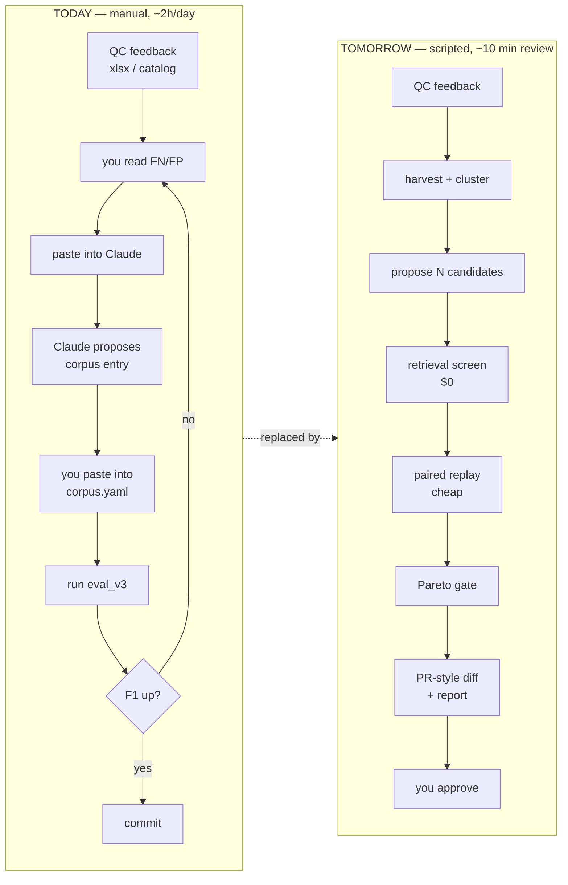
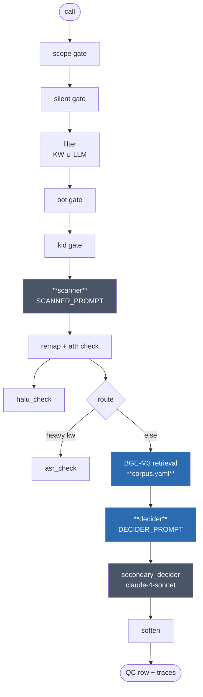
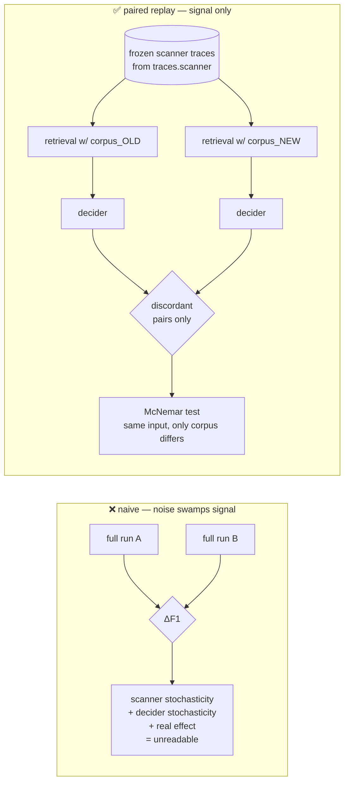
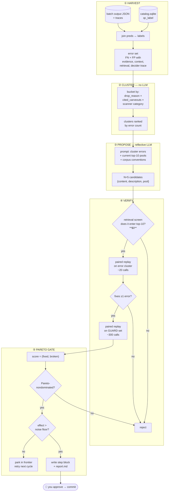
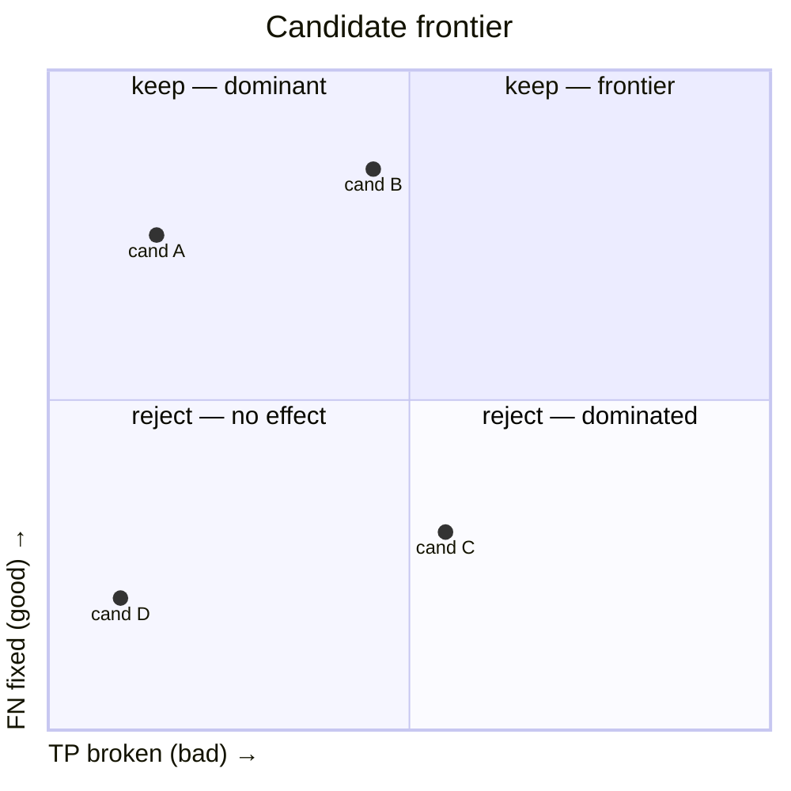
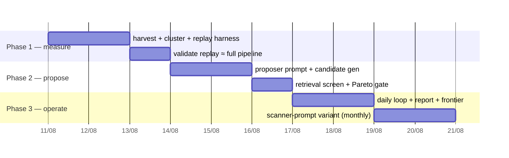
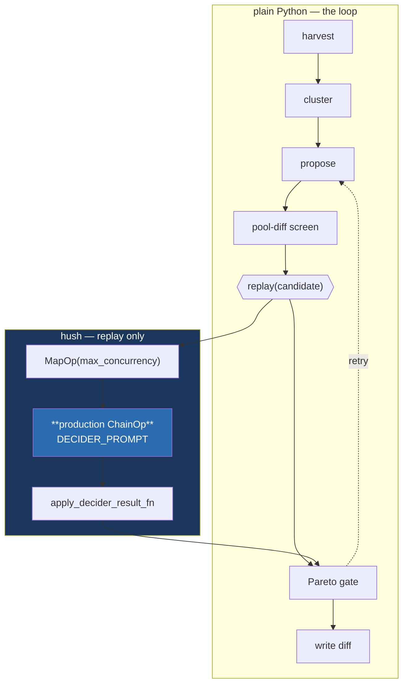

# Prompt Optimizer — sentiment_agent v4

Automating the daily loop: *QC feedback → FN/FP analysis → corpus/prompt edit → verify → ship.*

---

## Executive summary

| | |
|---|---|
| **Goal** | Replace the manual daily "hand Claude the feedback, get a corpus edit" loop with a scripted optimizer. |
| **Primary lever** | `corpus.yaml` — append `step*` blocks (positives for FN, carveouts for FP). Already 57 blocks / 481 positives / 369 carveouts. |
| **Secondary lever** | Prompt policy sections (scanner rules, decider procedure). Rare, gated, manual trigger. |
| **Algorithm** | GEPA-style: reflective LLM proposer on failing traces + **Pareto frontier** on (FN fixed, TP broken). No DSPy/TextGrad dependency. |
| **Key trick** | **Paired stage-replay** — freeze scanner traces, swap corpus, re-run *only* the decider. Kills the ~7% run-to-run noise floor and cuts cost 5×. |
| **Cost** | ~750 cheap LLM calls/day (~$0.3). Retrieval pre-screen kills most candidates at $0. |
| **Autonomy** | Proposes + verifies automatically, writes a PR-style diff. **Human approves the merge.** |
| **New code** | ~600 LOC across 5 files. Reuses `eval_v3`, `apply_corpus_batch`, `_retriever`, `pipeline.run`. |
| **Build** | 3 phases, each independently useful. Phase 1 ≈ 2 days. |

---

## 1. What changes



Everything in the right box is scripted. Your only job becomes **approving the diff**.

---

## 2. Where the optimizer plugs into v4



**Blue = optimizer targets (daily).** **Grey = optimizer targets (rare, gated).**

| Target | File | Why this tier |
|---|---|---|
| 🔵 `corpus.yaml` | `.prompts/sentiment_agent/corpus.yaml` | Highest leverage, safest, append-only, already has 57 precedent blocks |
| 🔵 `DECIDER_PROMPT` §CÁCH LÀM (L48-74) | v4 prompts | Policy procedure — small, high impact |
| ⚫ `SCANNER_PROMPT` §LỚP 0 + exemplars (L19-57, 157-192) | v4 prompts | Recall lever, but every change forces a full re-run (expensive) |
| ⚫ `SECONDARY_DECIDER_PROMPT` | `.prompts/sentiment_agent/` | Its own prompt says corpus is source of truth → tune corpus, not prompt |
| ⛔ `keyword_filter.yaml` | v4 | Filter is **off** in current `.env`. Out of scope until re-enabled. |

**Never mutate** (parsing/cache contracts): input-format blocks, JSON output schemas, `── DYNAMIC ──` anchors, `{placeholder}` names, `P<n>`/`C<n>` id format, corpus key names, the ` | ` variant separator.

---

## 3. The core trick — paired stage-replay

The naive approach (run full pipeline before + after, compare F1) fails: run-to-run noise is **~3% file-flip / ~7% HARD-field mismatch**, larger than most real gains.



Because `traces.scanner` is already persisted (`INCLUDE_TRACES=full`), scanner output for a given call is **fixed**. A corpus change can only act through retrieval → decider. So:

| Change type | Replay scope | LLM calls / case | Noise |
|---|---|---|---|
| `corpus.yaml` | retrieval + decider | **1** | paired, near-zero |
| `DECIDER_PROMPT` | decider | **1** | paired, near-zero |
| `SCANNER_PROMPT` | scanner + everything downstream | ~3 | unpaired, needs N≥300 + repeats |
| `SECONDARY_DECIDER_PROMPT` | secondary only | 1 | paired |

This is why the **corpus loop is daily and the scanner loop is monthly**.

### 3b. Pool-diff pruning — most of the guard set never needs an LLM call

A corpus edit can only change a case's verdict if the new entry actually **enters that case's top-10**. That is computable offline, deterministically, at zero LLM cost:

```python
pool_old = BgeRetriever(corpus_path=CURRENT).search(query)
pool_new = BgeRetriever(corpus_path=CANDIDATE).search(query)
if pool_old == pool_new:
    skip          # decider input is byte-identical → verdict provably unchanged
```

Typically **~5-20 of 300** guard cases shift. This is exact, not an approximation — strictly better than an LLM response cache, which would only *probably* hit.

---

## 4. Architecture



### Why Pareto, not "best F1"

Your memory records v4 losing 10pp F1 despite looking better on one axis. A single scalar hides that. The frontier keeps a candidate that fixes 5 FN / breaks 2 TP **and** one that fixes 2 FN / breaks 0 TP — you pick the tradeoff, and neither silently overwrites the other across days.



---

## 5. Data splits

| Split | Size | Source | Used for | Touched |
|---|---|---|---|---|
| **Error set** | ~20-60/day | today's FN+FP | proposal input + screen | every cycle |
| **Guard set** | 300 (150 pos / 150 neg) | stratified from `catalog.qc_label` `Thái độ ĐTV` (2723 rows / 562 pos) | regression check — must not break | every cycle |
| **Holdout** | 400 | disjoint, sealed | monthly true-F1 report | monthly only |
| **Selfcheck fixture** | 90 | `tests/sample/fixtures/` | deploy gate, unchanged | on release |

Guard set is **rotated monthly** (reseed) to prevent the optimizer overfitting to it — but rotation must be logged, because F1 across a rotation boundary is not comparable.

---

## 6. Cost per daily cycle

| Stage | Calls | Model | Note |
|---|---|---|---|
| Harvest + cluster | 0 | — | pure Python |
| Propose (5 candidates × 3 clusters) | ~15 | claude-4-sonnet | the only expensive model; reflection needs quality |
| Retrieval screen | 0 | — | BGE-M3 local, ~50ms each |
| Screen replay (survivors × ~20 cases) | ~150 | db-gemini-3-flash-high | paired decider only |
| Guard replay (1-2 survivors × **pool-diff subset**) | **~20-40** | db-gemini-3-flash-high | §3b prunes ~95% of the guard set |
| **Total** | **~200** | | **≈ $0.08/day** |

Compare: a full-pipeline rerun of 300 calls per candidate would be ~4500 calls **per candidate**.

---

## 7. New code

```
scripts/optimizer/
├── harvest.py      # catalog + output JSON → error set w/ traces        (~120 LOC)
├── cluster.py      # deterministic bucketing of errors                   (~60 LOC)
├── propose.py      # reflective LLM → candidate corpus entries           (~150 LOC)
├── replay.py       # ★ paired stage-replay harness (retrieval + decider) (~180 LOC)
└── loop.py         # orchestration + Pareto frontier + report writer     (~130 LOC)

.prompts/optimizer/
└── PROPOSER_PROMPT.prompt    # the reflective critic

outputs/optimizer/
├── frontier.json             # persisted Pareto population
└── run_YYYYMMDD/
    ├── errors.jsonl
    ├── candidates.jsonl
    ├── replay.jsonl
    └── report.md             # ← what you review
```

**`replay.py` is the only genuinely new engineering.** It must:
- load a *candidate* `corpus.yaml` into a throwaway `BgeRetriever` (the class already takes `corpus_path`)
- rebuild pools via existing `_format_indexed_pool`
- invoke the decider ChainOp directly (precedent: `eval_scanner.py` does stage isolation for the scanner)
- **not** touch the singleton `get_retriever()` — candidate retrievers are separate instances

Reused as-is: `eval_v3.compute_summary`, `apply_corpus_batch.py` (manifest → corpus write), `dump_fn_fp_cases.py` (context windows), `_retriever.BgeRetriever`, `_matcher._format_indexed_pool`.

---

## 8. Build phases



| Phase | Ships | Value standalone |
|---|---|---|
| **1** | `harvest` + `cluster` + `replay` | Already useful: *"what does this corpus edit do?"* answered in 2 min instead of a 40-min rerun |
| **2** | `propose` + Pareto gate | Candidates generated automatically; you still trigger runs |
| **3** | `loop.py` + report | Full daily automation, cron-able |

**Phase 1 gate:** replay verdicts must agree with full-pipeline verdicts on ≥95% of a 100-call sample. If they don't, the frozen-trace assumption is wrong and the whole design needs rework — find out on day 2, not day 8.

---

## 9. Non-goals (deliberately cut)

| Cut | Why |
|---|---|
| DSPy / TextGrad / any framework | Your surface is 2 YAML pools + 5 prompt files, not a DSPy module graph. A framework costs more than it saves. |
| BootstrapFewShot | Scanner/decider take no demos. `corpus.yaml` is retrieval-indexed, not few-shot. |
| Joint prompt+corpus co-optimization | Combinatorial, and prompt changes break pairing. Corpus daily / prompt monthly, separately. |
| Auto-commit | Phase 3 writes a diff; you merge. Flip to auto only after ~4 weeks of clean history. |
| Optimizing `keyword_filter.yaml` | Filter is disabled in current `.env`. |
| Optimizing soften / kid / bot / asr_check | Zero or near-zero F1 impact (`soften` only rewrites `reason`). |
| RL / weight training | Not the bottleneck. |

---

## 10. Pre-work found during research

Three real issues worth fixing **before** the optimizer, because they distort the baseline:

| # | Issue | Location | Impact |
|---|---|---|---|
| 1 | **Scanner cache-split is broken (latent).** `graph.py` partitions on `"Đây là nội dung cuộc gọi"`, but the prompt says `"Nội dung cuộc gọi"` (no `Đây là `). `str.partition` misses → the whole prompt incl. `{transcript}` lands in the cached system block. **Currently harmless**: `DatabricksGemini` strips `cache_control` and flattens content anyway (`hush-providers/.../databricks.py:116-146`), so all four v4 cache-splits are inert on `db-gemini-3-flash*`. It bites the moment you move back to `db-claude-*`. | [graph.py:66](../src/cases/sentiment_agent/v4/graph.py#L66) vs `SCANNER_PROMPT.prompt:213` | Fix = 1 word. Do it now so the latent bug never surfaces during a model switch. |
| 2 | **Taxonomy diverges across prompts.** Scanner defines C1-C11/N1-N5 (no C12). Secondary-decider defines C1-**C12** but only N1+N5 — and its **N1 means something different** (scanner N1 = mỉa mai; secondary N1 = xưng mày/tao). Decider uses 8 unnumbered groups. | 4 prompt files | The optimizer will "fix" contradictions that are really spec bugs. Reconcile first. |
| 3 | **Scanner and filter policy diverged.** `FILTER_PROMPT` has 5 carve-outs the scanner lacks (`trì hoãn`, `con nợ` exempt, `thả trôi`, …). | `FILTER_PROMPT.prompt` L63-96 | Only bites when the filter is re-enabled — note it, don't fix yet. |

---

## 10b. Measured findings (2026-08-10, run_20260810)

Phase 1 is built and the gate passed. What the data actually said — several
points contradict assumptions in §3-§5 above.

**Contract gate — passed at full scale, zero LLM calls.**

| check | result |
|---|---|
| replayable universe | 409 / 425 |
| evidence rebuild == persisted | **409 / 409** |
| context rebuild non-empty | 409 / 409 |
| positives + carveouts pool reproduced | **409 / 409** |

**Baseline on the 425-call UAT batch** — F1 `0.8333`, P `0.8434`, R `0.8235`
(TP 70 / FP 13 / FN 15 / TN 317). Errors 28, guard 381.

**Correction to §5** — the plan assumed the guard set needed a fresh labelled
batch. It does not: the calls v4 got **right** are the guard set and the ones it
got **wrong** are the error set, both already carrying traces. Guard costs zero
new LLM spend. Note the 425 batch is FP-enriched by construction (340 rows
labelled `Tích cực - AI bắt sai`), so it is an error-mining set, not a random
sample — a rotating random guard set from `catalog.sqlite` is still worth
building later.

**Correction to §2 — the biggest one.** The plan named `corpus.yaml` → primary
decider as the main FN lever. Measured, it is the **secondary** decider:

| FN killed by | n |
|---|---|
| `secondary_decider` downgrade | **11 / 15** |
| primary decider suppression | 4 / 15 |

Batch-wide the secondary decider downgrades **187 of 270** primary violations
(69.3%). It shares the retriever, corpus and query convention
(`_secondary_decider.py:135-142`), so corpus edits do reach it — but candidates
must be replayed against the correct stage. `cluster.py` now emits
`replay_stage` per cluster and `replay.py` takes `--stage primary|secondary`.

**Pool-diff pruning, measured.** 381/381 guard cases pruned against an unchanged
corpus — 0 LLM calls. §3b's estimate holds.

**New defect — secondary decider reads the wrong context window.**
`_secondary_decider.py:110-119` compares `enumerate(vads)` index against
`evidence_idxs`, which hold `turn_idx` (content-bearing vads only).

| | |
|---|---|
| input files with ≥1 empty-content vad | 289 / 425 (68%) |
| error cases where indices diverge | 21 / 28 |
| observed offset | +1 … +3 turns |

`_CONTEXT_WINDOW = 3`, so an offset of 3 can push the violating turn outside the
window entirely and put `<<<` on an innocent line. The primary decider maps
correctly (`_matcher._build_verifier_context`). Divergence is **proven**;
causation of the downgrades is **not yet measured** — `replay.py
--fix-context-idx` A/Bs it for 11 LLM calls. This is plausibly a larger F1 lever
than any prompt or corpus edit.

---

## 11. Should the optimizer be a hush graph?

**No for the control loop. Yes inside the replay harness.**



### Why hush inside replay
Replay must reproduce the decider **exactly** as production runs it. Hand-rolling the LLM call means different retry, template rendering, and parsing — replay verdicts drift from production and the Phase 1 gate fails for a reason unrelated to the design. Import the real `ChainOp` + `_DECIDER_TEMPLATE` + `DECIDER_LLM_RESOURCE_KEY`; swap **only** the retriever.

> `BaseOp.__call__` (`hush-core/hush/core/ops/base.py:576-604`) runs an op standalone with a throwaway schema+state — replay may not need a graph at all, just `asyncio.gather`. Verify this works for `ChainOp` (a `GraphOp` subclass) in Phase 1; if not, wrap in `MapOp` (~30 LOC).

### Why not hush for the loop

| # | Blocker | Ref |
|---|---|---|
| 1 | **Every op swallows exceptions.** `BaseOp.run` catches `Exception`, logs, writes the traceback to state, returns `{}` — plus a `return` inside `finally`. `engine.run()` essentially never raises. A failed proposer node yields `{}` and the loop continues, producing a confidently empty report. | `base.py:770-783` |
| 2 | **`WhileOp.until` is a string expression** `eval`'d with `{"__builtins__": {}}` over scalar loop vars. "Pareto-nondominated AND above noise floor" isn't a scalar expression — you'd compute it in a `FuncOp` and return a bool, at which point Python's `while` is strictly simpler. Live bug: `until` true at entry → `_outputs` unbound → `UnboundLocalError`, swallowed, returns `{}`. | `while_op.py:144-189` |
| 3 | **Zero eval infrastructure.** Grep for `dataset\|experiment\|optimiz\|evaluat\|scorer` across all three hush packages → **0 hits in library code**. No persistence, checkpoint, resume, or response cache either — every `engine.run()` builds a fresh `MemoryState`. The optimizer's hard problems are exactly the ones hush doesn't address. | `engine.py:144-149` |

### hush constraints to design around

| Constraint | Impact on optimizer | Ref |
|---|---|---|
| `resource` bound in `LLMOp.__init__`, not per-run | A/B-ing two models needs two graph builds (cheap — clients are cached) | `llm.py:212` |
| With `extract=`, `tokens_used`/`model_used` do **not** surface in ChainOp outputs | Read cost from `result["$state"]`, not the return dict | `chain.py:202-210` |
| `validator` without `fallback` is a silent **no-op** | Never rely on it for a pass/fail signal — check parsed values yourself | `llm.py:581` |
| Tracer flush is fire-and-forget on a thread pool | Don't read trace files synchronously after `run()` | `flush_worker.py:32-64` |
| Trace `metadata` is always `null` | Run configuration is not in the trace — log it yourself | `collector.py:102-114` |

---

## 12. Open decisions

| # | Decision | Default if you don't answer |
|---|---|---|
| 1 | Guard set size — 300 or 500? | **300** (cost/power balance; 500 if F1 gains get small) |
| 2 | Candidates per cluster — 3 or 5? | **5** (retrieval screen is free, so generate wide) |
| 3 | Where does daily feedback arrive? xlsx drop, catalog write, or manual? | Assume **catalog.sqlite `qc_label`** is the source of truth |
| 4 | Auto-commit after N clean weeks, or never? | **Never auto** until you say so |
| 5 | Include `SECONDARY_DECIDER_PROMPT` in scope? | **No** — its own prompt declares corpus is the tuning lever |
